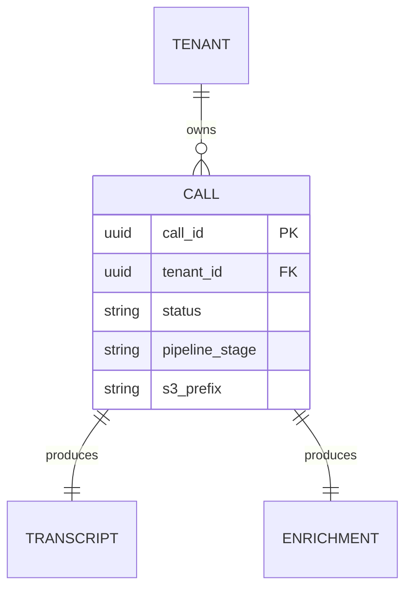
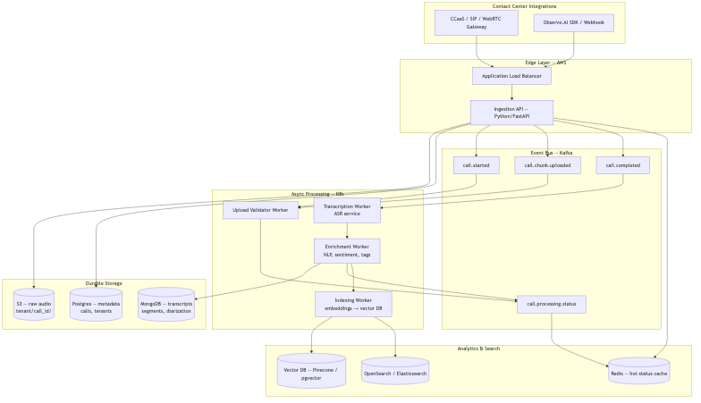
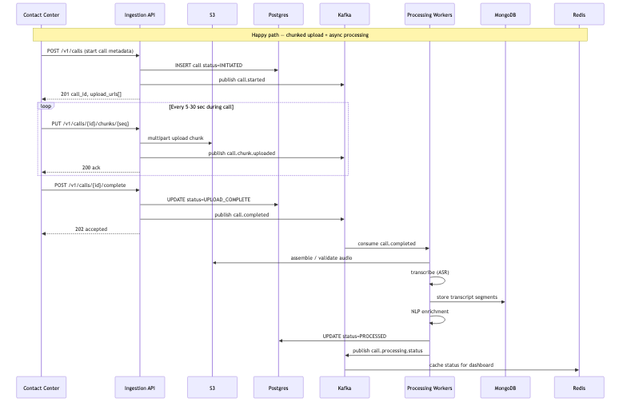

# Call Ingestion & Processing — HLD

> **Context:** Observe.AI-style system design interview (~60–70 min)  
> **Stack:** Python/FastAPI, Postgres, S3, Kafka, Redis, MongoDB, K8s  
> **Scale:** ~5–10M calls/day · transcript available < 15 min p95  
> **Pairs with:** [Real-time coaching](./realtime-contact-center-intelligence.md)

---

## How to use this doc

| Mode | What to do |
|------|------------|
| **Learn** | Read §1–6 fully, then each deep dive until you can explain *why* without notes |
| **Present (60–70 min)** | Follow the timebox below; deep dives A–C are the core; D–F if interviewer steers there |

### Interview timebox (~65 min)

| Min | Focus |
|-----|--------|
| 0–8 | Clarify requirements, out of scope, 3 NFRs + back-of-envelope |
| 8–15 | Entities + status model |
| 15–30 | APIs + HLD diagram + happy-path flow |
| 30–55 | Deep dives (aim for **A + B + C**; add D/E if asked) |
| 55–65 | Trade-offs, failure modes, close |

---

## Problem statement

Design a system that **ingests call recordings** from contact-center integrations, **stores them durably**, and **processes** them asynchronously (validate → transcribe → enrich) so QA/supervisors can analyze interactions. Live coaching is a *different* system (see realtime doc).

---

## 1. Requirements

### Functional (in scope for the interview)

| # | Requirement |
|---|-------------|
| F1 | Create a call session with metadata (`tenant_id`, `agent_id`, channel, …) |
| F2 | Upload audio via **presigned S3 URLs** (multipart preferred); API does **not** proxy bytes |
| F3 | **S3 completion event** starts the async pipeline (client does **not** need `POST /complete`) |
| F4 | Track lifecycle status queryable by `call_id` |
| F5 | Async pipeline: validate → ASR → NLP enrichment → **index for search** |
| F6 | Persist transcript (+ enrichment) readable via API |
| F7 | **Full-text search** over transcripts + structured filters (agent, date, duration) via Elasticsearch |
| F8 | Multi-tenant isolation by `tenant_id` |
| F9 | Idempotent create + safe retries (S3 events and Kafka are at-least-once) |

### Out of scope (state early)

Live real-time coaching, agent UI, model training, payments, semantic/vector search (mention as extension).  
**Mention if asked:** webhooks, retention cascade, PII redaction before index.

### Non-functional (anchor numbers)

| Category | Target | Why it matters |
|----------|--------|----------------|
| **Scale** | ~10M calls/day (~120/s avg, ~300/s peak) | Drives “thin API + async workers” |
| **Upload** | Client→S3; API only metadata | API must not be a bandwidth bottleneck |
| **Processing SLA** | Transcript ready < 15 min p95 | ASR/enrich path |
| **Search SLA** | Searchable ~30–60s after enrich (p95) *or* same budget as process if STT is fast | Index is eventually consistent |
| **Durability** | No durable object lost without processing attempt | S3 event → Kafka; idempotent workers |
| **Availability** | Ingest 99.9%; processing can lag | Prefer buffering over dropping calls |
| **Consistency** | Status by ID: strong (Postgres). Search: eventual | Call out explicitly |
| **Multi-tenancy** | Hard isolation | Auth, S3, DB, **ES index/filter** |

### Back-of-envelope (say out loud)

```
Storage: 10M × 10 min × ~1 MB/min ≈ 100 TB/day raw
         → compress ~4× + lifecycle (hot → Glacier) in real deployments

Ingest events: ~120 S3-complete → Kafka msgs/sec (easy for Kafka)

ASR capacity: ~1 min GPU time / 10-min call → ~7K GPU-hours/day
              → autoscale workers on Kafka consumer lag

Anti-pattern: 10–20 chunk rows × 10M calls = 100–200M Postgres rows/day
              → prefer S3 multipart / manifest; keep Postgres lean
```

---

## 2. Core entities & status

| Entity | Key fields | Storage | Role |
|--------|------------|---------|------|
| **Call** | `call_id`, `tenant_id`, `agent_id`, status, stage, `s3_prefix`, `multipart_upload_id`, `expected_parts` | Postgres | **Source of truth** for lifecycle |
| **Audio** | objects under `/{tenant}/{call_id}/` | S3 | Durable bytes; **CompleteMultipartUpload** fires the pipeline |
| **Transcript** | `call_id`, segments[] (speaker, text, timings, confidence) | MongoDB | Flexible, append-heavy |
| **Enrichment** | sentiment, topics, compliance flags, summary | MongoDB | Same doc or sibling by `call_id` |
| **SearchDocument** | denormalized transcript_text + filters | **Elasticsearch** | Derived view — **not** SoT |
| **ProcessingJob** *(optional)* | stage, status, retry_count, error | Postgres | Per-stage history |

### Status model (unify coarse + fine)

**Coarse `Call.status`** (what `GET /calls/{id}` returns):

```
INITIATED → UPLOADING → UPLOAD_COMPLETE → PROCESSING → INDEXED
                                                    ↘ FAILED
```

**Fine stage** (while `PROCESSING`): `VALIDATE → TRANSCRIBE → ENRICH → INDEX`

| Status | Meaning |
|--------|---------|
| `INITIATED` | Row created; presigned URLs / multipart id issued |
| `UPLOADING` | First S3 part event seen (optional) or first PUT observed |
| `UPLOAD_COMPLETE` | **S3 signaled** multipart/object complete; validation pending/running |
| `PROCESSING` | Pipeline running; see `pipeline_stage` |
| `INDEXED` | Terminal success — searchable in Elasticsearch |
| `FAILED` | Terminal failure (incomplete/bad object, ASR exhausted retries, …) |

*(If enrich is optional for some tenants, you can still mark `INDEXED` after ASR-only index; say so.)*

**Partial failure contract (have an answer):** ASR OK, enrich fails after retries → mark `FAILED` (or `PROCESSED` with degraded enrichments). Default interview answer: **fail the call status**, keep successful stage outputs via upsert so support can replay enrich.

**Redis:** cache of status for polling — **not** SoT. Miss → read Postgres.



---

## 3. API design

### Auth

`Authorization: Bearer <tenant_api_key>` (or JWT) scoped to `tenant_id`. Every query filters by tenant.

### Endpoints

| Method | Path | Purpose |
|--------|------|---------|
| `POST` | `/v1/calls` | Create call; return presigned upload info |
| `GET` | `/v1/calls/{id}` | Metadata + status |
| `GET` | `/v1/calls/{id}/transcript` | Transcript when available |
| `POST` | `/v1/search` | Full-text + filters (tenant-scoped) |
| `POST` | `/v1/calls/{id}/complete` | **Optional fallback** — checksum/duration hint if S3 events unavailable |

**Primary trigger (not an API):** S3 → EventBridge/SNS → Kafka `call.object.ready` when multipart upload completes (or final object `Put`). Client is free after the last PUT.

**Search body (sketch):**

```http
POST /v1/search
{
  "query": "refund policy",
  "filters": { "agent_id": "agent-42", "date_from": "2026-07-01", "min_duration_sec": 120 },
  "page": 1, "size": 20
}
→ { "total": 128, "results": [{ "call_id", "snippet", "score", "agent_id", "started_at" }] }
```

During the eventual-consistency window (audio exists, not yet `INDEXED`): `GET /calls/{id}` returns status `PROCESSING`; search simply omits the doc. Don’t pretend it’s searchable.

**Do not design** `PUT /chunks` through the API as the primary path — that reintroduces the bandwidth problem. Optional `POST .../chunks/{seq}/ack` only for progress UI.

### Examples

**Create**

```http
POST /v1/calls
Idempotency-Key: client-generated-uuid
{
  "agent_id": "agent-42",
  "channel": "voice",
  "language": "en-US",
  "expected_chunks": 12
}

→ 201
{
  "call_id": "uuid",
  "status": "INITIATED",
  "upload": {
    "mode": "presigned_multipart",
    "multipart_upload_id": "abc",
    "chunk_size_bytes": 5242880,
    "presigned_puts": [{ "part": 1, "url": "https://s3...?", "expires_in_sec": 3600 }]
  }
}
```

Client uploads parts, then calls S3 **CompleteMultipartUpload** (SDK does this).  
**No further call to our API is required** — S3 notifies us.

**Optional fallback** (only if asked / no S3 events):

```http
POST /v1/calls/{call_id}/complete
{ "checksum": "sha256:...", "duration_sec": 600 }
→ 202 { "status": "UPLOAD_COMPLETE" }   // enqueues same Kafka path; idempotent with S3 event
```

---

## 4. High-level design



**Excalidraw (editable):** [`./diagrams/call-ingestion-hld.excalidraw`](./diagrams/call-ingestion-hld.excalidraw) — open on [excalidraw.com](https://excalidraw.com) via **Open →** load file, or paste the JSON.

<details><summary>Mermaid source</summary>

`./diagrams/call-ingestion-hld.mmd`

</details>

### Component map

| Component | Responsibility |
|-----------|----------------|
| **Ingestion API** | Auth, create Call, issue presigned multipart URLs (no pipeline kick) |
| **S3** | Durable audio; **emits completion event** on multipart complete / final Put |
| **S3 → bus bridge** | EventBridge / SNS / S3 notify → publish Kafka `call.object.ready` |
| **Postgres** | Call + job state (SoT), including `multipart_upload_id` |
| **Kafka** | Decouple S3 notify from heavy ML; replay on failure |
| **Upload Validator** | Trust boundary: prefix, size, etag/checksum; then `call.validated` |
| **Transcription worker** | Pull audio → ASR → upsert Mongo transcript |
| **Enrichment worker** | Sentiment/topics/compliance → upsert Mongo; publish `call.enrichment.ready` |
| **Indexing worker** | Build denormalized `SearchDocument` → **upsert Elasticsearch** |
| **Search API** | Tenant-scoped query against ES (can be same FastAPI service) |
| **Redis** | Hot status cache for `GET` polling |
| **Elasticsearch** | Full-text + filter index (derived, rebuildable) |

### Kafka topics (interview set)

| Topic | Producer | Consumer | Key |
|-------|----------|----------|-----|
| `call.object.ready` | S3 event bridge | Validator | `call_id` |
| `call.validated` | Validator | ASR | `call_id` |
| `call.enrichment.ready` | Enrichment | Indexer | `call_id` |
| `call.processing.status` | Workers | Redis updater / UI | `call_id` |
| `call.processing.dlq` | Workers | Ops / replay | `call_id` |

Partition by `call_id` so one call’s stages stay ordered on a partition.  
Parse `call_id` / `tenant_id` from the S3 key: `s3://bucket/{tenant_id}/{call_id}/audio.wav`.

---

## 5. Data flow



<details><summary>Mermaid source</summary>

`./diagrams/call-ingestion-data-flow.mmd`

</details>

1. **Create** — API inserts `INITIATED` + `multipart_upload_id`, returns presigned part URLs.  
2. **Upload** — Client PUTs parts **directly to S3**, then S3 **CompleteMultipartUpload**. Client is done.  
3. **S3 notify** — EventBridge/SNS → Kafka `call.object.ready` → Postgres `UPLOAD_COMPLETE`.  
4. **Validate** — Prefix/tenant match, size/etag; success → `PROCESSING` + `call.validated`; else `FAILED`.  
5. **Transcribe / enrich** — Idempotent upserts to Mongo; status → Postgres + Redis.  
6. **Index** — Elasticsearch upsert; status → `INDEXED`.  
7. **Search** — `POST /v1/search` hits ES (always filter `tenant_id`).

**Key decision:** client never kicks the pipeline — **object durability in S3** does. STT/enrich/index stay async. Search is eventually consistent with Postgres.

---

## 6. Deep dives (learn these)

### Deep dive A — Presigned upload + S3-triggered pipeline (core)

**Problem 1 — bytes through the API:** At millions of calls/day, routing multi-MB audio through app servers makes them a bandwidth bottleneck.

**Problem 2 — client-triggered `complete`:** If the client must call `POST /complete` after upload, a crash between “S3 has the file” and “API was told” leaves orphaned audio that never processes.

**Design:**

1. API creates Call + starts **S3 multipart**, returns short-lived presigned part URLs.  
2. Client uploads **Client → S3** and completes the multipart upload via the S3 API/SDK.  
3. **S3 event** (EventBridge on `CompleteMultipartUpload` / final `Object Created`) → bridge publishes Kafka `call.object.ready`.  
4. Validator runs; client never talks to us again for that call.

```
Client:  POST /calls → PUT parts → S3 CompleteMultipart  →  (done)
S3:      event ──► Kafka call.object.ready ──► Validator ──► ASR …
```

**Idempotency:**

| Operation | Mechanism |
|-----------|-----------|
| `POST /calls` | `Idempotency-Key` → same `call_id` |
| S3 event | At-least-once; validator no-ops if already `PROCESSING` / `INDEXED` |
| Workers | Upsert transcript / ES doc by `call_id` |

**Interview line:** *“API is the control plane; S3 is the data plane; S3 notifications start the async plane — the client doesn’t kick the pipeline.”*

**Optional `POST /complete`:** keep as fallback (no EventBridge) or to attach client checksum/duration. Same Kafka topic; dedupe with S3 event.

---

### Deep dive B — What the S3 event means (and what it doesn’t)

**S3 says:** “An object (or multipart complete) exists at this key.”  
**S3 does not say:** “Audio is valid, long enough, or belongs to a live call.”

**Validator algorithm:**

1. Parse `tenant_id` / `call_id` from key; load Call from Postgres.  
2. Reject if call missing, wrong tenant, or already terminal (`INDEXED` / `FAILED`) — idempotent.  
3. Prefer listening to **CompleteMultipartUpload** (not every part `Put`).  
4. Check size / content-type / etag against policy; optional HeadObject.  
5. OK → `UPLOAD_COMPLETE` → `PROCESSING` + `call.validated`. Bad → `FAILED` (no ASR).

**Why multipart complete as the trigger:** part uploads would fire N events per call; completing the multipart is the natural “upload finished” signal without a client callback.

**Race with create:** extremely rare that S3 event arrives before Postgres commit — if so, retry consume with short backoff until Call row exists (or DLQ).

---


### Deep dive C — Async pipeline, retries, idempotency

**Why Kafka between stages?**

- Ingest spike ≠ ASR capacity; buffer absorbs bursts  
- Retry/replay without blocking the API  
- Independent scale: many API pods, fewer/more GPU workers  

**Delivery semantics:** Kafka consumers are typically **at-least-once**. Therefore:

- Publishing `call.validated` twice must not create two transcripts → **upsert by `call_id`**  
- Stage transitions should be monotonic (don’t go `PROCESSED` → `PROCESSING`)  
- Poison messages → **DLQ** after N retries + alert  

**Retry policy (example):** exponential backoff 1m / 5m / 30m, max 5; then `FAILED` + DLQ.

**Enrich after ASR:** either chained in one consumer group (simpler interview story) or separate topics per stage (clearer isolation). For 60–70 min, **one pipeline after validate** is enough; say you’d split topics when teams/SLAs diverge.

**Scale ASR:**

| Lever | Detail |
|-------|--------|
| HPA | Scale GPU deployments on consumer lag |
| Priority | Premium tenants → separate topic / consumer group |
| Degrade | Draft/faster model when lag threatens 15 min SLA |
| Parallelism | Chunk audio into windows, merge segments (advanced) |

---

### Deep dive D — Multi-tenant isolation

| Layer | How |
|-------|-----|
| API | Credentials bound to `tenant_id`; never trust body `tenant_id` alone |
| S3 | Prefix `/{tenant_id}/...` + IAM/bucket policy |
| Postgres | `tenant_id` on every row + composite indexes; always in `WHERE` |
| Kafka | Payload includes `tenant_id`; workers re-check before side effects |
| Redis | Key prefix `tenant:{id}:call:{call_id}:status` |

**Noisy neighbor (if asked):** per-tenant rate limits on `POST /calls`; processing quotas / priority queues so one tenant can’t starve GPU.

---

### Deep dive E — Storage choices (why not one DB?)

| Data | Store | Why |
|------|-------|-----|
| Call lifecycle | Postgres | ACID status transitions, relational queries |
| Audio | S3 | Cheap, durable, large blobs |
| Transcript | MongoDB | Nested segments, evolving schema, document fetch by `call_id` |
| Hot status | Redis | Cheap polling without hammering Postgres |

**Anti-pattern:** stuffing raw audio or huge transcripts into Postgres.

---

### Deep dive F — Elasticsearch text search

**Why ES (not Postgres `LIKE` / full-text alone)?** At millions of transcripts, you need inverted-index relevance, highlighting, and mixed text + structured filters at interactive latency. Postgres remains SoT for status/metadata; ES is a **derived, rebuildable** search view.

**Pipeline placement:**

```
Enrich done → publish call.enrichment.ready
Indexer reads Mongo transcript + Postgres metadata
  → build SearchDocument (flattened text + filter fields)
  → ES index upsert by call_id
  → Call.status = INDEXED
```

**SearchDocument (denormalized):**

```json
{
  "call_id": "uuid",
  "tenant_id": "uuid",
  "transcript_text": "agent: hello ... customer: I want a refund ...",
  "agent_id": "agent-42",
  "started_at": "2026-07-08T10:00:00Z",
  "duration_sec": 600,
  "topics": ["billing", "refund"],
  "language": "en"
}
```

**Tenant isolation in ES:** prefer index-per-tenant (`calls-{tenant_id}`) *or* shared index with a **mandatory** `term` filter on `tenant_id` in every query (and a security plugin / query rewrite in the Search API). Never trust the client to pass tenant correctly — take it from the auth token.

**Eventual consistency window:** between `UPLOAD_COMPLETE` / `PROCESSING` and `INDEXED`, `GET /calls/{id}` works; `POST /search` won’t return the call. That’s expected — say it.

**Reindex:** because ES is derived, changing analyzers or fixing bad STT = replay from Mongo/Postgres (or Kafka) into the indexer — don’t treat the index as precious state.

---

### Deep dive G — Analyzers & normalizers (why we didn’t have them before)

Earlier drafts stopped at “put text in ES” and skipped mapping details. In a real search design (and if the interviewer knows ES), you should name **how text is processed at index/query time**.

| Concept | What it is | Use here |
|---------|------------|----------|
| **Analyzer** | Tokenizer + token filters for **full-text** fields (`transcript_text`) | lowercase, asciifolding, stopwords (careful), maybe synonym filter for “refund”↔“chargeback” |
| **Normalizer** | Like an analyzer but for **keyword** fields — **no tokenization**, only character filters | `agent_id`, `tenant_id`, `language` — e.g. lowercase so `Agent-42` and `agent-42` match as terms |
| **keyword vs text** | `keyword` = exact term; `text` = analyzed tokens | Filters/aggs → `keyword` (+ normalizer). Transcript → `text` (+ analyzer) |

**Example mapping sketch:**

```json
{
  "settings": {
    "analysis": {
      "normalizer": {
        "lowercase_normalizer": {
          "type": "custom",
          "filter": ["lowercase", "asciifolding"]
        }
      },
      "analyzer": {
        "transcript_analyzer": {
          "tokenizer": "standard",
          "filter": ["lowercase", "asciifolding"]
        }
      }
    }
  },
  "mappings": {
    "properties": {
      "tenant_id": { "type": "keyword", "normalizer": "lowercase_normalizer" },
      "agent_id":  { "type": "keyword", "normalizer": "lowercase_normalizer" },
      "transcript_text": {
        "type": "text",
        "analyzer": "transcript_analyzer",
        "search_analyzer": "transcript_analyzer"
      },
      "started_at": { "type": "date" },
      "duration_sec": { "type": "integer" }
    }
  }
}
```

**Why normalizer matters in interviews:** without it, filter `agent_id=Agent-42` fails against indexed `agent-42`, or you invent ad-hoc `toLowerCase` in app code. Put normalization in the index mapping so ingest and query stay consistent.

**App-level “normalizer” (optional mention):** a small **ingest normalizer** step before ES (and sometimes before Mongo) that:

- strips / redacts PII from text going to the index  
- lowercases IDs  
- maps language codes  

That’s complementary to ES normalizers — ES handles token/term form; the app handles PII and business canonicalization.

---

### Deep dive H — Observability & ops (short)

- Metrics: ingest RPS, time-to-validate, time-to-transcript, **time-to-indexed**, lag per stage, GPU util, DLQ rate, ES index lag  
- Trace with `call_id` across API → Kafka → workers → indexer  
- Logs: structured JSON, **no PII**  
- Alert: lag > SLA, DLQ spike, ES reject/bulk errors  

---

## 7. Failure modes (quick table)

| Failure | Behavior |
|---------|----------|
| S3 event before Call row visible | Retry `object.ready` briefly → DLQ |
| Duplicate S3 / Kafka events | Validator/workers idempotent by `call_id` + status |
| Bad/tiny object uploaded | Validator → `FAILED`; no ASR |
| ASR worker crash | Kafka redelivery; upsert transcript |
| Enrich fails, ASR OK | Retry enrich; then `FAILED` or index ASR-only (state your choice) |
| Indexer / ES down | Kafka retains `enrichment.ready`; retry upsert; status stays `PROCESSING` |
| Redis down | `GET` status falls back to Postgres |
| Poison audio | Fail stage → DLQ |

---

## 8. What to skip unless asked

| Topic | One-liner |
|-------|-----------|
| Vectors / semantic search | Embeddings + kNN alongside ES text (hybrid) |
| Outbound webhooks | On `INDEXED` → signed HTTP to customer URL |
| Retention | S3 lifecycle + delete worker for PG/Mongo/**ES doc** |
| Playback / seek | Presigned GET from S3; UI seeks via segment `start_ms` |
| Priority STT queues | Separate Kafka topics by tenant tier |
| Client `POST /complete` | Optional fallback / checksum; same Kafka path as S3 event |

---

## 30-second close

> "Thin API issues **presigned multipart** uploads; the client never kicks processing. **S3 completion events** enter Kafka, then validate → ASR → enrich → **Elasticsearch**. Postgres is status SoT; Mongo holds transcripts; ES is a derived search view with analyzers/normalizers. Everything after S3 is idempotent and independently scalable."

---

## Self-check before the interview

Can you explain without notes:

1. Why not upload audio through the API?  
2. Why prefer S3 events over client `POST /complete`?  
3. What does the validator still check after an S3 event?  
4. Why upsert by `call_id` (Mongo **and** ES)?  
5. Status SoT vs Redis vs ES?  
6. Analyzer vs normalizer — which field gets which?
