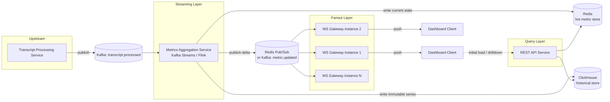
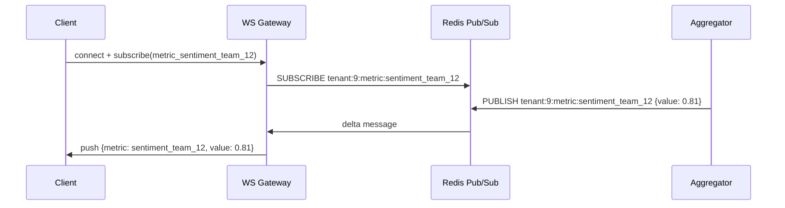

# Real-Time Analytics Dashboard Backend — HLD

**Context**: Call transcripts are processed (ASR + NLP already done upstream). As soon as a transcript finishes processing, the dashboard should reflect updated metrics (sentiment, call volume, AHT, keyword hits, QA scores) with minimal lag.

---

## 1. Functional Requirements

1. Consume "transcript processed" events and compute metric updates from them (sentiment score, talk time, keyword/topic counts, QA rule hits).
2. Update aggregate metrics in real time — per agent, per team, per tenant, at multiple time granularities (last 5 min, hourly, daily).
3. Push live updates to connected dashboard clients within a low, bounded latency (no polling required).
4. Serve historical/backfill queries for dashboards on load or drill-down (e.g., "show me last 24h trend").
5. Support tenant-configurable metrics/widgets (different call centers care about different KPIs).
6. (Stretch) Trigger alerts when a metric crosses a threshold (e.g., negative sentiment spike for a team).

### Out of scope (explicitly, to bound the problem)
- ASR / transcription itself
- NLP extraction of sentiment/keywords (assume a `TranscriptProcessed` event already contains or references these)
- Dashboard UI rendering

---

## 2. Non-Functional Requirements

| Requirement | Target / Reasoning |
|---|---|
| **Latency** | Transcript-processed → dashboard update in ~1-3s (this is the whole point of the system) |
| **Throughput** | Bursty: think 50k concurrent calls across tenants, transcripts arriving continuously, spiky at shift-change / peak hours |
| **Scalability** | Horizontal scaling of ingestion, aggregation, and fan-out independently |
| **Availability** | Dashboard should degrade (stale data) rather than go down. Prefer AP over CP for the live path |
| **Durability** | Never silently drop a transcript event — undercounted metrics are worse than a few seconds of delay |
| **Consistency** | Eventual consistency is *fine* for aggregates. We are not doing financial ledger correctness here |
| **Multi-tenancy** | Strict isolation — one tenant's burst shouldn't starve another's updates |
| **Idempotency** | Reprocessing the same transcript (retries, replays) must not double-count |

**Gut-check framing**: this is a classic *stream processing + fan-out* problem, structurally identical to "live sports score updates" or "stock ticker." The domain (call transcripts) just tells you what the aggregation logic looks like — the skeleton (ingest → aggregate → publish → fan-out) is reusable across all of these. Worth internalizing that pattern since it'll show up in any "real-time X" HLD.

---

## 3. Core Entities

```
TranscriptEvent
 - transcript_id (idempotency key)
 - tenant_id
 - call_id, agent_id, team_id
 - sentiment_score, keywords[], qa_flags[], talk_time_sec
 - processed_at (timestamp)

MetricDefinition
 - metric_id, tenant_id
 - name (e.g. "avg_sentiment"), aggregation_type (avg/sum/count/rate)
 - dimensions (agent, team, tenant), window (5m/1h/1d)

MetricValue  (the current computed state)
 - metric_id, dimension_key (e.g. agent_42), window
 - value, last_updated_at

Dashboard / Widget
 - dashboard_id, tenant_id
 - widgets[]: {metric_id, viz_type, refresh_mode}

AlertRule (stretch)
 - metric_id, threshold, comparator, notify_channel
```

**Key modeling decision**: `MetricValue` is *derived* state, not source of truth. Source of truth is the immutable `TranscriptEvent` stream. This means if aggregation logic changes, you can always replay from the event log to recompute — a property you want to explicitly call out in an interview, it signals you're thinking about correctness/recoverability, not just the happy path.

---

## 4. APIs

```
# Ingestion (internal, from upstream transcript pipeline)
Kafka topic: transcript.processed   (not a REST call — event-driven, see below for why)

# Dashboard-facing REST (initial load / historical / config)
GET  /v1/dashboards/{dashboardId}                     -> widget config
GET  /v1/metrics/{metricId}?range=24h&granularity=1h   -> historical series
POST /v1/dashboards/{dashboardId}/widgets              -> configure a widget
POST /v1/alerts/rules                                  -> configure alert (stretch)

# Real-time channel
WS   /v1/ws/dashboard/{dashboardId}
     client -> {"subscribe": ["metric_avg_sentiment_team_12", "metric_call_volume_tenant_9"]}
     server -> {"metric_id": "...", "value": 0.72, "ts": "..."}
```

**Why not REST polling for live updates?** Quick gut-check: if you have 5,000 dashboards open, each wanting sub-3s freshness, that's ~1,700 req/s of *mostly wasted* polling just to catch the rare update. WebSocket (or SSE) inverts this: push only when something actually changed. This is the single biggest NFR-driven design choice in this system — flag it explicitly if asked "why WS."

---

## 5. High-Level Architecture


> Open `./diagrams/realtime-analytics-dashboard-hld.excalidraw` in Excalidraw (VS Code extension or excalidraw.com).



**Data flow narrated:**
1. Transcript pipeline finishes → emits `TranscriptEvent` to Kafka, partitioned by `tenant_id` (keeps per-tenant ordering, enables per-tenant parallelism).
2. Aggregation service consumes, maintains windowed stateful aggregates (e.g., "rolling 5-min avg sentiment per team") in local state store (RocksDB, checkpointed to Kafka changelog for fault tolerance).
3. On every state update, it does two things: (a) upsert the hot value in Redis for instant reads, (b) append the point to ClickHouse for history, (c) publish a small delta message ("metric X changed to Y") to a pub/sub channel scoped by tenant.
4. WS Gateway instances hold live client connections. Each instance subscribes only to the pub/sub channels its connected clients care about — not a full broadcast. On receiving a delta, it pushes to the relevant open sockets.
5. On dashboard load (or reconnect), client hits REST API which reads Redis (current values) + ClickHouse (recent history) to render the initial state, then the WS stream takes over for live deltas.

---

## 6. Deep Dives

### 6.1 Why stream processing instead of "consumer that writes to DB on each event"?

A naive design: consumer reads `TranscriptEvent`, does `UPDATE metrics SET value = value + x WHERE ...` per event. This breaks down under load because:
- Every event = a read-modify-write against a shared row = **hot key contention** the moment call volume spikes (which is exactly when your metrics matter most).
- No natural way to express **windowed** aggregates ("avg over last 5 minutes") without either scanning raw events repeatedly or hand-rolling bucket logic.

Stream processing frameworks (Kafka Streams, Flink) give you windowing, exactly-once semantics, and local state (fast, no network round-trip per event) as first-class primitives — you're not reinventing them badly under deadline pressure. Concrete example: a *tumbling 5-second window* keyed by `(tenant_id, team_id)` naturally answers "what's the sentiment trend right now" without you writing custom bucket-rollover code.

### 6.2 Fan-out: avoiding the "broadcast storm"

If every WS gateway instance subscribed to *every* tenant's pub/sub channel, you'd waste bandwidth pushing irrelevant data through instances with no interested clients, and each instance's memory/CPU scales with *total system volume* instead of *its own connected clients*. 

Better: gateway instances dynamically subscribe/unsubscribe to Redis pub/sub channels based on what their currently-connected clients asked for (channel = `tenant:{id}:metric:{metric_id}`). A connection registry (could live in Redis too) tracks which gateway instance owns which client, mostly for reconnect/failover bookkeeping, not for routing (pub/sub handles routing).



**Alternative view**: at very large scale (multi-region, huge fan-out), Redis pub/sub itself becomes a bottleneck (no persistence, no consumer groups, single point per shard). At that point you'd swap in Kafka for the `metric.updated` topic too, with WS gateways as a Kafka consumer group — trades some latency for durability and better horizontal scaling of the fan-out layer. Worth mentioning this tradeoff explicitly rather than presenting Redis pub/sub as the only answer — interviewers like seeing you know *when* your first choice stops working.

### 6.3 Idempotency & exactly-once-ish

Transcript events can be redelivered (consumer restart, at-least-once Kafka semantics). If the aggregator just does `sentiment_sum += value`, a redelivery double-counts.

Two common fixes:
- **Deterministic recompute from windowed state keyed by event ID**: track processed `transcript_id`s within the window (e.g., a small dedupe set per window, TTL'd) — cheap since windows are short-lived.
- **Kafka Streams' built-in exactly-once processing** (transactional writes across input offset commit + state store + output topic) — the "let the framework handle it" answer, which is usually the right one to give in an interview unless asked to go deeper.

### 6.4 Multi-tenancy isolation

Two concrete risks: (a) one huge tenant's aggregation workload starves a small tenant's on a shared consumer group, (b) a tenant's dashboard connection count overwhelms a WS gateway shared with others.

Mitigation: Kafka partitioning by `tenant_id` lets you scale consumer parallelism, but for a *very* large tenant you'd want a dedicated partition/consumer set rather than the same shard as everyone else (a "noisy neighbor" bucket, similar to how you'd isolate a hot shard in any multi-tenant system). For WS gateways, connection limits + backpressure per tenant prevent one tenant's dashboard fleet from starving another's socket capacity on the same instance.

### 6.5 Backpressure / graceful degradation

If a WS gateway instance can't keep up with delta volume (buffer growing), don't block the aggregation pipeline — that would cause cascading delay for *all* tenants. Instead: bounded per-connection buffer, and if it overflows, drop intermediate deltas and send only the *latest* value (fine for a dashboard — nobody needs every intermediate tick, just eventual freshness). This is a nice concrete instance of a more general principle: **for live dashboards, "last value wins" is usually an acceptable, even correct, degradation strategy** — unlike, say, a payments event stream where dropping anything is unacceptable.

---

## 7. Quick recap: the reusable skeleton

```
Event happens → durable log (Kafka) → stateful stream aggregation
   → hot store (fast reads) + cold store (history) + change notification
   → fan-out layer (pub/sub-backed WS) → client
```

This shape (ingest → aggregate → dual-write hot/cold → pub/sub → fan-out) is worth having memorized cold — swap "transcript processed" for "trade executed," "sensor reading," or "chat message," and the skeleton barely changes. What changes is the aggregation *logic* and the specific latency/consistency tradeoffs the domain demands.
