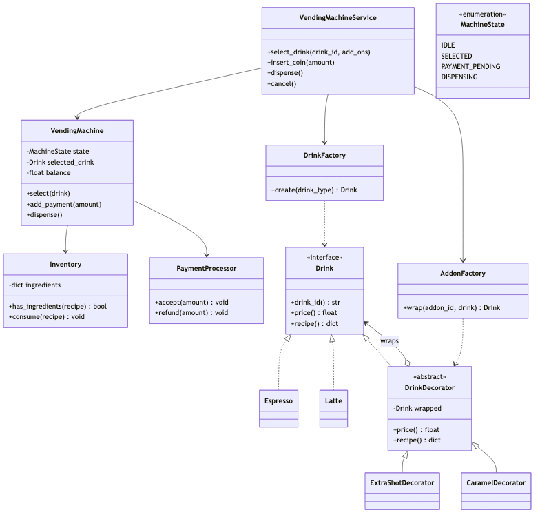
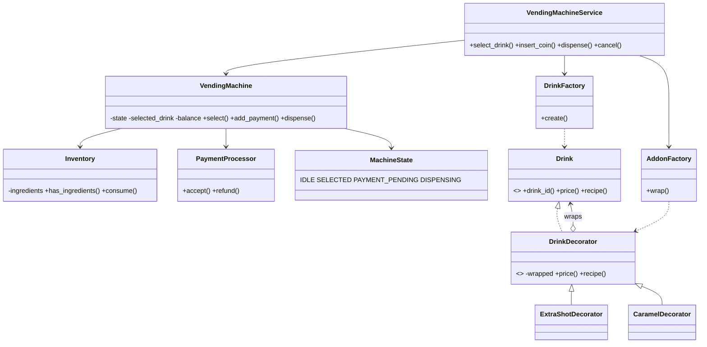
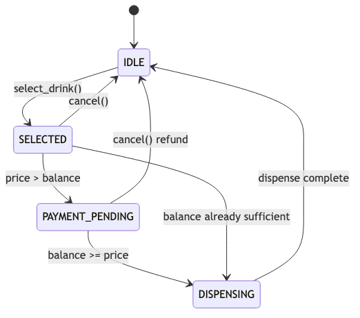
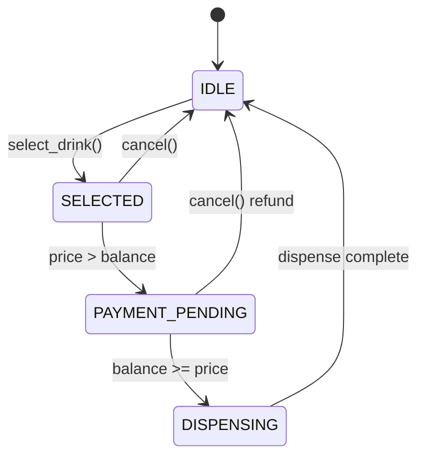
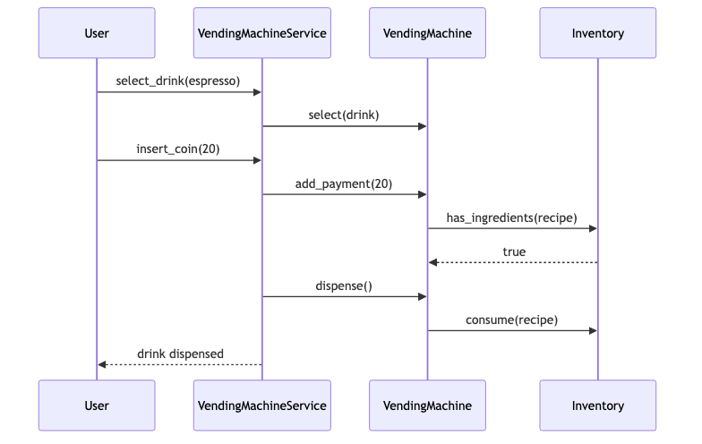
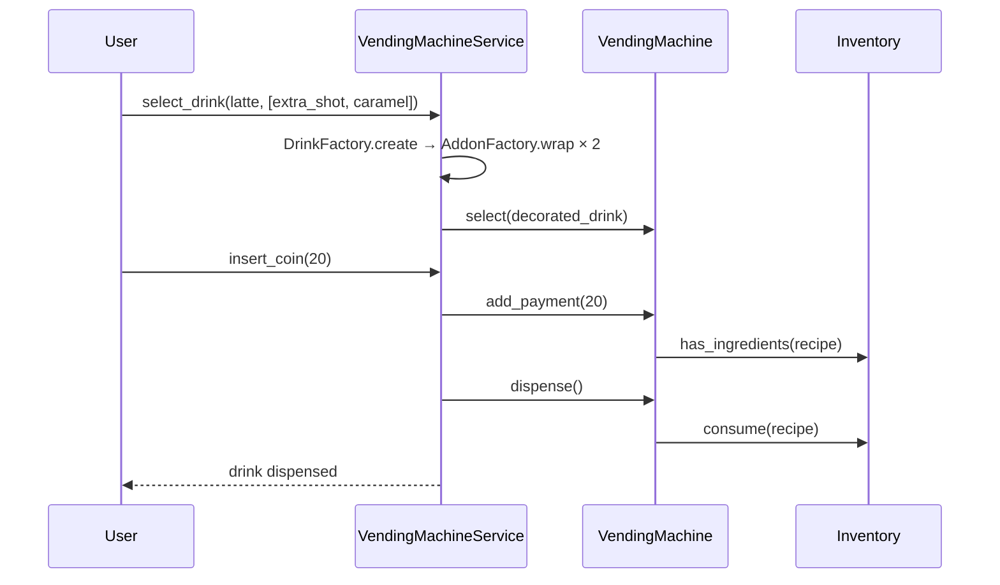

# Coffee Vending Machine — LLD (1-Hour Scope)

> **Context:** Classic LLD / Machine Coding interview  
> **Focus:** Class design, state machine, inventory, edge cases — not full hardware  
> **Time budget:** 60 minutes

---

## Problem statement

Design a **coffee vending machine**: select drink (with optional **add-ons** like extra shot, caramel) → insert payment → dispense if ingredients available; support change and cancel/refund.

---

## Scope boundary

### In scope

| Item | Notes |
|------|-------|
| Drink selection | `Drink` + `DrinkFactory` |
| Add-ons / toppings | `DrinkDecorator` + `AddonFactory` (Decorator) |
| Payment + refund | `PaymentProcessor` |
| Ingredient stock | `Inventory` (separate from machine) |
| State machine | `IDLE` → `SELECTED` → `PAYMENT_PENDING` → `DISPENSING` |
| Orchestration | `VendingMachineService` |
| Schema (optional) | `drinks`, `inventory` |

### Out of scope (mention only if asked)

Hardware/GPIO, fleet ops, admin UI, real card gateway, microservices

**Opening line:** "Machine state, inventory, and recipes are separate; add-ons wrap the base `Drink` via Decorator; `PaymentProcessor` owns money; I'll walk the state machine and edge cases."

---

## Assumptions

```
- Single machine, in-memory; one transaction at a time
- Coin payment (float); exact change for refund
- Recipe = dict[str, int]; add-ons stack price + ingredients; cancel refunds full balance
```

---

## Time plan (60 min)

| Min | Activity |
|-----|----------|
| 0–5 | Clarify + assumptions |
| 5–20 | Class diagram + responsibilities |
| 20–28 | Schema (2 tables) |
| 28–45 | State machine + flow + edge cases |
| 45–55 | Patterns + extensibility |
| 55–60 | Close |

---

## Class diagram



<details>
<summary>Mermaid source</summary>



</details>

---

## Class responsibilities

### `VendingMachineService` — orchestration

```python
def select_drink(self, drink_type: str, add_ons: list[str] | None = None) -> None:
    base = self.drink_factory.create(drink_type)
    drink = base
    for addon_id in add_ons or []:
        drink = self.addon_factory.wrap(addon_id, drink)  # stacks decorators
    self.machine.select(drink)

def dispense(self) -> DispenseView:
    recipe = self.machine.selected_drink.recipe()
    if not self.inventory.has_ingredients(recipe):
        raise VendingError(OUT_OF_STOCK)
    drink = self.machine.dispense()
    self.inventory.consume(recipe)
    change = max(0.0, self.machine.balance - drink.price())
    if change: self.payment_processor.refund(change)
    return DispenseView(drink.drink_id(), change)
```

Coordinates only — state in `VendingMachine`, stock in `Inventory`, money in `PaymentProcessor`. Add-ons are applied **before** selection so price/recipe are final when payment starts.

---

### `VendingMachine` — State pattern

```python
def add_payment(self, amount: float) -> None:
    if self.state not in (MachineState.SELECTED, MachineState.PAYMENT_PENDING):
        raise VendingError(INVALID_STATE)
    self.balance += amount
    if self.balance >= self.selected_drink.price():
        self.state = MachineState.DISPENSING
    else:
        self.state = MachineState.PAYMENT_PENDING

def dispense(self) -> Drink:
    if self.state != MachineState.DISPENSING:
        raise VendingError(INSUFFICIENT_PAYMENT)
    drink = self.selected_drink
    self._reset()  # → IDLE, balance=0
    return drink
```

---

### `Inventory` — separate from machine

```python
ingredients: dict[str, int]

def has_ingredients(self, recipe: dict[str, int]) -> bool:
    return all(self.ingredients.get(k, 0) >= v for k, v in recipe.items())

def consume(self, recipe: dict[str, int]) -> None:
    if not self.has_ingredients(recipe): raise VendingError(OUT_OF_STOCK)
    for k, v in recipe.items(): self.ingredients[k] -= v
```

---

### `Drink`, `DrinkFactory`, `PaymentProcessor`

```python
class Drink(ABC):
    @abstractmethod
    def drink_id(self) -> str: ...
    @abstractmethod
    def price(self) -> float: ...
    @abstractmethod
    def recipe(self) -> dict[str, int]: ...

class DrinkFactory:
    _registry: dict[str, type[Drink]] = {"espresso": Espresso, "latte": Latte}
    def create(self, drink_type: str) -> Drink: ...

class PaymentStrategy(ABC):
    @abstractmethod
    def process_payment(self, amount: float) -> None: ...
    @abstractmethod
    def process_refund(self, amount: float) -> None: ...

class PaymentProcessor:
    def __init__(self, strategy: PaymentStrategy): ...
    def accept(self, amount: float) -> None: self.strategy.process_payment(amount)
    def refund(self, amount: float) -> None: self.strategy.process_refund(amount)
```

---

### `DrinkDecorator`, `AddonFactory` — Decorator pattern

Add-ons **wrap** a base `Drink` and compose price + recipe without subclass explosion (`LatteWithExtraShotWithCaramel`).

```python
class DrinkDecorator(Drink):
    def __init__(self, wrapped: Drink):
        self._wrapped = wrapped

    def drink_id(self) -> str:
        return f"{self._wrapped.drink_id()}+{self._addon_id()}"

    def price(self) -> float:
        return self._wrapped.price() + self._addon_price()

    def recipe(self) -> dict[str, int]:
        merged = dict(self._wrapped.recipe())
        for ingredient, units in self._addon_recipe().items():
            merged[ingredient] = merged.get(ingredient, 0) + units
        return merged

    @abstractmethod
    def _addon_id(self) -> str: ...
    @abstractmethod
    def _addon_price(self) -> float: ...
    @abstractmethod
    def _addon_recipe(self) -> dict[str, int]: ...

class ExtraShotDecorator(DrinkDecorator):
    def _addon_id(self) -> str: return "extra_shot"
    def _addon_price(self) -> float: return 15.0
    def _addon_recipe(self) -> dict[str, int]: return {"coffee_beans": 1}

class CaramelDecorator(DrinkDecorator):
    def _addon_id(self) -> str: return "caramel"
    def _addon_price(self) -> float: return 10.0
    def _addon_recipe(self) -> dict[str, int]: return {"caramel_syrup": 1}

class AddonFactory:
    _registry: dict[str, type[DrinkDecorator]] = {
        "extra_shot": ExtraShotDecorator,
        "caramel": CaramelDecorator,
    }
    def wrap(self, addon_id: str, drink: Drink) -> Drink:
        cls = self._registry.get(addon_id)
        if not cls: raise VendingError(ADDON_NOT_FOUND)
        return cls(drink)
```

**Example:** `latte` + `["extra_shot", "caramel"]` → `Latte` wrapped by `ExtraShotDecorator` wrapped by `CaramelDecorator` → price = base + 15 + 10; recipe merges all layers. `VendingMachine` only sees a `Drink` — no decorator awareness.

---

## Patterns used

| Pattern | Where | Why |
|---------|-------|-----|
| **State** | `VendingMachine` + `MachineState` | Valid select / pay / dispense / cancel transitions |
| **Factory** | `DrinkFactory`, `AddonFactory` | New drinks/add-ons without service `if/elif` |
| **Decorator** | `DrinkDecorator` + concrete add-ons | Stack toppings on any base drink; compose price + recipe |
| **Strategy** | `PaymentStrategy` | Coin vs card without changing `VendingMachine` |

`MachineState`: `IDLE`, `SELECTED`, `PAYMENT_PENDING`, `DISPENSING`  
`ErrorCode`: `DRINK_NOT_FOUND`, `ADDON_NOT_FOUND`, `OUT_OF_STOCK`, `INSUFFICIENT_PAYMENT`, `INVALID_STATE`

---

## State machine (machine)



<details>
<summary>Mermaid source</summary>



</details>

---

## Core flow (select + pay + dispense)



<details>
<summary>Mermaid source</summary>



</details>

---

## Schema (2 tables — optional)

| Table | PK | Role |
|-------|-----|------|
| `drinks` | `drink_id` | Name, base price, base recipe JSON |
| `add_ons` | `addon_id` | Extra price, extra recipe JSON |
| `inventory` | `ingredient_id` | `units_available`, low-stock threshold |

Mirror as `dict` in memory for interview; restock updates `inventory` without touching machine code.

---

## Edge cases (know these 6)

| Case | Behavior |
|------|----------|
| **Out of stock** at dispense | Re-check `has_ingredients()` → `OUT_OF_STOCK` |
| **Insufficient payment** | `PAYMENT_PENDING`; `dispense()` rejects |
| **Cancel** mid-payment | Refund balance; reset `IDLE` |
| **Select** when not `IDLE` | `INVALID_STATE` |
| **Unknown drink** | `DrinkFactory` → `DRINK_NOT_FOUND` |
| **Unknown add-on** | `AddonFactory` → `ADDON_NOT_FOUND` |
| **Add-on out of stock** | Decorated `recipe()` may need extra syrup/beans → `OUT_OF_STOCK` at dispense |
| **Overpay** | Dispense; refund `balance - price` |

---

## Extensibility (3 bullets only)

| Question | Answer |
|----------|--------|
| New drink? | Implement `Drink`; register in `DrinkFactory._registry` |
| New add-on? | Subclass `DrinkDecorator`; register in `AddonFactory._registry` |
| Card payment? | New `PaymentStrategy` in `PaymentProcessor` |
| Multiple machines? | `VendingMachine` + `Inventory` per unit |

---

## SOLID (say 3, not 5)

| Principle | Application |
|-----------|-------------|
| **S** | `Inventory` = stock; `VendingMachine` = state; `PaymentProcessor` = money |
| **O** | New drink / add-on / payment via new class — no combinatorial subclasses |
| **D** | `PaymentProcessor` depends on `PaymentStrategy` ABC |

---

## What to code if asked (~10 min)

Pick **one**: `DrinkDecorator.price()` + `recipe()` · `VendingMachine.add_payment()` · `AddonFactory.wrap()`

---

## 30-second close

> "State (`VendingMachine`), stock (`Inventory`), recipes (`Drink` + `DrinkFactory`) are separate. Add-ons use **Decorator** — stack wrappers for price and ingredients without `LatteWithX` subclasses. `PaymentProcessor` handles money via `PaymentStrategy`. State machine gates select → pay → dispense."

---

## Anti-patterns to avoid

- God class mixing inventory, payment, brewing
- Stock check only at selection (re-check at dispense)
- Boolean flags instead of state machine
- Combinatorial drink subclasses (`LatteExtraShotCaramel`) instead of `DrinkDecorator`
- Giant `if/elif` for drinks instead of factory registry
- Refund inside `VendingMachine` not `PaymentProcessor`

---

## References

- Classic machine-coding / LLD — vending machine (State + Factory + Decorator + Strategy)
