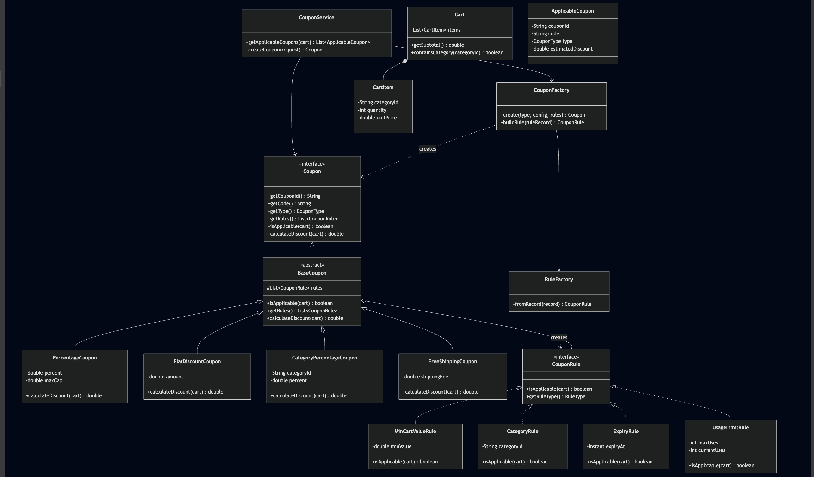
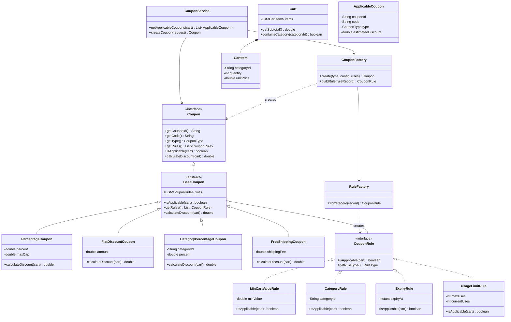
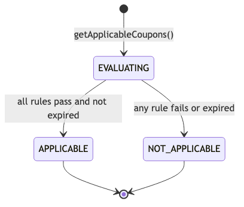
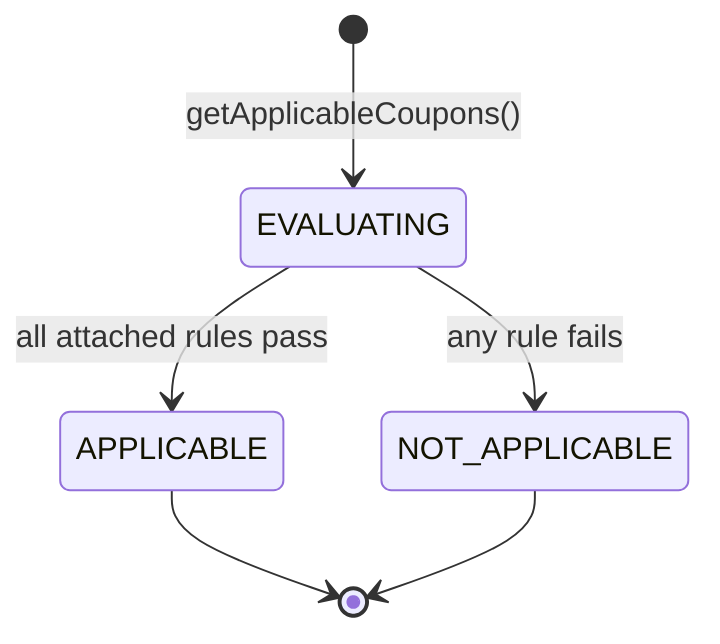
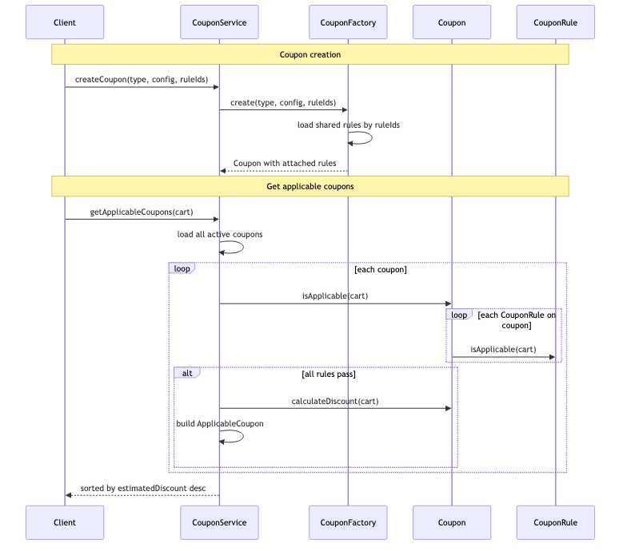
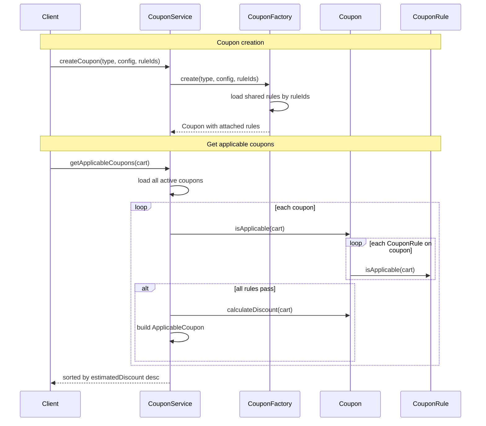
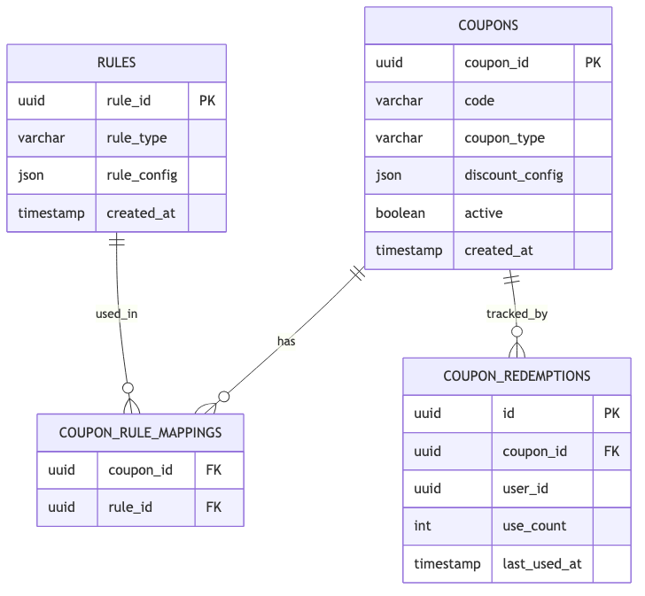
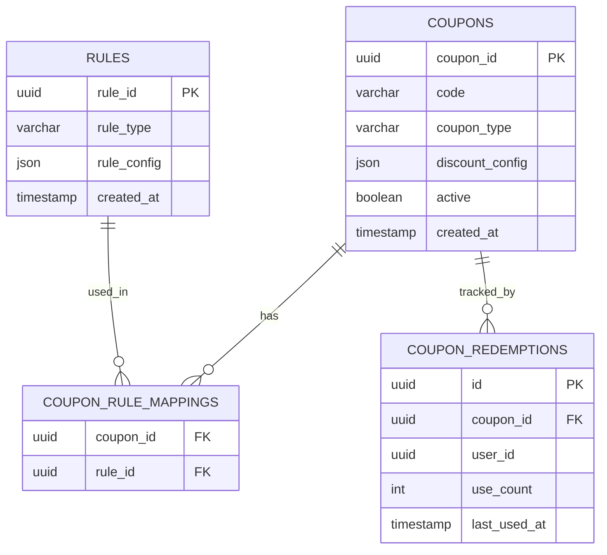

# E-Commerce Coupon System — LLD (1-Hour Scope)

> **Company:** Observe.AI (reported LLD question)  
> **Focus:** Class design, extensibility, schema — not full implementation  
> **Time budget:** 60 minutes

---

## Problem statement

Design a **coupon system** for an e-commerce app where:

- Given a **cart** (items, quantities, prices) and a **list of coupons**
- Return the coupons that **can be applied** to that cart
- Include **estimated discount** for each applicable coupon

---

## Scope boundary

### In scope

| Item | Notes |
|------|-------|
| `Coupon` interface | Discount formula per coupon type |
| `CouponRule` interface | Reusable eligibility rules, shared across coupons |
| Rules composed at **coupon creation** | Not hardcoded inside each coupon type |
| `CouponService` | Create coupon, get applicable coupons |
| `CouponFactory` + `RuleFactory` | Build impls and rules from DB |
| 4-table schema | `coupons`, `rules`, `coupon_rule_mappings`, `coupon_redemptions` |

### Out of scope (mention only if asked)

- Apply coupon at checkout / mutate cart
- Stackable coupon combos
- Separate `CouponEngine` layer
- Admin UI

**Opening line:**

> "`Coupon` defines the discount formula; `CouponRule` defines eligibility. Rules are reusable and attached when a coupon is created. `CouponService` filters and ranks — no extra engine."

---

## Assumptions

```
- Rules are independent objects — same rule instance config can map to many coupons
- A coupon is applicable only if ALL attached rules pass
- Each coupon type implements its own `calculate_discount()` formula
- isApplicable() is shared via BaseCoupon — delegates to attached rules
- Return list sorted by estimatedDiscount descending
```

---

## Time plan (60 min)

| Min | Activity |
|-----|----------|
| 0–5 | Clarify + assumptions |
| 5–20 | Coupon + CouponRule interfaces, BaseCoupon, 2 impls |
| 20–30 | Schema (rules many-to-many with coupons) + factories |
| 30–45 | Creation flow + getApplicable flow |
| 45–55 | Extensibility |
| 55–60 | Close |

---

## Class diagram



<details>
<summary>Mermaid source</summary>



</details>

---

## Class responsibilities

### `CouponRule` — reusable eligibility (interface)

Rules are **not tied to a coupon type**. Same rule definition can attach to many coupons.

```python
from abc import ABC, abstractmethod

class CouponRule(ABC):
    @abstractmethod
    def is_applicable(self, cart: Cart) -> bool:
        ...

    @abstractmethod
    def rule_type(self) -> RuleType:
        ...
```

| Implementation | Checks |
|----------------|--------|
| `MinCartValueRule` | `cart.subtotal() >= min_value` |
| `CategoryRule` | `cart.contains_category(category_id)` |
| `ExpiryRule` | `now <= expiryAt` |
| `UsageLimitRule` | `currentUses < maxUses` for user |

**New rule answer:**

> "Add `FirstOrderRule(CouponRule)` — attach to any coupon at creation. No change to `PercentageCoupon` or service loop."

---

### `Coupon` — discount formula (interface)

```python
class Coupon(ABC):
    @abstractmethod
    def coupon_id(self) -> str: ...

    @abstractmethod
    def code(self) -> str: ...

    @abstractmethod
    def coupon_type(self) -> CouponType: ...

    @abstractmethod
    def rules(self) -> list[CouponRule]: ...

    @abstractmethod
    def is_applicable(self, cart: Cart) -> bool: ...

    @abstractmethod
    def calculate_discount(self, cart: Cart) -> float: ...
```

- **`isApplicable`** → delegated to rules (via `BaseCoupon`)
- **`calculateDiscount`** → implemented per coupon type

---

### `BaseCoupon` — shared rule composition

```python
class BaseCoupon(Coupon):
    def __init__(self, rules: list[CouponRule]):
        self._rules = rules

    def is_applicable(self, cart: Cart) -> bool:
        return all(rule.is_applicable(cart) for rule in self._rules)

    # subclasses implement calculate_discount(self, cart)
```

**Interview signal:** rules are **injected at construction**, not hardcoded in subclasses.

---

### Coupon type implementations (formula only)

**`PercentageCoupon`**
```python
def calculate_discount(self, cart: Cart) -> float:
    discount = cart.subtotal() * self.percent / 100
    return min(discount, self.max_cap)
```

**`FlatDiscountCoupon`**
```python
def calculate_discount(self, cart: Cart) -> float:
    return min(self.amount, cart.subtotal())
```

**`CategoryPercentageCoupon`**
```python
def calculate_discount(self, cart: Cart) -> float:
    category_subtotal = sum(
        item.line_total() for item in cart.items_by_category(self.category_id)
    )
    return category_subtotal * self.percent / 100
```

**`FreeShippingCoupon`**
```python
def calculate_discount(self, cart: Cart) -> float:
    return self.shipping_fee
```

---

### Coupon creation — rules attached here

```python
def create_coupon(type: CouponType, discount_config: dict, rule_ids: list[str]) -> Coupon:
    rules = [rule_catalog[rule_id] for rule_id in rule_ids]  # shared rule objects
    coupon = coupon_factory.create(type, discount_config, rules)
    save_coupon(coupon, rule_ids)
    return coupon
```

**Example:** `SAVE20` and `FLAT50` can both attach the same `MinCartValueRule` and `ExpiryRule`.

```python
min_999 = MinCartValueRule(min_value=999)
dec_31 = ExpiryRule(expiry_at=datetime(2025, 12, 31))
shared_rules = [min_999, dec_31]

save20 = coupon_factory.create(
    CouponType.PERCENTAGE,
    {"percent": 20, "max_cap": 500},
    shared_rules,
)

flat50 = coupon_factory.create(
    CouponType.FLAT,
    {"amount": 50},
    shared_rules,  # same rules, different discount formula
)
```

---

### `RuleFactory` — build rules from DB

```python
def from_record(rule_row: dict) -> CouponRule:
    match rule_row["rule_type"]:
        case RuleType.MIN_CART_VALUE:
            return MinCartValueRule(min_value=rule_row["config"]["min_value"])
        case RuleType.CATEGORY:
            return CategoryRule(category_id=rule_row["config"]["category_id"])
        case RuleType.EXPIRY:
            return ExpiryRule(expiry_at=rule_row["config"]["expiry_at"])
        case RuleType.USAGE_LIMIT:
            return UsageLimitRule(
                max_uses=rule_row["config"]["max_uses"],
                current_uses=rule_row["config"]["current_uses"],
            )
```

---

### `CouponFactory` — build coupon + attach rules

```python
def create(type: CouponType, discount_config: dict, rules: list[CouponRule]) -> Coupon:
    match type:
        case CouponType.PERCENTAGE:
            return PercentageCoupon(discount_config, rules)
        case CouponType.FLAT:
            return FlatDiscountCoupon(discount_config, rules)
        case CouponType.CATEGORY_PERCENTAGE:
            return CategoryPercentageCoupon(discount_config, rules)
        case CouponType.FREE_SHIPPING:
            return FreeShippingCoupon(discount_config, rules)
```

---

### `CouponService` — create + filter + rank

```python
coupon_catalog: dict[str, Coupon] = {}
rule_catalog: dict[str, CouponRule] = {}

def create_coupon(self, request: CreateCouponRequest) -> Coupon:
    rules = [self.rule_catalog[rid] for rid in request.rule_ids]
    coupon = self.coupon_factory.create(request.type, request.config, rules)
    self.coupon_catalog[coupon.coupon_id()] = coupon
    self._save(coupon, request.rule_ids)
    return coupon

def get_applicable_coupons(self, cart: Cart) -> list[ApplicableCoupon]:
    result = []
    for coupon in self.coupon_catalog.values():
        if coupon.is_applicable(cart):
            result.append(ApplicableCoupon(
                coupon_id=coupon.coupon_id(),
                code=coupon.code(),
                coupon_type=coupon.coupon_type(),
                estimated_discount=coupon.calculate_discount(cart),
            ))
    return sorted(result, key=lambda c: c.estimated_discount, reverse=True)
```

---

### Storage model

#### In memory

| Map | Key | Value |
|-----|-----|-------|
| `ruleCatalog` | `ruleId` | `CouponRule` (shared) |
| `couponCatalog` | `couponId` | `Coupon` (holds refs to rules) |

#### Database — rules many-to-many with coupons

```
rules                    → reusable rule definitions
coupon_rule_mappings     → which rules attach to which coupon
coupons                  → coupon type + discount config
coupon_redemptions       → usage tracking
```

**Same `rule_id` can appear in multiple `coupon_rule_mappings` rows.**

---

## Enums

### `CouponType`

```
PERCENTAGE, FLAT, CATEGORY_PERCENTAGE, FREE_SHIPPING
```

### `RuleType`

```
MIN_CART_VALUE, CATEGORY, EXPIRY, USAGE_LIMIT, FIRST_ORDER
```

---

## State machine (per coupon evaluation)



<details>
<summary>Mermaid source</summary>



</details>

---

## Core flow



<details>
<summary>Mermaid source</summary>



</details>

---

## Schema (4 tables)



<details>
<summary>Mermaid source</summary>



</details>

| Design choice | Rationale |
|---------------|-----------|
| `rules` as separate table | Reusable across many coupons |
| `coupon_rule_mappings` | Many-to-many — compose rules at creation |
| `discount_config` on `coupons` | Type-specific formula params only |
| `rule_config` on `rules` | Rule params decoupled from coupon type |

**Example rows:**

```
rules:  { rule_id: r1, rule_type: MIN_CART_VALUE, rule_config: {"minValue": 999} }
        { rule_id: r2, rule_type: EXPIRY,         rule_config: {"expiryAt": "2025-12-31"} }

coupons: { coupon_id: c1, coupon_type: PERCENTAGE, discount_config: {"percent": 20, "maxCap": 500} }
         { coupon_id: c2, coupon_type: FLAT,       discount_config: {"amount": 50} }

coupon_rule_mappings: (c1, r1), (c1, r2), (c2, r1), (c2, r2)   ← r1 and r2 shared
```

---

## API (minimal)

```
POST   /coupons                  → create coupon { type, config, ruleIds[] }
POST   /coupons/applicable       → { cart }
```

---

## Edge cases (know these 6)

| Case | Handled by |
|------|------------|
| Expired coupon | `ExpiryRule` on coupon (shared rule) |
| Subtotal below min | `MinCartValueRule` (shared across coupons) |
| Category not in cart | `CategoryRule` |
| One rule fails | `BaseCoupon.isApplicable()` → false (short-circuit on first fail optional) |
| FLAT > subtotal | `FlatDiscountCoupon.calculateDiscount()` caps |
| Usage exceeded | `UsageLimitRule` |

---

## Extensibility (3 bullets only)

| Question | Answer |
|----------|--------|
| New rule? | New `CouponRule` impl + `rules` row — attach to any coupon |
| New coupon type? | New class extends `BaseCoupon` + factory case |
| Reuse min-cart rule on 10 coupons? | Same `rule_id` in 10 mapping rows |

---

## SOLID (say 4)

| Principle | Application |
|-----------|-------------|
| **S** | Rules = eligibility; coupon types = discount formula |
| **O** | New rule or coupon type = new class, not edits to service |
| **L** | Any `Coupon` / `CouponRule` substitutable |
| **D** | `BaseCoupon` depends on `CouponRule` interface |

---

## What to code if asked (~10 min)

Pick **one**:

- `BaseCoupon.is_applicable(cart)` with rule list, or
- `PercentageCoupon.calculate_discount(cart)`, or
- `create_coupon()` attaching shared rules

---

## 30-second close

> "`CouponRule` is a reusable interface — rules live in a shared catalog and attach to coupons at creation via mappings. `Coupon` types only own the discount formula via `BaseCoupon`. `CouponService` creates, filters, and ranks. New rule = new rule class; new promotion type = new coupon class — service loop unchanged."

---

## Anti-patterns to avoid

- Hardcoding eligibility inside `PercentageCoupon` (belongs in `CouponRule`)
- One rule row per coupon with no sharing (use `rules` + mappings)
- `CouponEngine` as a separate layer
- `switch(ruleType)` inside `isApplicable` on each coupon type

---

## References

- Observe.AI reported LLD — e-commerce coupon applicability for a cart
