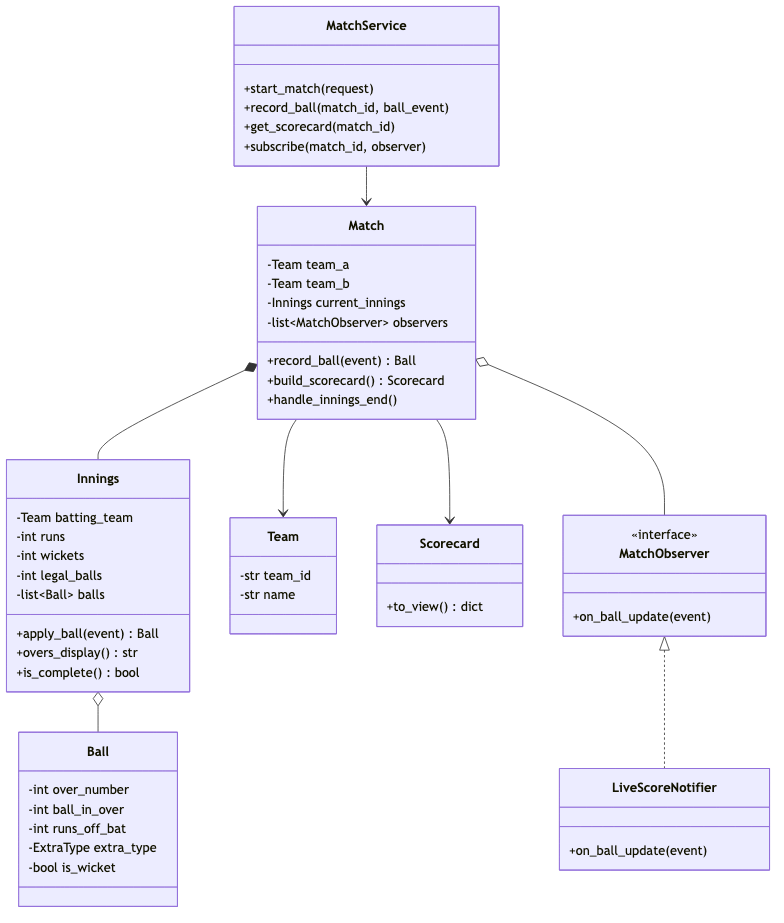

# Cricket Live Scoring (Cricinfo Style) — LLD (1-Hour Scope)

> **Focus:** Class design, scoring rules, observer pattern, schema — not full implementation  
> **Time budget:** 60 minutes

---

## Problem statement

Design a **live cricket scoring service** (Cricinfo-style): scorers **record each ball**, clients fetch a **scorecard**, live subscribers get **ball-by-ball updates**.

---

## Scope boundary

| In scope | Out of scope |
|----------|--------------|
| `MatchService`, `Match`, `Innings`, `Ball`, `Team`, `Scorecard` | Player batting/bowling stats |
| `record_ball` → runs/wickets/overs; `get_scorecard` | DRS, rain (D/L), Test cricket |
| `MatchObserver` / `LiveScoreNotifier` on ball update | WebSocket wiring (interface only) |
| Schema: `matches`, `innings`, `balls` | Microservices, Repository layer |
| Edge cases: last-ball wicket, wide/no-ball, innings end | |

**Opening line:** "`Match` owns innings; `Innings` applies scoring rules; `MatchService` persists; `Match` notifies observers per ball."

---

## Assumptions

```
- T20: 20 overs/innings, max 10 wickets; two innings (bat → chase)
- Wide/no-ball: add runs, NOT a legal delivery (over does not advance)
- Wicket on legal delivery counts; 6th legal ball completes the over
```

---

## Time plan (60 min)

| Min | Activity |
|-----|----------|
| 0–5 | Clarify format + extras |
| 5–20 | Class diagram |
| 20–30 | Schema |
| 30–50 | `record_ball` + edge cases |
| 50–60 | Observer + close |

---

## Class diagram



`MatchService` → `Match` → `Innings` → `Ball`; `Match` holds `Team`s, builds `Scorecard`, and owns `MatchObserver` list (`LiveScoreNotifier` impl).

---

## Class responsibilities

### `MatchService`

```python
matches: dict[str, Match] = {}

def start_match(self, team_a: Team, team_b: Team, overs: int) -> MatchView:
    match = Match(uuid4(), team_a, team_b, overs)
    match.start_first_innings(team_a, team_b)
    self.matches[match.match_id] = match
    self._persist_match(match)
    return match.to_view()

def record_ball(self, match_id: str, event: BallEvent) -> ScorecardView:
    match = self.matches[match_id]
    if match.status != MatchStatus.IN_PROGRESS:
        raise ScoringError(MATCH_NOT_IN_PROGRESS)
    ball = match.record_ball(event)
    self._persist_ball(match.current_innings, ball)
    self._update_innings_totals(match.current_innings)
    if match.is_innings_complete():
        match.handle_innings_end()
    return match.build_scorecard().to_view()

def get_scorecard(self, match_id: str) -> ScorecardView:
    return self.matches[match_id].build_scorecard().to_view()

def subscribe(self, match_id: str, observer: MatchObserver) -> None:
    self.matches[match_id].observers.append(observer)
```

---

### `Innings` — runs, wickets, overs

```python
def apply_ball(self, event: BallEvent) -> Ball:
    if self.is_complete():
        raise ScoringError(INNINGS_ALREADY_COMPLETE)
    is_legal = event.extra_type not in (ExtraType.WIDE, ExtraType.NO_BALL)
    self.runs += event.runs_off_bat + event.extra_runs
    if event.is_wicket and is_legal:
        self.wickets += 1
    over_number = self.legal_balls // 6 + 1
    ball_in_over = (self.legal_balls % 6) + 1 if is_legal else (self.legal_balls % 6 or 6)
    ball = Ball(over_number, ball_in_over, event.runs_off_bat,
                event.extra_type, event.extra_runs, event.is_wicket)
    self.balls.append(ball)
    if is_legal:
        self.legal_balls += 1
    return ball

def overs_display(self) -> str:
    return f"{self.legal_balls // 6}.{self.legal_balls % 6}"

def is_complete(self) -> bool:
    return self.wickets >= 10 or self.legal_balls >= self.max_overs * 6
```

---

### `Match` — lifecycle + observers

```python
def record_ball(self, event: BallEvent) -> Ball:
    ball = self.current_innings.apply_ball(event)
    for obs in self.observers:
        obs.on_ball_update(BallUpdateEvent(self.match_id, ball, self.current_innings))
    return ball

def handle_innings_end(self) -> None:
    if len(self.innings) == 1:
        self.status = MatchStatus.INNINGS_BREAK
        self.start_second_innings(self.team_b, self.team_a)
    else:
        self.status = MatchStatus.COMPLETED

def build_scorecard(self) -> Scorecard:
    return Scorecard.from_match(self)
```

---

### `Team`, `Ball`, `Scorecard`

```python
class Team:
    team_id: str
    name: str
    squad: list[str]          # player ids; expand later for stats

class Ball:
    over_number: int
    ball_in_over: int
    runs_off_bat: int
    extra_type: ExtraType     # NONE | WIDE | NO_BALL | BYE | LEG_BYE
    extra_runs: int
    is_wicket: bool

class Scorecard:
    def to_view(self) -> dict:
        return {
            "match_id": self.match_id,
            "innings": [{"team": i.batting_team.name, "runs": i.runs,
                         "wickets": i.wickets, "overs": i.overs_display()}
                        for i in self.innings_summaries],
            "target": self.chase_target,
        }
```

---

### `MatchObserver` / `LiveScoreNotifier`

```python
class MatchObserver(ABC):
    def on_ball_update(self, event: BallUpdateEvent) -> None: ...

class LiveScoreNotifier(MatchObserver):
    def on_ball_update(self, event: BallUpdateEvent) -> None:
        self.push_channel.broadcast(event.match_id, {
            "over": f"{event.ball.over_number}.{event.ball.ball_in_over}",
            "runs": event.innings.runs,
            "wickets": event.innings.wickets,
            "wicket": event.ball.is_wicket,
        })
```

---

## Enums

`MatchStatus`: SCHEDULED · IN_PROGRESS · INNINGS_BREAK · COMPLETED  
`ExtraType`: NONE · WIDE · NO_BALL · BYE · LEG_BYE  
`ErrorCode`: MATCH_NOT_IN_PROGRESS · INNINGS_ALREADY_COMPLETE

---

## Core flow (`record_ball`)

Scorer → `MatchService.record_ball` → `Match.record_ball` → `Innings.apply_ball` → persist → `MatchObserver.on_ball_update` → if innings complete, `handle_innings_end` → return `ScorecardView`.

---

## Schema (3 tables)

| Table | Key columns | Role |
|-------|-------------|------|
| `matches` | `match_id`, `team_a_id`, `team_b_id`, `overs_per_innings`, `status` | Match metadata |
| `innings` | `innings_id`, `match_id` FK, `total_runs`, `total_wickets`, `legal_balls` | Per-innings totals (denormalized) |
| `balls` | `ball_id`, `innings_id` FK, `over_number`, `ball_in_over`, `runs_off_bat`, `extra_type`, `extra_runs`, `is_wicket` | Append-only ball log |

`innings.legal_balls` denormalized for fast scorecard reads; `extra_type` on `balls` replays wides/no-balls correctly.

---

## API (minimal)

```
POST   /matches                  → { teamAId, teamBId, oversPerInnings }
POST   /matches/{id}/balls       → { runsOffBat, extraType, extraRuns, isWicket }
GET    /matches/{id}/scorecard
POST   /matches/{id}/innings/end
WS     /matches/{id}/live
```

---

## Edge cases (key for this question)

| Case | Behavior |
|------|----------|
| **Wide** | +runs; `legal_balls` unchanged; re-bowl same ball number |
| **No-ball** | +penalty + bat runs; not legal; over unchanged |
| **Wicket on 6th legal ball** | Wicket counts; over completes (`legal_balls % 6 == 0`) |
| **10 wickets** | `is_complete()`; reject further balls |
| **Overs done** | `legal_balls == max_overs * 6` ends innings |
| **Wide on last ball of over** | Illegal delivery — over does NOT advance |
| **Bye / leg-bye** | Legal delivery; over advances |
| **Chase** | `target = innings1.runs + 1`; early win if reached (mention) |

---

## Extensibility

New push channel → new `MatchObserver`. Player stats → `batsman_id`/`bowler_id` on `Ball`. Test cricket → drop `max_overs`, N innings.

---

## What to code (~10 min)

`Innings.apply_ball()` (wide/no-ball + legal counting), or `LiveScoreNotifier.on_ball_update()`.

---

## 30-second close

> "`Innings` owns ball math — wides/no-balls add runs but don't advance the over. `Match` notifies observers each ball. Innings ends at 10 wickets or overs exhausted. Schema: `matches` → `innings` → `balls`."

---

## Anti-patterns

- `len(balls)/6` for overs (ignores illegal deliveries)
- Notifying in `MatchService` instead of `Match`
- Balls accepted after innings complete
