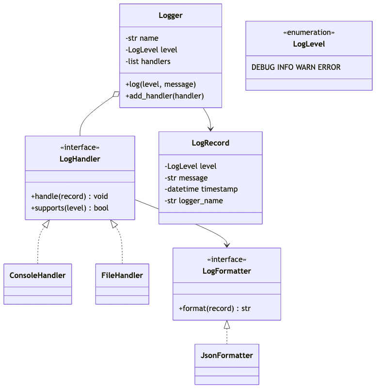
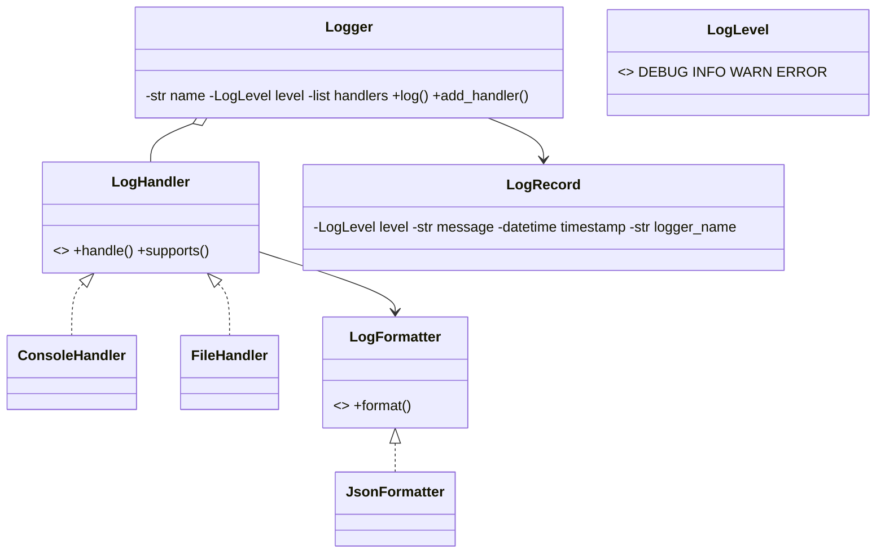
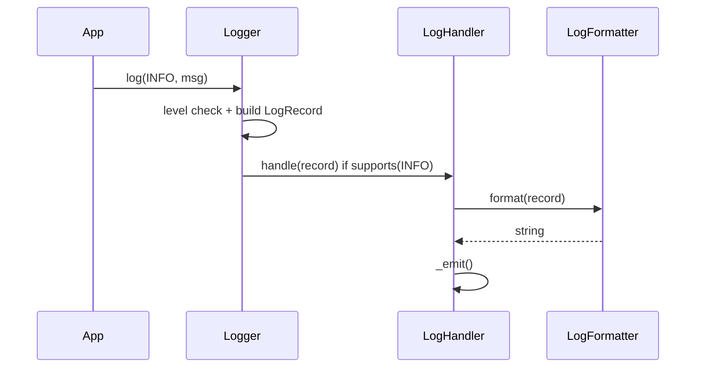

# Logger Manager — LLD (1-Hour Scope)

> **Focus:** Class design, extensibility, handler chain — not full implementation  
> **Time budget:** 60 minutes  
> **Inspiration:** log4j / Python `logging` module

---

## Problem statement

Design a **logging framework** where:

- Application code calls `logger.log(level, message)` on a named `Logger`
- Each logger fans out to **multiple handlers** (console, file, …)
- Each handler filters by **its own level**, formats via a **pluggable formatter**, then writes output
- Format and destination are **independently extensible**

---

## Scope boundary

### In scope

| Item | Notes |
|------|-------|
| `Logger`, `LogRecord`, `LogLevel` | Core domain objects |
| `LogHandler` + `ConsoleHandler`, `FileHandler` | Output destinations |
| `LogFormatter` + `JsonFormatter` | Plain-text is trivial variant |
| Handler chain on `logger.log()` | Filter → format → output per handler |
| `LoggerFactory` (optional) | Named logger registry (Singleton) |
| Level filtering + multiple handlers | Logger-level and handler-level gates |

### Out of scope (mention only if asked)

- Async queue / background worker, log rotation, remote appenders
- MDC / correlation IDs, config hot-reload

**Opening line:**

> "`Logger` owns handlers; each `LogHandler` filters by level, formats via `LogFormatter` Strategy, then writes."

---

## Assumptions

```
- Levels ordered: DEBUG < INFO < WARN < ERROR (numeric comparison)
- Emit only if record.level >= logger.level AND handler.supports(level)
- Each handler owns its formatter; handlers synchronous; no DB schema
```

---

## Time plan (60 min)

| Min | Activity |
|-----|----------|
| 0–5 | Clarify + assumptions |
| 5–20 | Class diagram + responsibilities |
| 20–35 | `log()` chain + level filtering |
| 35–50 | Pseudocode + core flow |
| 50–60 | Edge cases, patterns, close |

---

## Class diagram



<details>
<summary>Mermaid source</summary>



</details>

---

## Class responsibilities

### `LogLevel` — `DEBUG=10, INFO=20, WARN=30, ERROR=40`

### `LogRecord` — `level`, `message`, `timestamp`, `logger_name` (immutable, built per call)

### `Logger` — entry point

```python
class Logger:
    def __init__(self, name: str, level: LogLevel = LogLevel.INFO):
        self.name, self.level = name, level
        self.handlers: list[LogHandler] = []

    def log(self, level: LogLevel, message: str) -> None:
        if level.value < self.level.value:
            return
        record = LogRecord(level, message, datetime.now(), self.name)
        for handler in self.handlers:
            if handler.supports(level):
                handler.handle(record)
```

### `LogHandler` — Chain of Responsibility

```python
class LogHandler(ABC):
    def __init__(self, level: LogLevel, formatter: LogFormatter):
        self.level, self.formatter = level, formatter

    def supports(self, level: LogLevel) -> bool:
        return level.value >= self.level.value

    def handle(self, record: LogRecord) -> None:
        self._emit(self.formatter.format(record))

    @abstractmethod
    def _emit(self, output: str) -> None: ...

class ConsoleHandler(LogHandler):
    def _emit(self, output: str) -> None:
        print(output)

class FileHandler(LogHandler):
    def __init__(self, level, formatter, file_path: str):
        super().__init__(level, formatter)
        self.file_path = file_path

    def _emit(self, output: str) -> None:
        with open(self.file_path, "a") as f:
            f.write(output + "\n")
```

### `LogFormatter` — Strategy

```python
class LogFormatter(ABC):
    @abstractmethod
    def format(self, record: LogRecord) -> str: ...

class JsonFormatter(LogFormatter):
    def format(self, record: LogRecord) -> str:
        return json.dumps({
            "level": record.level.name, "message": record.message,
            "timestamp": record.timestamp.isoformat(), "logger": record.logger_name,
        })
```

Plain-text: `f"[{ts}] {level} {name}: {msg}"`

### `LoggerFactory` — optional Singleton

One `Logger` per name via `get_logger(name)`; configure handlers at startup.

---

## Core flow

**Chain:** `logger.log()` → logger filter → `LogRecord` → each handler: `supports()` → `format()` → `_emit()`.



---

## Design patterns

| Pattern | Where |
|---------|-------|
| **Chain of Responsibility** | `Logger` fans out to handler list — add/remove without changing caller |
| **Strategy** | `LogFormatter` swappable per handler |
| **Singleton** (optional) | `LoggerFactory` — one named-logger registry per process |

---

## Edge cases (know these 6)

| Case | Behavior |
|------|----------|
| Below logger level | Drop silently |
| Below handler level | Skip handler; others still run |
| Zero handlers | No-op after level check |
| Handlers at different levels | Console=DEBUG, File=ERROR → file sees subset |
| Multiple handlers | Each calls own `format()` independently |
| File write failure | Catch `IOError`, stderr fallback (mention if asked) |

**Async:** `QueueHandler` enqueues formatted strings; worker thread calls real `_emit()` — `Logger.log()` non-blocking.

---

## Extensibility

| Question | Answer |
|----------|--------|
| New output (syslog)? | New `LogHandler` subclass |
| New format? | New `LogFormatter` on handler |
| Parent logger propagation? | Walk parent chain in `log()` (if asked) |

---

## SOLID (say 3)

| Principle | Application |
|-----------|-------------|
| **S** | Logger orchestrates; Handler I/O; Formatter presentation |
| **O** | New handler/formatter → new class |
| **D** | Logger depends on `LogHandler` interface |

---

## What to code if asked (~10 min)

`Logger.log` or `LogHandler.handle` + `ConsoleHandler._emit` — not full stack.

---

## 30-second close

> "log4j-style: `Logger.log()` → `LogRecord` → handlers filter, format (Strategy), emit (Chain of Responsibility). Optional Singleton `LoggerFactory`. No DB. Async = queue around `_emit()`."

---

## Anti-patterns

- `if channel == CONSOLE` in `Logger.log()`
- Formatting in `Logger` instead of `LogFormatter`
- One global level, no per-handler control

---

## References

Python `logging`, Apache log4j
