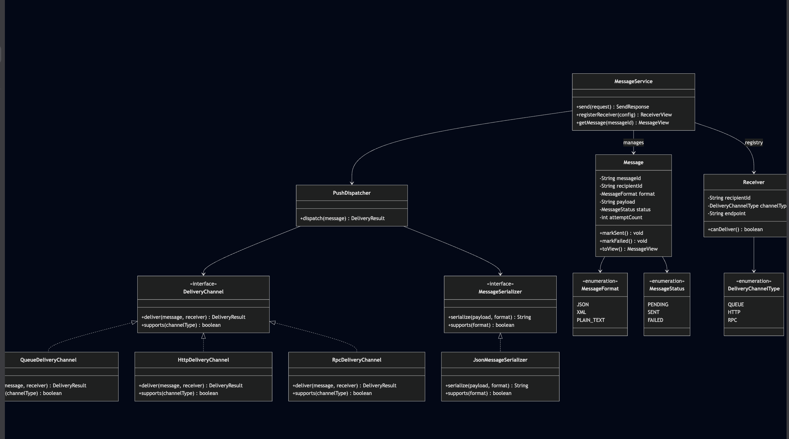
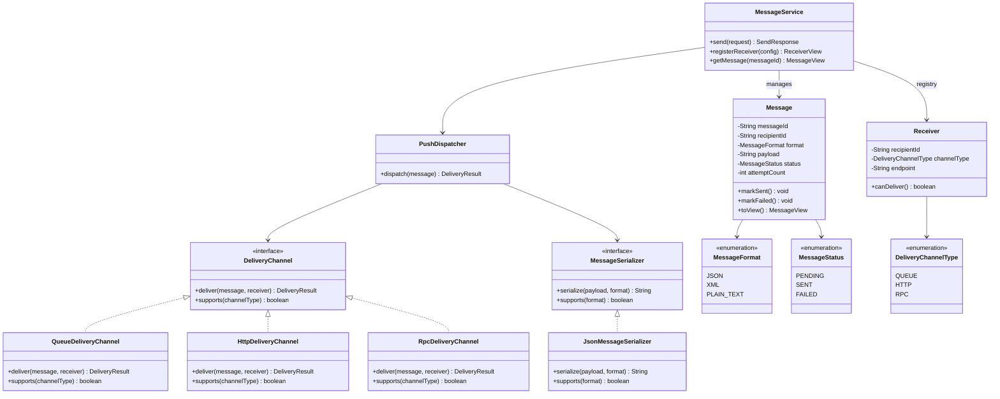
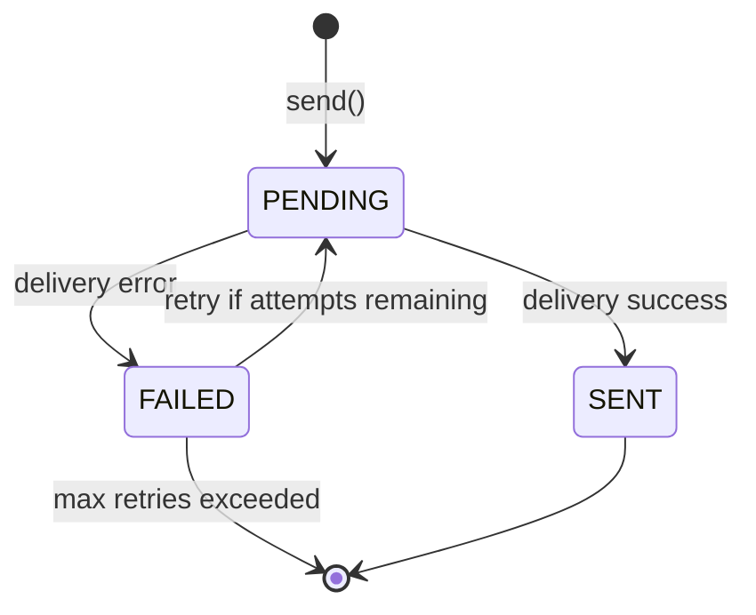
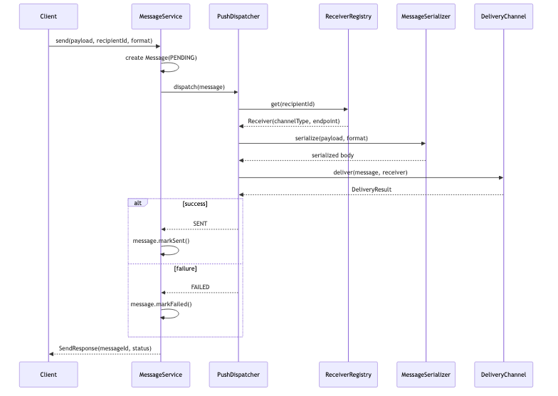
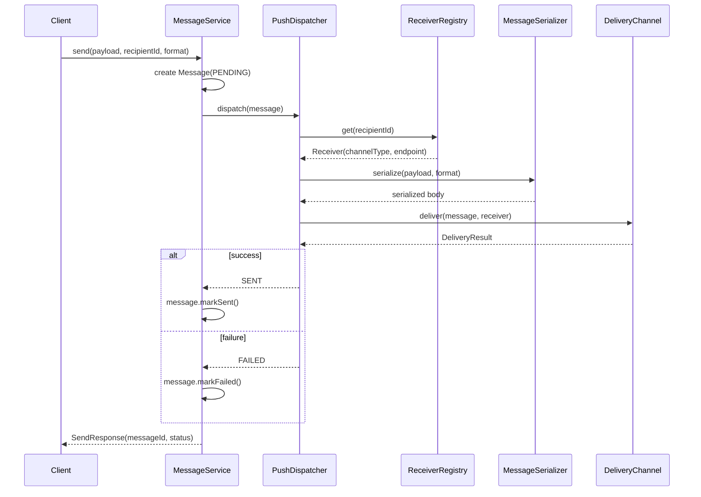
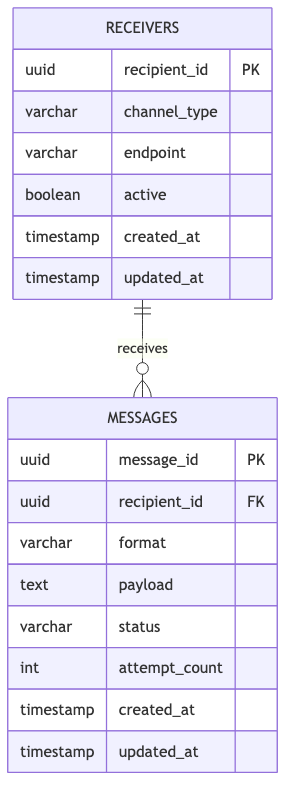
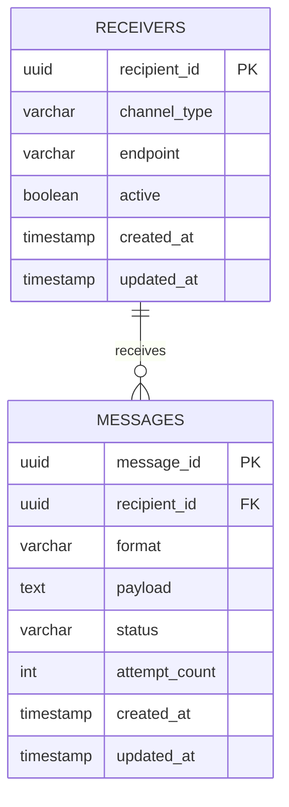

# Push Messaging System — LLD (1-Hour Scope)

> **Company:** Observe.AI (reported LLD question)  
> **Focus:** Class design, extensibility, schema — not full implementation  
> **Time budget:** 60 minutes

---

## Problem statement

Design a **push-based messaging system** where:

- A **sender server** accepts messages and pushes them to **receiving servers**
- Receivers do **not** poll — the sender initiates delivery
- Messages can be in **multiple formats** (JSON, XML, plain text)
- Delivery can happen via **multiple channels** (Queue, HTTP, RPC)

---

## Scope boundary

### In scope

| Item | Notes |
|------|-------|
| Send message to a registered recipient | Core flow |
| Register receiver with channel + endpoint | Receiver config |
| 6 classes + 3 enums | Enough OOP without sprawl |
| 2-table schema | `receivers` + `messages` |
| Push dispatch + delivery result | Must-have behavior |
| `DeliveryChannel` + `MessageSerializer` | Two extensibility hooks |

### Out of scope (mention only if asked)

- Kafka / SQS / gRPC wire implementation
- Dead-letter queue, circuit breaker, rate limiting
- Fan-out (one message → many recipients)
- Format conversion (JSON → XML)
- Separate `Repository`, `Factory`, retry scheduler classes
- Auth, encryption, message signing

**Opening line:**

> "I'll design the sender-side push flow — register receiver, send message, route to the right delivery channel and format. I'll skip broker wiring and retry infrastructure unless we have time."

---

## Assumptions

```
- Sender server is authoritative — it owns outbound message state
- Each recipientId maps to exactly one delivery channel + endpoint
- Push = sender calls deliver() on the channel (not receiver polling)
- Message format is set at send time (JSON, XML, PLAIN_TEXT)
- Delivery is synchronous in interview scope (await result, update status)
- Persist messages + receivers; active lookups can live in memory
```

---

## Time plan (60 min)

| Min | Activity |
|-----|----------|
| 0–5 | Clarify + write assumptions |
| 5–20 | Class diagram + responsibility per class |
| 20–30 | Schema (2 tables) + rationale |
| 30–45 | Push flow + edge cases |
| 45–55 | Extensibility (new channel, new format, retry) |
| 55–60 | Close: trade-offs + production next steps |

---

## Class diagram



<details>
<summary>Mermaid source</summary>



</details>

---

## Class responsibilities

### `Message` — aggregate root (spend most time here)

**Owns:** payload, format, recipient, delivery status, attempt count.

All status transitions go through this class.

```
on creation:
  status = PENDING
  attemptCount = 0

markSent():
  status = SENT

markFailed():
  attemptCount++
  status = FAILED (or PENDING if retry allowed)
```

**Does NOT:** know HTTP vs Queue details — that is `PushDispatcher`'s job.

---

### `PushDispatcher` — push orchestration

**Owns:** routing a message to the correct serializer + delivery channel.

```python
def dispatch(self, message: Message) -> DeliveryResult:
    receiver = self.registry.get(message.recipient_id)
    if receiver is None:
        raise DeliveryError(RECEIVER_NOT_FOUND)
    if not receiver.can_deliver():
        raise DeliveryError(RECEIVER_INACTIVE)

    serializer = self._find_serializer(message.format)
    body = serializer.serialize(message.payload, message.format)

    channel = self._find_channel(receiver.channel_type)
    result = channel.deliver(message.with_body(body), receiver)

    if result.success:
        message.mark_sent()
    else:
        message.mark_failed()

    return result
```

**Interview signal:** sender **pushes** by calling `channel.deliver()` — receiver never pulls.

---

### `DeliveryChannel` — extensibility hook #1 (Strategy)

```python
from abc import ABC, abstractmethod

class DeliveryChannel(ABC):
    @abstractmethod
    def supports(self, channel_type: DeliveryChannelType) -> bool:
        ...

    @abstractmethod
    def deliver(self, message: Message, receiver: Receiver) -> DeliveryResult:
        ...
```

| Implementation | `endpoint` meaning |
|----------------|-------------------|
| `QueueDeliveryChannel` | queue/topic name |
| `HttpDeliveryChannel` | webhook URL (POST body) |
| `RpcDeliveryChannel` | service method identifier |

**New channel answer:**

> "Add `WebhookDeliveryChannel(DeliveryChannel)` — zero changes to `Message` or `PushDispatcher` loop."

---

### `MessageSerializer` — extensibility hook #2 (Strategy)

```python
class MessageSerializer(ABC):
    @abstractmethod
    def supports(self, fmt: MessageFormat) -> bool:
        ...

    @abstractmethod
    def serialize(self, payload: str, fmt: MessageFormat) -> str:
        ...
```

| Implementation | Handles |
|----------------|---------|
| `JsonMessageSerializer` | JSON |
| `XmlMessageSerializer` | XML |
| `PlainTextSerializer` | PLAIN_TEXT |

`PushDispatcher` picks serializer by `message.format` — same pattern as delivery channels.

---

### `Receiver` — delivery target config

```
recipient_id: str
channel_type: DeliveryChannelType  # QUEUE | HTTP | RPC
endpoint:     str                  # queue name, URL, or RPC target
active:       bool
```

Registered once; looked up on every `send()`.

---

### `MessageService` — thin orchestration

```python
receivers: dict[str, Receiver] = {}
messages: dict[str, Message] = {}

def register_receiver(self, config: ReceiverConfig) -> ReceiverView:
    receiver = Receiver(**config)
    self.receivers[receiver.recipient_id] = receiver
    self._save(receiver)
    return receiver.to_view()

def send(self, request: SendRequest) -> SendResponse:
    message = Message(
        message_id=uuid4(),
        recipient_id=request.recipient_id,
        format=request.format,
        payload=request.payload,
        status=MessageStatus.PENDING,
    )
    self.messages[message.message_id] = message
    result = self.dispatcher.dispatch(message)
    self._save(message)
    return SendResponse(message_id=message.message_id, status=message.status)

def get_message(self, message_id: str) -> MessageView:
    return self.messages[message_id].to_view()
```

**Rule:** `MessageService` never implements delivery logic — only registry lookup + persist.

---

### Registry & message storage (by `recipientId` / `messageId`)

#### Layer 1 — In memory (interview scope)

| Map | Key | Value |
|-----|-----|-------|
| `receivers` | `recipient_id` | `Receiver` |
| `messages` | `message_id` | `Message` |

| Operation | Lookup |
|-----------|--------|
| `register_receiver()` | `receivers[recipient_id] = receiver` |
| `send()` | `receivers[recipient_id]` then `messages[message_id] = message` |
| `get_message()` | `messages[message_id]` |

#### Layer 2 — Database (persistence)

| Table | PK | Role |
|-------|-----|------|
| `receivers` | `recipient_id` | Channel type + endpoint per recipient |
| `messages` | `message_id` | Outbound message + delivery status |

| When | What gets written |
|------|-------------------|
| `registerReceiver()` | Insert/update `receivers` row |
| `send()` | Insert `messages` row (`status=PENDING`) |
| After dispatch | Update `messages` (`status`, `attempt_count`) |

#### Read path

```
send(recipient_id, ...)
  → receivers[recipient_id]        # who to deliver to
  → create Message(message_id)
  → push_dispatcher.dispatch(message)
  → messages[message_id] = message
  → save(message)
```

**Interview line:**

> "`receivers` is indexed by `recipientId` for routing. `messages` is indexed by `messageId` for status tracking. Push dispatch reads receiver config, then writes delivery outcome back to the message."

---

### Response objects (minimal)

**`SendResponse`:**

```
messageId, status, errorCode?
```

**`MessageView`:**

```
messageId, recipientId, format, status, attemptCount, createdAt
```

**`ReceiverView`:**

```
recipientId, channelType, endpoint, active
```

**`DeliveryResult`:**

```
success, errorCode?, channelType
```

---

## Enums

### `MessageFormat`

```
JSON, XML, PLAIN_TEXT
```

### `DeliveryChannelType`

```
QUEUE, HTTP, RPC
```

### `MessageStatus`

```
PENDING   → accepted, not yet delivered
SENT      → push succeeded
FAILED    → push failed (terminal or retryable)
```

### `ErrorCode` (optional)

```
NONE, RECEIVER_NOT_FOUND, RECEIVER_INACTIVE,
UNSUPPORTED_FORMAT, UNSUPPORTED_CHANNEL, DELIVERY_FAILED
```

---

## State machine


<details>
<summary>Mermaid source</summary>



</details>

---

## Core flow



<details>
<summary>Mermaid source</summary>



</details>

---

## Schema (2 tables)



<details>
<summary>Mermaid source</summary>



</details>

| Design choice | Rationale |
|---------------|-----------|
| `receivers.recipient_id` = registry key | Same ID used in send API and in-memory map |
| `messages.message_id` = tracking key | Status lookups and audit by messageId |
| `channel_type` + `endpoint` on receiver | Push routing without hardcoding delivery logic |
| `payload` on message | Sender-owned content; format stored separately |
| No `delivery_attempts` table | Overkill for 1-hour scope; `attempt_count` on message is enough |

---

## API (minimal)

```
POST   /receivers                   → register receiver
POST   /messages                    → { recipientId, format, payload }
GET    /messages/{messageId}        → delivery status
```

---

## Edge cases (know these 6)

| Case | Behavior |
|------|----------|
| Unknown `recipientId` | Reject — `RECEIVER_NOT_FOUND` |
| Inactive receiver | Reject — `RECEIVER_INACTIVE` |
| Unsupported format | Reject — `UNSUPPORTED_FORMAT` |
| No channel for receiver type | Reject — `UNSUPPORTED_CHANNEL` |
| HTTP/RPC endpoint down | `markFailed()`, return `DELIVERY_FAILED` |
| Duplicate send with same `messageId` | Idempotent return existing status (mention if asked) |

**Concurrency (one sentence):**

> Lock on `messageId` during dispatch so a retry and a duplicate send can't race on status updates.

---

## Extensibility (3 bullets only)

| Question | Answer |
|----------|--------|
| New delivery channel (e.g. email)? | New `DeliveryChannel` impl + register in dispatcher list |
| New message format (e.g. Protobuf)? | New `MessageSerializer` impl |
| Async retry on failure? | Background worker re-calls `dispatch()` — `Message` status machine unchanged |

---

## SOLID (say 3, not 5)

| Principle | Application |
|-----------|-------------|
| **S** | `Message` = state; `PushDispatcher` = routing; channels = transport |
| **O** | New channel/format → new Strategy class, not edits to dispatcher |
| **D** | `PushDispatcher` depends on `DeliveryChannel` + `MessageSerializer` interfaces |

---

## What to code if asked (~10 min)

Pick **one** method only:

- `PushDispatcher.dispatch`, or
- `HttpDeliveryChannel.deliver` (mock HTTP call)

Do not implement the full stack.

---

## 30-second close

> "I scoped to sender-side push: register receivers by `recipientId`, send messages by `messageId`, route through `PushDispatcher` to the right `DeliveryChannel` and `MessageSerializer`. Two tables — `receivers` for routing config and `messages` for status. New transport or format means a new Strategy class, not a rewrite of dispatch logic."

---

## Anti-patterns to avoid

- 15+ classes in a 1-hour round
- HLD (Kafka cluster design, API gateway topology)
- `Message` knowing HTTP headers or queue SDK details
- if/else chain on channel type inside `PushDispatcher` instead of Strategy list
- Polling-based delivery when the problem asks for push

---

## Push model confirmation

This design **is** push-based:

| Aspect | Covered |
|--------|---------|
| Sender initiates delivery | `PushDispatcher.dispatch()` calls `channel.deliver()` |
| Receiver config, not pull | `Receiver` stores endpoint; no `fetchMessages()` API |
| Multiple formats | `MessageSerializer` per format |
| Multiple channels | `DeliveryChannel` per transport |
| Outbound tracking | `Message.status` lifecycle |

**Deferred:** actual broker/client SDK wiring (mention as production adapters behind `DeliveryChannel`).

---

## References

- Observe.AI reported LLD — push messaging with Queue, HTTP, RPC delivery
