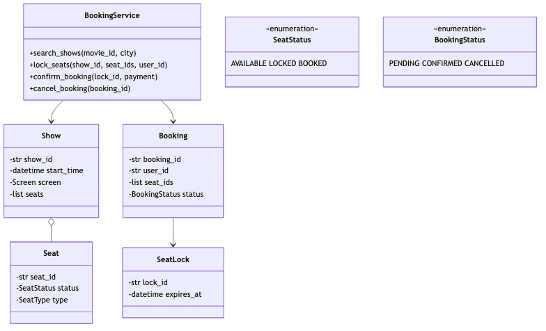

# Movie Ticket Booking — LLD (1-Hour Scope)

> **Style:** BookMyShow-like booking  
> **Focus:** Class design, concurrency, seat locking with TTL — not full payment gateway  
> **Time budget:** 60 minutes

---

## Problem statement

Design a **movie ticket booking system** where users search shows, select seats, **lock** them temporarily, then **confirm** after payment — with no double booking under concurrency.

---

## Scope boundary

### In scope

| Item | Notes |
|------|-------|
| `BookingService`, `Show`, `Seat`, `Booking`, `SeatLock` | Core domain |
| `lock_seats` → `confirm_booking` | Two-phase booking |
| `SeatStatus` | `AVAILABLE` / `LOCKED` / `BOOKED` (State pattern) |
| Per-`show_id` mutex | Serialize seat mutations per show |
| TTL on `SeatLock` | Auto-release expired locks |
| 5-table schema | `movies`, `shows`, `seats`, `bookings`, `seat_locks` |

### Out of scope (mention only if asked)

Payment gateway, dynamic pricing, waitlist, admin UI, distributed cross-region locks

**Opening line:**

> "Two-phase booking: `lock_seats` holds seats with TTL; `confirm_booking` converts to a booking. State pattern for seat transitions; mutex per `show_id` for concurrency."

---

## Assumptions

```
- Seats pre-seeded per show; lock TTL = 10 min
- Partial lock failure → rollback entire request (all-or-nothing)
- Expired locks released lazily on next access + optional background sweeper
```

---

## Time plan (60 min)

| Min | Activity |
|-----|----------|
| 0–5 | Clarify + assumptions |
| 5–20 | Class diagram + State pattern |
| 20–30 | Schema (5 tables) |
| 30–45 | `lock_seats` + `confirm_booking` |
| 45–55 | Edge cases |
| 55–60 | Close |

---

## Class diagram



---

## State pattern — seat transitions

```
AVAILABLE --lock_seats()--> LOCKED --confirm_booking()--> BOOKED
LOCKED --expiry/release--> AVAILABLE
BOOKED --cancel_booking()--> AVAILABLE  (optional)
```

```python
from abc import ABC, abstractmethod

class SeatState(ABC):
    @abstractmethod
    def lock(self, seat): ...
    @abstractmethod
    def confirm(self, seat): ...
    @abstractmethod
    def release(self, seat): ...

class AvailableState(SeatState):
    def lock(self, seat):
        seat._state, seat.status = LockedState(), SeatStatus.LOCKED
    def confirm(self, seat): raise InvalidTransition("cannot confirm AVAILABLE")
    def release(self, seat): pass

class LockedState(SeatState):
    def lock(self, seat): raise SeatUnavailable("already locked")
    def confirm(self, seat):
        seat._state, seat.status = BookedState(), SeatStatus.BOOKED
    def release(self, seat):
        seat._state, seat.status = AvailableState(), SeatStatus.AVAILABLE

class BookedState(SeatState):
    def lock(self, seat): raise SeatUnavailable("already booked")
    def confirm(self, seat): raise InvalidTransition("already booked")
    def release(self, seat):
        seat._state, seat.status = AvailableState(), SeatStatus.AVAILABLE

class Seat:
    def __init__(self, seat_id: str):
        self.seat_id = seat_id
        self._state = AvailableState()
        self.status = SeatStatus.AVAILABLE
    def lock(self): self._state.lock(self)
    def confirm(self): self._state.confirm(self)
    def release(self): self._state.release(self)
```

---

## Concurrency — lock per `show_id`

```python
from threading import Lock
from collections import defaultdict

class ShowLockRegistry:
    def __init__(self):
        self._locks: dict[str, Lock] = defaultdict(Lock)
    def for_show(self, show_id: str) -> Lock:
        return self._locks[show_id]
```

Two shows book in parallel; only seats within the same show contend.

---

## `SeatLock` with TTL

```python
from dataclasses import dataclass
from datetime import datetime, timedelta
import uuid

LOCK_TTL = timedelta(minutes=10)

@dataclass
class SeatLock:
    lock_id: str
    show_id: str
    user_id: str
    seat_ids: list[str]
    expires_at: datetime

    def is_expired(self) -> bool:
        return datetime.utcnow() >= self.expires_at

    @staticmethod
    def create(show_id, user_id, seat_ids) -> "SeatLock":
        return SeatLock(str(uuid.uuid4()), show_id, user_id, seat_ids,
                        datetime.utcnow() + LOCK_TTL)
```

---

## `BookingService` — lock → confirm

```python
class BookingService:
    def __init__(self, show_repo, lock_repo, booking_repo):
        self._shows, self._locks, self._bookings = show_repo, lock_repo, booking_repo
        self._show_locks = ShowLockRegistry()

    def lock_seats(self, show_id: str, seat_ids: list[str], user_id: str) -> SeatLock:
        with self._show_locks.for_show(show_id):
            show = self._shows.get(show_id)
            self._purge_expired_locks(show)
            locked: list[Seat] = []
            try:
                for seat_id in seat_ids:
                    seat = show.get_seat(seat_id)
                    if seat.status != SeatStatus.AVAILABLE:
                        raise SeatUnavailable(seat_id)
                    seat.lock()
                    locked.append(seat)
                seat_lock = SeatLock.create(show_id, user_id, seat_ids)
                self._locks.save(seat_lock)
                self._shows.save(show)
                return seat_lock
            except Exception:
                for seat in locked: seat.release()
                raise

    def confirm_booking(self, lock_id: str, payment: Payment) -> Booking:
        lock = self._locks.get(lock_id)
        if lock.is_expired():
            self._release_lock(lock); raise LockExpired(lock_id)
        if not payment.success:
            raise PaymentFailed()

        with self._show_locks.for_show(lock.show_id):
            lock = self._locks.get(lock_id)
            if lock.is_expired():
                self._release_lock(lock); raise LockExpired(lock_id)
            show = self._shows.get(lock.show_id)
            for seat_id in lock.seat_ids:
                seat = show.get_seat(seat_id)
                if seat.status != SeatStatus.LOCKED:
                    raise SeatUnavailable(seat_id)
                seat.confirm()
            booking = Booking(str(uuid.uuid4()), lock.user_id, lock.show_id,
                              lock.seat_ids, BookingStatus.CONFIRMED)
            self._bookings.save(booking)
            self._locks.delete(lock_id)
            self._shows.save(show)
            return booking

    def _release_lock(self, lock: SeatLock) -> None:
        show = self._shows.get(lock.show_id)
        for seat_id in lock.seat_ids:
            seat = show.get_seat(seat_id)
            if seat.status == SeatStatus.LOCKED: seat.release()
        self._locks.delete(lock.lock_id)
        self._shows.save(show)

    def _purge_expired_locks(self, show: Show) -> None:
        for lock in self._locks.find_expired_for_show(show.show_id):
            self._release_lock(lock)
```

---

## Core flow

```
User → lock_seats(showId, seatIds)
  → acquire show mutex → purge expired locks
  → for each seat: AVAILABLE → LOCKED (rollback all on any failure)
  → save SeatLock(TTL) → return lockId

User → confirm_booking(lockId, payment)
  → if expired: release seats → LOCK_EXPIRED
  → acquire show mutex → re-validate LOCKED
  → LOCKED → BOOKED → save Booking → delete lock
```

---

## Schema (5 tables)

```
movies        → movie_id, title, duration_mins, language
shows         → show_id, movie_id FK, theatre_id, city, start_time, base_price
seats         → seat_id, show_id FK, row_label, seat_number, seat_type, status
seat_locks    → lock_id, show_id FK, user_id, seat_ids (JSON), expires_at
bookings      → booking_id, show_id FK, user_id, status, total_amount, created_at
booking_seats → booking_id FK, seat_id FK   (junction for confirmed seats)
```

| Design choice | Rationale |
|---------------|-----------|
| `seat_locks` separate from `bookings` | Lock is ephemeral; booking is durable |
| `seats.status` denormalized | Fast availability check under show mutex |
| Index `(show_id, status)` | Fast available-seat query |

---

## API (minimal)

```
GET    /shows?movieId=&city=
POST   /shows/{showId}/lock          → { seatIds[], userId }
POST   /bookings/confirm            → { lockId, paymentToken }
GET    /shows/{showId}/seats
DELETE /bookings/{bookingId}
```

---

## Edge cases (know these 6)

| Case | Behavior |
|------|----------|
| **Lock expiry** before confirm | `_release_lock()` → `AVAILABLE`; return `LOCK_EXPIRED` |
| **Double book** | Show mutex + `status == AVAILABLE` check; second user fails |
| **Partial seat failure** | Rollback all seats locked in this attempt |
| Confirm when seat no longer locked | Re-check under mutex → `SeatUnavailable` |
| **Duplicate confirm** | Lock deleted after first confirm → `LockNotFound` |
| Payment failure | No seat mutation; lock stays until TTL |

---

## Extensibility & SOLID

| Question / Principle | Answer |
|----------------------|--------|
| VIP pricing? | `SeatType` + pricing on `Show` |
| Extend lock? | `extend_lock(lock_id)` if same user, not expired |
| Scale? | Shard by city; mutex stays per show |
| **S** | `SeatState` = transitions; `BookingService` = orchestration |
| **O** | New seat type → enum + pricing, not lock logic |
| **D** | Service depends on repo interfaces |

---

## What to code if asked (~10 min)

Pick one: `lock_seats()` with rollback · `Seat` state classes · `confirm_booking()` with expiry + mutex

---

## 30-second close

> "`lock_seats` moves seats `AVAILABLE → LOCKED` under a per-show mutex and stores a TTL `SeatLock`. `confirm_booking` validates payment and lock, then `LOCKED → BOOKED`. State pattern owns transitions; partial failures roll back; expired locks release seats."

**Anti-patterns:** no TTL · global system lock · confirm without re-check under mutex · lock only in memory

---

## References

- BookMyShow-style two-phase seat booking (common LLD interview topic)
