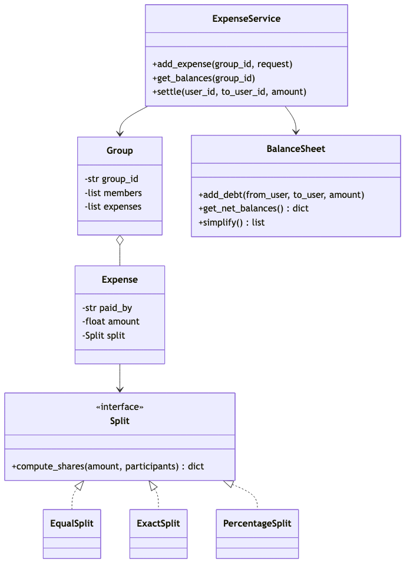
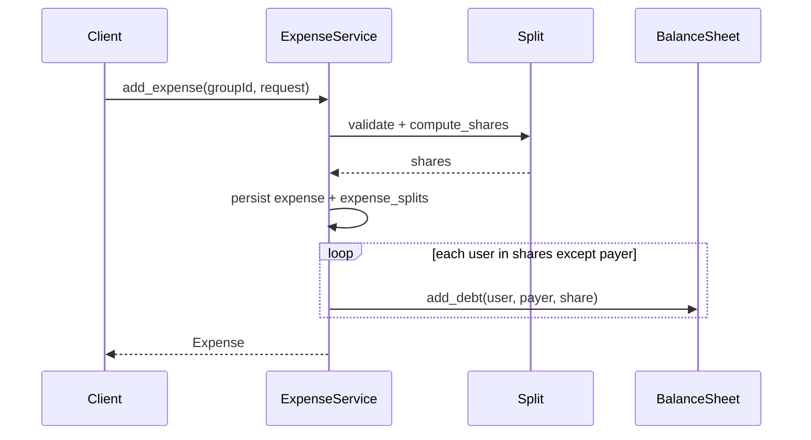
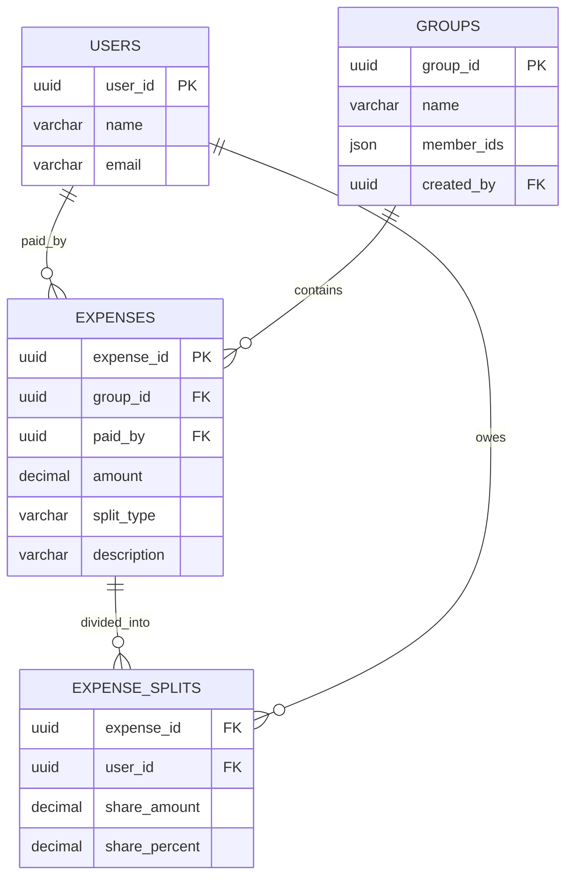

# Splitwise Expense Sharing — LLD (1-Hour Scope)

> **Context:** Classic LLD / Machine Coding interview  
> **Focus:** Class design, split strategies, balance sheet, schema — not full implementation  
> **Time budget:** 60 minutes

---

## Problem statement

Design a **Splitwise-like expense sharing** system where users in a group can:

- Add expenses with **split types** (equal, exact amounts, percentage)
- Track **who owes whom** via a balance sheet
- **Simplify debts** to minimize transactions
- **Settle up** between two users

---

## Scope boundary

### In scope

| Item | Notes |
|------|-------|
| `ExpenseService` | Add expense, get balances, settle |
| `Group`, `Expense` | Group membership + expense records |
| `Split` interface | Strategy: `EqualSplit`, `ExactSplit`, `PercentageSplit` |
| `BalanceSheet` | Net balances + `simplify()` |
| `add_expense` | Validates split → updates balance sheet |
| 4-table schema | users, groups, expenses, expense_splits |
| Edge cases | Payer not in split, exact-sum validation, settle up |

### Out of scope (mention only if asked)

Multi-currency, recurring expenses, notifications, friend graph outside groups.

**Opening line:**

> "`Split` is a Strategy for computing shares. `add_expense` validates, persists, then updates `BalanceSheet`. Debt simplification is a read-time transform on net balances."

---

## Assumptions

```
- Single currency; round to cents; ±0.01 tolerance on validation
- One group context per balance query
- Payer may or may not be in participant list
- Exact split: sum(shares) == amount; Percentage: sum(percents) == 100
```

---

## Time plan (60 min)

| Min | Activity |
|-----|----------|
| 0–5 | Clarify + assumptions |
| 5–20 | Class diagram + Split strategy |
| 20–30 | Schema (4 tables) |
| 30–45 | `add_expense` + BalanceSheet |
| 45–55 | Simplify debts + edge cases |
| 55–60 | Close |

---

## Class diagram



<details>
<summary>Mermaid source</summary>

See `./diagrams/splitwise-class-diagram.mmd`.

</details>

---

## Class responsibilities

### `Split` — Strategy interface

`ExpenseService` never branches on split type; factory injects the right impl.

```python
class Split(ABC):
    @abstractmethod
    def validate(self, amount: float, participants: list[str]) -> None: ...
    @abstractmethod
    def compute_shares(self, amount: float, participants: list[str]) -> dict[str, float]: ...
```

| Implementation | Logic |
|----------------|-------|
| `EqualSplit` | `amount / n` per user; first user absorbs rounding remainder |
| `ExactSplit` | Pre-set `user → amount`; reject if sum ≠ amount |
| `PercentageSplit` | Pre-set `user → percent`; reject if sum ≠ 100 |

```python
class ExactSplit(Split):
    def __init__(self, amounts: dict[str, float]):
        self._amounts = amounts

    def validate(self, amount, participants):
        if set(self._amounts) != set(participants):
            raise ValueError("PARTICIPANT_MISMATCH")
        if abs(sum(self._amounts.values()) - amount) > 0.01:
            raise ValueError("EXACT_SUM_MISMATCH")

    def compute_shares(self, amount, participants):
        return dict(self._amounts)
```

**New split type:** add `ShareSplit(Split)` + factory case — service loop unchanged.

---

### `BalanceSheet` — pairwise debts

Directed map `balances[from][to] = amount owed`. Offset reverse edges on `add_debt`.

```python
class BalanceSheet:
    def add_debt(self, from_user, to_user, amount):
        if from_user == to_user or amount <= 0: return
        self._balances[from_user][to_user] += amount
        # net pairwise offset against reverse direction
        ...

    def settle(self, from_user, to_user, amount):
        self.add_debt(from_user, to_user, -amount)

    def get_net_balances(self) -> dict[str, float]:
        # debtor −= amt, creditor += amt across all edges
        ...

    def simplify(self) -> list[tuple[str, str, float]]:
        """Greedy: match max debtor to max creditor on net balances."""
        debtors = sorted([(u, -b) for u, b in nets.items() if b < 0], key=lambda x: -x[1])
        creditors = sorted([(u, b) for u, b in nets.items() if b > 0], key=lambda x: -x[1])
        # two-pointer: pay = min(d_amt, c_amt); append (debtor, creditor, pay)
        ...
```

---

### `ExpenseService` — `add_expense` updates balance sheet

```python
def add_expense(self, group_id: str, request: AddExpenseRequest) -> Expense:
    group = self._get_group(group_id)
    split = self._split_factory.create(request.split_type, request.split_config)
    split.validate(request.amount, request.participants)
    shares = split.compute_shares(request.amount, request.participants)

    expense = Expense(paid_by=request.paid_by, amount=request.amount, split=split, shares=shares)
    group.add_expense(expense)
    self._persist_expense(group_id, expense, shares)

    sheet = self._balance_sheets[group_id]
    for user, share in shares.items():
        if user != request.paid_by:
            sheet.add_debt(user, request.paid_by, share)  # non-payers owe payer

    return expense

def get_balances(self, group_id, simplified=False):
    sheet = self._balance_sheets[group_id]
    return sheet.simplify() if simplified else sheet.get_net_balances()

def settle(self, group_id, from_user, to_user, amount):
    self._balance_sheets[group_id].settle(from_user, to_user, amount)
    self._persist_settlement(group_id, from_user, to_user, amount)
```

**Invariant:** payer's share creates no self-debt edge; payer net credit = `amount − payer_share`.

---

## Core flow (add expense)



---

## Schema (4 tables)

<details>
<summary>Mermaid source</summary>



</details>

| Design choice | Rationale |
|---------------|-----------|
| `expense_splits` | One row per participant; all split types |
| `member_ids` on `groups` | Keeps schema to 4 tables; normalize later if needed |
| `split_type` on `expenses` | Factory picks `Split` on read |
| Balance sheet | In-memory; rebuild from splits minus settlements |

---

## API (minimal)

```
POST   /groups/{id}/expenses   → { paidBy, amount, splitType, splitConfig, participants[] }
GET    /groups/{id}/balances   → ?simplified=true
POST   /groups/{id}/settle      → { fromUser, toUser, amount }
```

---

## Edge cases (know these 3)

| Case | Behavior |
|------|----------|
| **Payer not in split** | Valid — payer fronted cash; all listed participants owe payer; payer has no self-edge |
| **Uneven exact split** | `ExactSplit.validate()` rejects when `sum(amounts) ≠ expense amount` |
| **Settle up** | `settle(from, to, amt)` reduces pairwise debt; expense history preserved |

Also: zero-amount rejected; percentage ≠ 100 rejected; solo equal split → no debt edges.

**Pattern:** Strategy — `Split` encapsulates equal / exact / percentage algorithms; `ExpenseService` stays type-agnostic.

---

## Extensibility / SOLID

New split type → new `Split` class + factory (**O**, **D**). `ExpenseService` orchestrates only (**S**). Itemized expenses = line items each with own `Split`.

**Code if asked (~10 min):** `ExactSplit.validate()`, `BalanceSheet.simplify()`, or `add_expense` debt loop.

---

## 30-second close

> "`Split` Strategy handles equal, exact, and percentage shares. `add_expense` persists then updates `BalanceSheet` — non-payers owe the payer. `simplify()` greedily minimizes transactions from net balances. Edge cases: payer outside split, exact-sum check, settle-up."

---

## Anti-patterns to avoid

- `if splitType == EQUAL` in `ExpenseService`
- Only net balances, no expense audit trail
- Simplifying on every write (run on read)
- Debt edge payer → payer

---

## References

- Observe.AI reported LLD — Splitwise expense sharing with split types and balance simplification
