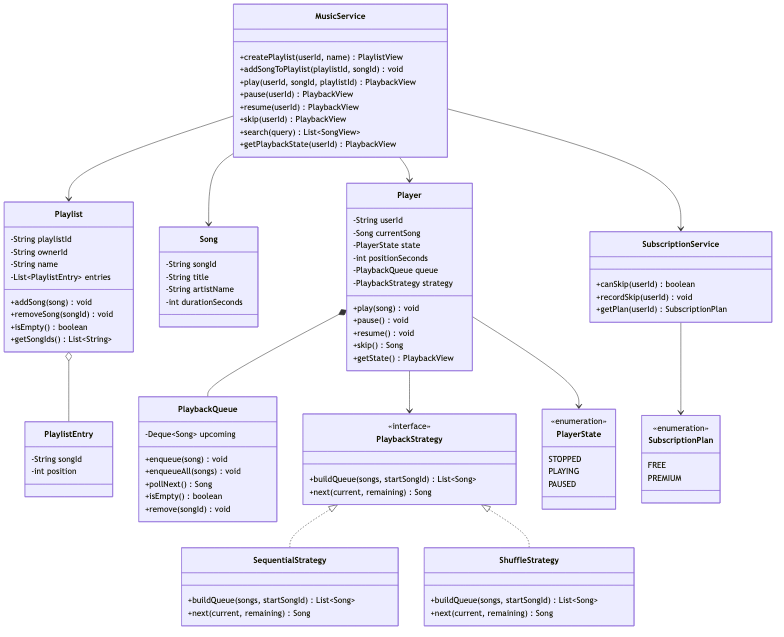
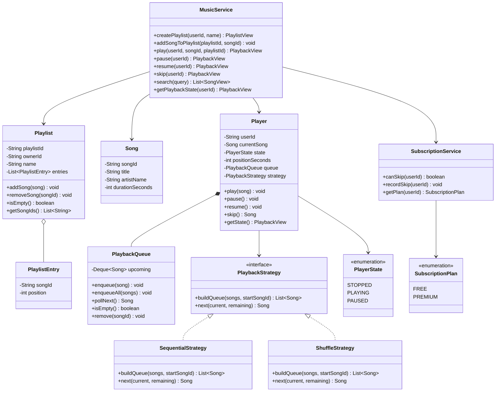
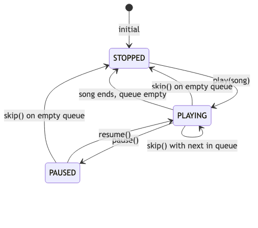
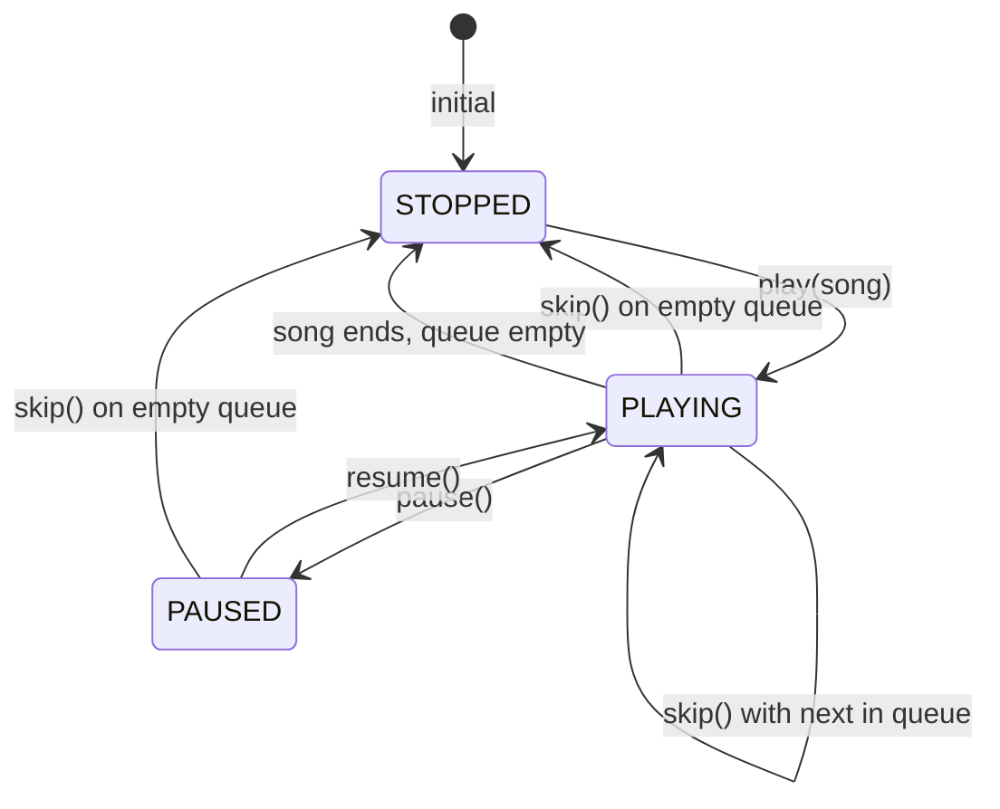
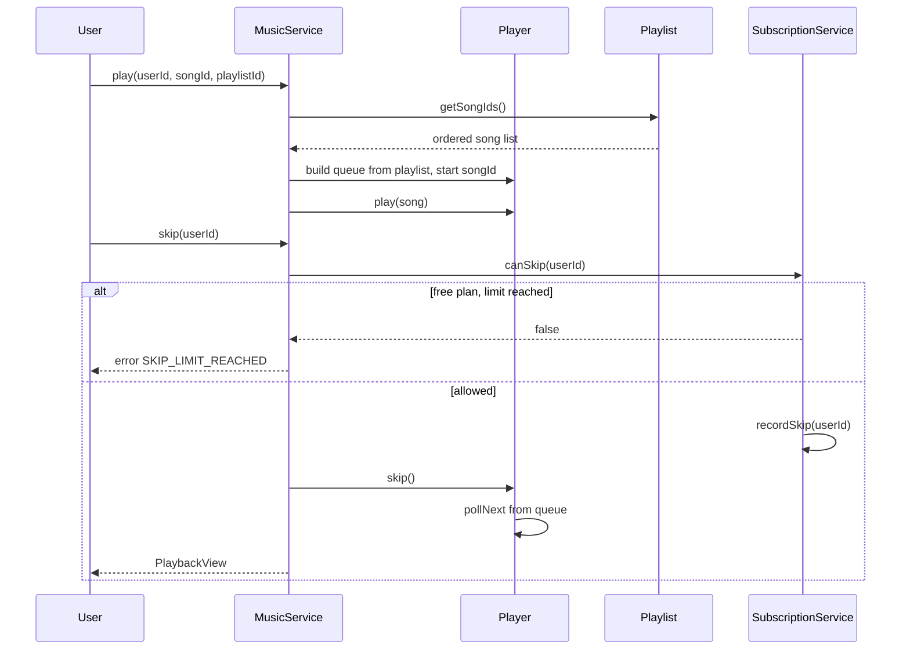
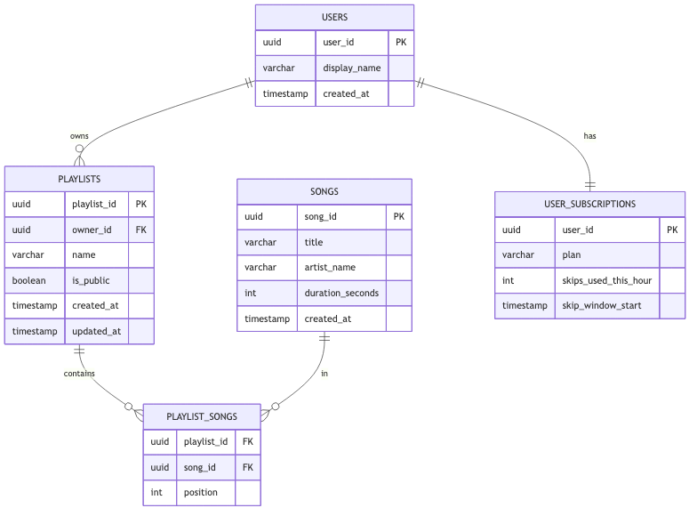
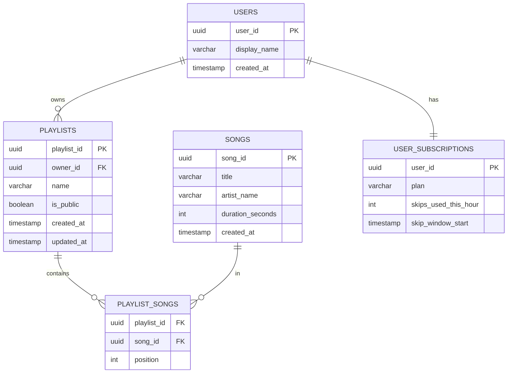

# Spotify-Like Music App — LLD (1-Hour Scope)

> **Company:** Observe.AI (reported LLD question)  
> **Focus:** Class design, extensibility, schema, edge cases — not full implementation  
> **Time budget:** 60 minutes

---

## Problem statement

Design a **Spotify-like music streaming app** where users can:

- Browse / search songs
- Create playlists and add songs
- Play, pause, resume, and skip tracks
- Handle subscription limits and playback edge cases

---

## Scope boundary

### In scope

| Item | Notes |
|------|-------|
| Playlist CRUD (create, add song) | Core library feature |
| `Player` + `PlaybackQueue` | Playback state |
| Play / pause / resume / skip | Core player APIs |
| `PlaybackStrategy` | Sequential vs shuffle |
| `SubscriptionService` | Free-tier skip limit |
| 5-table schema | users, songs, playlists, playlist_songs, subscriptions |
| Edge cases | Empty playlist, skip limit, delete while playing, duplicates |

### Out of scope (mention only if asked)

- Audio streaming / CDN / file storage
- Social features (follow, share feed)
- Recommendations / ML
- Offline download (premium)
- Separate `Repository` layer, microservices

**Opening line:**

> "I'll split catalog (`Song`), library (`Playlist`), and playback (`Player` + queue). Subscription rules stay in `SubscriptionService`. I'll call out edge cases explicitly."

---

## Assumptions

```
- One active Player per user (in-memory for interview)
- play() can start from a song in a playlist — queue fills with remaining tracks
- Skip on FREE plan is limited per hour; PREMIUM is unlimited
- Duplicate songs in a playlist are rejected (or clarify with interviewer)
- Search is simple title/artist match on in-memory catalog
```

---

## Time plan (60 min)

| Min | Activity |
|-----|----------|
| 0–5 | Clarify + assumptions |
| 5–20 | Class diagram + responsibilities |
| 20–30 | Schema (5 tables) |
| 30–50 | Playback flow + edge cases (important for this question) |
| 50–55 | Extensibility (shuffle, repeat, offline) |
| 55–60 | Close |

---

## Class diagram



<details>
<summary>Mermaid source</summary>



</details>

---

## Class responsibilities

### `MusicService` — orchestration (single service layer)

```pythonpython
playlists: dict[str, Playlist] = {}       # playlist_id → Playlist
song_catalog: dict[str, Song] = {}        # song_id → Song
active_players: dict[str, Player] = {}    # user_id → Player

def create_playlist(self, user_id: str, name: str) -> PlaylistView:
    playlist = Playlist(playlist_id=uuid4(), owner_id=user_id, name=name)
    self.playlists[playlist.playlist_id] = playlist
    self._save(playlist)
    return playlist.to_view()

def add_song_to_playlist(self, playlist_id: str, song_id: str) -> None:
    playlist = self.playlists[playlist_id]
    song = self.song_catalog[song_id]
    playlist.add_song(song)
    self._save(playlist)

def play(self, user_id: str, song_id: str, playlist_id: str) -> PlaybackView:
    playlist = self.playlists[playlist_id]
    song = self.song_catalog[song_id]
    player = self.active_players.setdefault(user_id, Player(user_id))
    queue_songs = self.strategy.build_queue(playlist.songs(), song_id)
    player.queue.enqueue_all(queue_songs)
    player.play(song)
    return player.state()

def skip(self, user_id: str) -> PlaybackView:
    if not self.subscription_service.can_skip(user_id):
        raise PlaybackError(SKIP_LIMIT_REACHED)
    self.subscription_service.record_skip(user_id)
    player = self.active_players[user_id]
    player.skip()  # may leave current_song None if queue empty
    return player.state()
```

**Rule:** service coordinates; `Playlist` owns entries; `Player` owns playback state.

---

### `Playlist` — aggregate root for library

```python
def add_song(self, song: Song) -> None:
    if any(entry.song_id == song.song_id for entry in self.entries):
        raise PlaylistError(DUPLICATE_SONG)
    self.entries.append(PlaylistEntry(song.song_id, position=len(self.entries)))

def remove_song(self, song_id: str) -> None:
    self.entries = [e for e in self.entries if e.song_id != song_id]
    self._renumber_positions()

def is_empty(self) -> bool:
    return len(self.entries) == 0

def song_ids(self) -> list[str]:
    return [e.song_id for e in sorted(self.entries, key=lambda e: e.position)]
```

---

### `Player` — playback state (State pattern)

```python
def play(self, song: Song) -> None:
    self.current_song = song
    self.position_seconds = 0
    self.state = PlayerState.PLAYING

def pause(self) -> None:
    if self.state != PlayerState.PLAYING:
        raise PlaybackError(INVALID_STATE)
    self.state = PlayerState.PAUSED

def resume(self) -> None:
    if self.state != PlayerState.PAUSED:
        raise PlaybackError(INVALID_STATE)
    self.state = PlayerState.PLAYING

def skip(self) -> Song | None:
    if self.queue.is_empty():
        self.state = PlayerState.STOPPED
        self.current_song = None
        return None
    self.current_song = self.queue.poll_next()
    self.position_seconds = 0
    self.state = PlayerState.PLAYING
    return self.current_song
```

---

### `PlaybackQueue` — upcoming tracks

```python
from collections import deque

upcoming: deque[Song]

def enqueue_all(self, songs: list[Song]) -> None:
    self.upcoming.extend(songs)

def poll_next(self) -> Song:
    return self.upcoming.popleft()

def remove(self, song_id: str) -> None:
    self.upcoming = deque(s for s in self.upcoming if s.song_id != song_id)
```

---

### `PlaybackStrategy` — extensibility hook

```python
class PlaybackStrategy(ABC):
    @abstractmethod
    def build_queue(self, playlist_songs: list[Song], start_song_id: str) -> list[Song]:
        ...
```

| Implementation | Behavior |
|----------------|----------|
| `SequentialStrategy` | Songs after `startSongId` in playlist order, then wrap or stop |
| `ShuffleStrategy` | Shuffle remaining songs after start |

Inject strategy into `Player` or pass per `play()` call.

---

### `SubscriptionService` — plan limits

```python
def can_skip(self, user_id: str) -> bool:
    if self.get_plan(user_id) == SubscriptionPlan.PREMIUM:
        return True
    return self.skips_used_this_hour(user_id) < FREE_SKIP_LIMIT

def record_skip(self, user_id: str) -> None:
    self._increment_skip_count(user_id)  # reset window hourly
```

Keeps free/premium rules out of `Player`.

---

### Storage (by `playlistId` / `songId` / `userId`)

#### In memory

| Map | Key | Value |
|-----|-----|-------|
| `song_catalog` | `song_id` | `Song` |
| `playlists` | `playlist_id` | `Playlist` |
| `active_players` | `user_id` | `Player` |

#### Database

| Table | PK | Role |
|-------|-----|------|
| `songs` | `song_id` | Catalog |
| `playlists` | `playlist_id` | User-owned collections |
| `playlist_songs` | `(playlist_id, song_id)` | Ordered entries |
| `users` | `user_id` | Identity |
| `user_subscriptions` | `user_id` | Plan + skip counter |

---

## Enums

### `PlayerState`

```
STOPPED, PLAYING, PAUSED
```

### `SubscriptionPlan`

```
FREE, PREMIUM
```

### `ErrorCode` (optional)

```
SONG_NOT_FOUND, PLAYLIST_NOT_FOUND, DUPLICATE_SONG,
EMPTY_PLAYLIST, SKIP_LIMIT_REACHED, INVALID_STATE
```

---

## State machine (player)



<details>
<summary>Mermaid source</summary>



</details>

---

## Core flow (play + skip)


<details>
<summary>Mermaid source</summary>



</details>

---

## Schema (5 tables)



<details>
<summary>Mermaid source</summary>



</details>

| Design choice | Rationale |
|---------------|-----------|
| `playlist_songs.position` | Preserves play order for sequential strategy |
| `user_subscriptions` separate | Plan limits don't pollute `Player` |
| `song_id` in catalog + junction | Same song in many playlists |
| One `Player` per `userId` in memory | Matches single active session |

---

## API (minimal)

```
POST   /playlists                         → { userId, name }
POST   /playlists/{id}/songs              → { songId }
POST   /playback/play                     → { userId, songId, playlistId }
POST   /playback/pause                    → { userId }
POST   /playback/resume                   → { userId }
POST   /playback/skip                     → { userId }
GET    /playback/state                    → ?userId=
GET    /search                            → ?q=
```

---

## Edge cases (know these 8 — key for this question)

| Case | Behavior |
|------|----------|
| Play from **empty playlist** | Reject — `EMPTY_PLAYLIST` |
| **Duplicate** song in playlist | Reject in `Playlist.addSong()` |
| Skip on **free plan** over limit | `SubscriptionService.canSkip()` → false |
| Skip with **empty queue** | `Player` → `STOPPED`, `current_song = None` |
| **Pause** when not playing | Reject — `INVALID_STATE` |
| **Remove song** currently playing | Remove from playlist + `queue.remove(song_id)`; if current, call `skip()` |
| **Remove song** only in queue | `PlaybackQueue.remove(songId)` |
| Play same song again | Restart from position 0 (or clarify: resume policy) |

**Concurrent edit (one sentence):**

> Version or lock on `Playlist` when adding songs while another client plays from it.

---

## Extensibility (3 bullets only)

| Question | Answer |
|----------|--------|
| Shuffle mode? | Inject `ShuffleStrategy` into `play()` |
| Repeat one / repeat all? | `RepeatStrategy` wraps `PlaybackStrategy` |
| Offline (premium)? | `DownloadService` — `Player` unchanged |
| Recommendations? | New service returns song list → feed into `play()` |

---

## SOLID (say 3, not 5)

| Principle | Application |
|-----------|-------------|
| **S** | `Playlist` = entries; `Player` = playback; `SubscriptionService` = limits |
| **O** | New play order → new `PlaybackStrategy` |
| **D** | `Player` depends on `PlaybackStrategy` interface |

---

## What to code if asked (~10 min)

Pick **one**:

- `Player.skip()` with empty queue handling, or
- `Playlist.add_song()` with duplicate check, or
- `SubscriptionService.can_skip()`

---

## 30-second close

> "Catalog (`Song`), library (`Playlist`), and playback (`Player` + `PlaybackQueue`) are separate. `PlaybackStrategy` handles sequential vs shuffle; `SubscriptionService` enforces skip limits. Schema uses `playlist_songs` for order. Edge cases — empty playlist, skip limit, delete while playing — are handled at the owning class."

---

## Anti-patterns to avoid

- One god class mixing search, playlists, and audio bytes
- Skip limit logic inside `Player`
- No queue — skip can't advance to next track
- Ignoring empty playlist / invalid state transitions
- Storing play order only in `Player` (lost on restart)

---

## References

- Observe.AI reported LLD — Spotify-like app with edge cases
