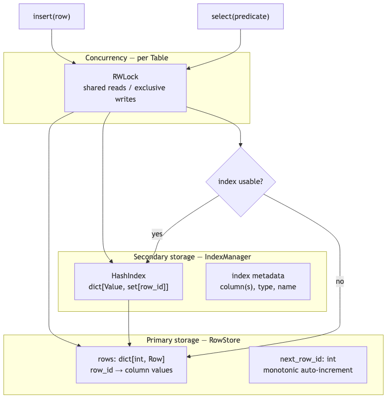
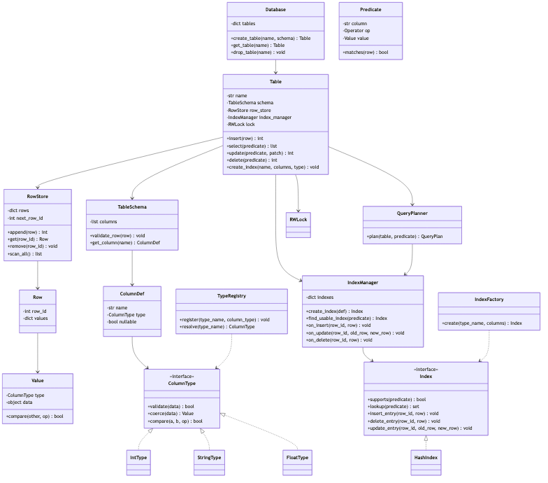
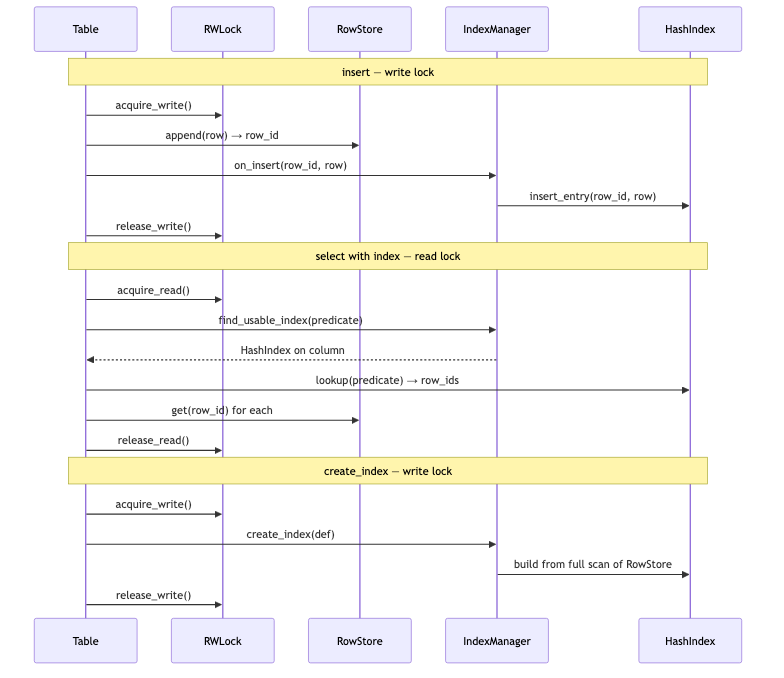

# In-Memory SQL Engine — LLD (1-Hour Scope)

> **Context:** SQL machine coding / LLD interview  
> **Focus:** Data structures, generic types, indexes, extensibility, multi-threading — not disk persistence or query parser  
> **Time budget:** 60 minutes

---

## Problem statement

Design an **in-memory SQL-like storage engine** that supports:

- **CRUD** on tables with typed columns (`INSERT`, `SELECT`, `UPDATE`, `DELETE`)
- **Generic column types** (int, string, float, …) — extensible without changing core code
- **Indexes** on columns for faster lookups
- **Multi-threaded** safe concurrent reads and writes

---

## Scope boundary

### In scope

| Item | Notes |
|------|-------|
| `Database`, `Table`, `RowStore` | Core storage |
| `Value` + `ColumnType` | Generic typed data |
| `TypeRegistry` | Register new column types at runtime |
| `Index` + `HashIndex` | Equality lookups; extensible via `IndexFactory` |
| `IndexManager` | Create/maintain indexes on DML |
| `QueryPlanner` | Index vs full table scan |
| `RWLock` per `Table` | Reader-writer concurrency |
| `Predicate` | `WHERE col = value` (extend to `>`, `<`) |

### Out of scope (mention only if asked)

SQL parser, JOINs, transactions/ACID, WAL, B-tree on disk, distributed sharding

**Opening line:**

> "Rows live in a `dict[row_id → Row]` heap. Indexes are separate structures mapping column values → row IDs. `ColumnType` Strategy handles generic validation/compare. One `RWLock` per table — shared for reads, exclusive for writes including index maintenance."

---

## Assumptions

```
- Single process, in-memory only
- row_id is hidden auto-increment int (primary key)
- SELECT supports single-column equality WHERE in v1; planner picks index if available
- Index maintenance is synchronous under the same write lock as the row mutation
- NULL handling: nullable columns allowed; index skips NULL keys (or stores sentinel — pick one)
```

---

## Time plan (60 min)

| Min | Activity |
|-----|----------|
| 0–5 | Clarify + assumptions |
| 5–15 | Data structure choice + why |
| 15–25 | Class diagram + generic types |
| 25–35 | Index design + maintenance |
| 35–45 | Multi-threading strategy |
| 45–55 | Pseudocode for insert + select |
| 55–60 | Edge cases + close |

---

## Data structures (say this first)



| Structure | Role | Why |
|-----------|------|-----|
| `dict[int, Row]` | **Primary heap** — `row_id → row` | O(1) fetch by ID; stable row identity when index points to IDs |
| `int next_row_id` | Auto-increment PK | Monotonic; never reused in v1 |
| `dict[str, Index]` | **Secondary indexes** | Separate from heap — classic DB separation |
| `dict[Value, set[int]]` | **HashIndex** innards | O(1) equality lookup → candidate row IDs |
| `RWLock` per `Table` | Concurrency | Many readers OR one writer |

**Why not a single list?** List scan is O(n) for fetch-by-id; `dict` gives O(1) row retrieval after index narrows candidates.

**Why index stores `row_id` not `Row`?** Row data has one canonical copy in `RowStore`; indexes stay small and consistent on update.

---

## Class diagram



<details>
<summary>Mermaid source</summary>

See `./diagrams/sql-engine-class-diagram.mmd`.

</details>

---

## Generic typed data

### `Value` + `ColumnType` — Strategy pattern

```python
class ColumnType(ABC):
    @abstractmethod
    def validate(self, raw: object) -> bool: ...

    @abstractmethod
    def coerce(self, raw: object) -> "Value": ...

    @abstractmethod
    def compare(self, a: object, b: object, op: Operator) -> bool: ...

class Value:
    def __init__(self, col_type: ColumnType, data: object):
        if not col_type.validate(data):
            raise TypeError(f"invalid value {data!r} for {col_type}")
        self.col_type = col_type
        self.data = data

    def compare(self, other: "Value", op: Operator) -> bool:
        if self.col_type is not other.col_type:
            raise TypeError("type mismatch")
        return self.col_type.compare(self.data, other.data, op)

    def __hash__(self) -> int:
        return hash((type(self.col_type), self.data))  # for HashIndex keys

class IntType(ColumnType):
    def validate(self, raw): return isinstance(raw, int) and not isinstance(raw, bool)
    def coerce(self, raw): return Value(self, int(raw))
    def compare(self, a, b, op):
        return {Operator.EQ: a == b, Operator.GT: a > b, Operator.LT: a < b}[op]

class StringType(ColumnType):
    def validate(self, raw): return isinstance(raw, str)
    def coerce(self, raw): return Value(self, raw)
    def compare(self, a, b, op):
        if op == Operator.EQ: return a == b
        if op == Operator.LT: return a < b
        if op == Operator.GT: return a > b
        return False
```

### `TypeRegistry` — extensibility for new types

```python
class TypeRegistry:
    _types: dict[str, ColumnType] = {
        "int": IntType(),
        "string": StringType(),
        "float": FloatType(),
    }

    @classmethod
    def register(cls, name: str, col_type: ColumnType) -> None:
        cls._types[name] = col_type

    @classmethod
    def resolve(cls, name: str) -> ColumnType:
        if name not in cls._types:
            raise SchemaError(f"unknown type: {name}")
        return cls._types[name]
```

**Add `DateType`?** Implement `ColumnType`, call `TypeRegistry.register("date", DateType())` — zero changes to `Table` or `RowStore`.

---

## Schema + row validation

```python
@dataclass
class ColumnDef:
    name: str
    col_type: ColumnType
    nullable: bool = False

class TableSchema:
    def __init__(self, columns: list[ColumnDef]):
        self._columns = {c.name: c for c in columns}

    def validate_row(self, raw: dict[str, object]) -> dict[str, Value]:
        result: dict[str, Value] = {}
        for name, col in self._columns.items():
            if name not in raw:
                if not col.nullable:
                    raise ValidationError(f"missing column: {name}")
                continue
            if raw[name] is None:
                if not col.nullable:
                    raise ValidationError(f"{name} cannot be null")
                result[name] = None
            else:
                result[name] = col.col_type.coerce(raw[name])
        return result
```

---

## Primary storage — `RowStore`

```python
class RowStore:
    def __init__(self):
        self._rows: dict[int, dict[str, Value | None]] = {}
        self._next_row_id = 1

    def append(self, values: dict[str, Value | None]) -> int:
        row_id = self._next_row_id
        self._next_row_id += 1
        self._rows[row_id] = values
        return row_id

    def get(self, row_id: int) -> dict[str, Value | None] | None:
        return self._rows.get(row_id)

    def remove(self, row_id: int) -> None:
        del self._rows[row_id]

    def scan_all(self) -> list[tuple[int, dict]]:
        return list(self._rows.items())
```

---

## Index design

### `Index` interface — extensible

```python
class Index(ABC):
    @abstractmethod
    def supports(self, predicate: Predicate) -> bool:
        """Can this index answer this predicate?"""
        ...

    @abstractmethod
    def lookup(self, predicate: Predicate) -> set[int]:
        """Return candidate row_ids (may need recheck via predicate.matches)."""
        ...

    @abstractmethod
    def insert_entry(self, row_id: int, row: dict) -> None: ...

    @abstractmethod
    def delete_entry(self, row_id: int, row: dict) -> None: ...

    @abstractmethod
    def update_entry(self, row_id: int, old: dict, new: dict) -> None: ...
```

### `HashIndex` — equality on one column

```python
class HashIndex(Index):
    def __init__(self, column: str):
        self.column = column
        self._map: dict[Value, set[int]] = {}

    def supports(self, predicate: Predicate) -> bool:
        return predicate.op == Operator.EQ and predicate.column == self.column

    def lookup(self, predicate: Predicate) -> set[int]:
        return set(self._map.get(predicate.value, set()))

    def insert_entry(self, row_id: int, row: dict) -> None:
        val = row.get(self.column)
        if val is None:
            return
        self._map.setdefault(val, set()).add(row_id)

    def delete_entry(self, row_id: int, row: dict) -> None:
        val = row.get(self.column)
        if val is None:
            return
        bucket = self._map.get(val)
        if bucket:
            bucket.discard(row_id)
            if not bucket:
                del self._map[val]

    def update_entry(self, row_id: int, old: dict, new: dict) -> None:
        self.delete_entry(row_id, old)
        self.insert_entry(row_id, new)
```

### `IndexFactory` — add B-tree later

```python
class IndexFactory:
    _builders: dict[str, Callable] = {
        "hash": lambda cols: HashIndex(cols[0]),
        # "btree": lambda cols: BTreeIndex(cols[0]),  # range queries
    }

    @classmethod
    def create(cls, index_type: str, columns: list[str]) -> Index:
        return cls._builders[index_type](columns)
```

### `IndexManager`

```python
class IndexManager:
    def __init__(self):
        self._indexes: dict[str, Index] = {}

    def create_index(self, name: str, index: Index, row_store: RowStore) -> None:
        if name in self._indexes:
            raise SchemaError("index already exists")
        # backfill from existing rows
        for row_id, row in row_store.scan_all():
            index.insert_entry(row_id, row)
        self._indexes[name] = index

    def find_usable_index(self, predicate: Predicate) -> Index | None:
        for index in self._indexes.values():
            if index.supports(predicate):
                return index
        return None

    def on_insert(self, row_id: int, row: dict) -> None:
        for index in self._indexes.values():
            index.insert_entry(row_id, row)

    def on_delete(self, row_id: int, row: dict) -> None:
        for index in self._indexes.values():
            index.delete_entry(row_id, row)

    def on_update(self, row_id: int, old: dict, new: dict) -> None:
        for index in self._indexes.values():
            index.update_entry(row_id, old, new)
```

---

## `Table` — orchestration with threading

```python
class RWLock:
    """Reader-writer lock: many readers OR one writer."""
    def __init__(self):
        self._lock = threading.Lock()
        self._readers = 0
        self._writers = 0
        self._read_ready = threading.Condition(self._lock)
        self._write_ready = threading.Condition(self._lock)

    def acquire_read(self) -> None:
        with self._lock:
            while self._writers > 0:
                self._read_ready.wait()
            self._readers += 1

    def release_read(self) -> None:
        with self._lock:
            self._readers -= 1
            if self._readers == 0:
                self._write_ready.notify()

    def acquire_write(self) -> None:
        with self._lock:
            while self._writers > 0 or self._readers > 0:
                self._write_ready.wait()
            self._writers += 1

    def release_write(self) -> None:
        with self._lock:
            self._writers -= 1
            self._read_ready.notify_all()
            self._write_ready.notify()
```

```python
class Table:
    def __init__(self, name: str, schema: TableSchema):
        self.name = name
        self.schema = schema
        self.row_store = RowStore()
        self.index_manager = IndexManager()
        self.lock = RWLock()

    def insert(self, raw: dict) -> int:
        self.lock.acquire_write()
        try:
            row = self.schema.validate_row(raw)
            row_id = self.row_store.append(row)
            self.index_manager.on_insert(row_id, row)
            return row_id
        finally:
            self.lock.release_write()

    def select(self, predicate: Predicate | None = None) -> list[dict]:
        self.lock.acquire_read()
        try:
            if predicate is None:
                return [row for _, row in self.row_store.scan_all()]

            index = self.index_manager.find_usable_index(predicate)
            if index:
                candidates = index.lookup(predicate)
                return [
                    self.row_store.get(rid)
                    for rid in candidates
                    if predicate.matches(self.row_store.get(rid))
                ]

            # full table scan
            return [
                row for _, row in self.row_store.scan_all()
                if predicate.matches(row)
            ]
        finally:
            self.lock.release_read()

    def create_index(self, name: str, column: str, index_type: str = "hash") -> None:
        self.lock.acquire_write()
        try:
            if column not in self.schema._columns:
                raise SchemaError(f"unknown column: {column}")
            index = IndexFactory.create(index_type, [column])
            self.index_manager.create_index(name, index, self.row_store)
        finally:
            self.lock.release_write()

    def update(self, predicate: Predicate, patch: dict) -> int:
        self.lock.acquire_write()
        try:
            count = 0
            for row_id, row in self.row_store.scan_all():
                if not predicate.matches(row):
                    continue
                old = dict(row)
                merged = {**{k: v.data if isinstance(v, Value) else v for k, v in row.items()},
                          **patch}
                new_row = self.schema.validate_row(merged)
                self.row_store._rows[row_id] = new_row
                self.index_manager.on_update(row_id, old, new_row)
                count += 1
            return count
        finally:
            self.lock.release_write()

    def delete(self, predicate: Predicate) -> int:
        self.lock.acquire_write()
        try:
            to_delete = [
                (row_id, row) for row_id, row in self.row_store.scan_all()
                if predicate.matches(row)
            ]
            for row_id, row in to_delete:
                self.index_manager.on_delete(row_id, row)
                self.row_store.remove(row_id)
            return len(to_delete)
        finally:
            self.lock.release_write()
```

---

## Core flow



<details>
<summary>Mermaid source</summary>

See `./diagrams/sql-engine-core-flow.mmd`.

</details>

---

## Query planner (simple)

```python
class QueryPlan:
  def __init__(self, use_index: bool, index: Index | None, scan_all: bool):
      ...

class QueryPlanner:
    def plan(self, index_manager: IndexManager, predicate: Predicate | None) -> QueryPlan:
        if predicate is None:
            return QueryPlan(use_index=False, index=None, scan_all=True)
        index = index_manager.find_usable_index(predicate)
        if index:
            return QueryPlan(use_index=True, index=index, scan_all=False)
        return QueryPlan(use_index=False, index=None, scan_all=True)
```

| Predicate | Plan |
|-----------|------|
| `WHERE id = 5` + hash index on `id` | Index lookup → O(1) |
| `WHERE name = 'alice'` + hash index on `name` | Index lookup → O(1) + verify |
| `WHERE age > 30` | Full scan (unless `BTreeIndex` added) |
| No WHERE | Full scan |

---

## Patterns used

| Pattern | Where | Why |
|---------|-------|-----|
| **Strategy** | `ColumnType`, `Index` | New types/indexes without changing `Table` |
| **Factory** | `TypeRegistry`, `IndexFactory` | Register extensions at runtime |
| **Repository-like** | `RowStore` | Isolate heap from index/query logic |
| **Template method** | DML hooks in `IndexManager` | Every mutation updates all indexes consistently |

---

## Multi-threading rules

| Operation | Lock | Why |
|-----------|------|-----|
| `select` | **Read (shared)** | Multiple concurrent readers OK |
| `insert` / `update` / `delete` | **Write (exclusive)** | Mutates heap + all indexes atomically |
| `create_index` | **Write (exclusive)** | Backfill scans entire heap |

**Invariant:** Index and heap are always consistent when lock is released.

**Optional upgrades (mention if asked):**
- **Lock striping** per hash bucket for higher write throughput
- **Copy-on-write snapshot** for lock-free reads (more complex)
- **Table-level vs Database-level** lock — per-table is finer-grained

---

## Edge cases

| Case | Behavior |
|------|----------|
| Insert invalid type | `TypeError` at `coerce()` |
| Missing non-nullable column | `ValidationError` |
| Duplicate index name | `SchemaError` |
| Index on unknown column | `SchemaError` |
| NULL in indexed column | Skip in `HashIndex` (NULL ≠ NULL in SQL) |
| Update indexed column | `update_entry` removes old key, inserts new |
| Delete row | Remove from heap **and** all indexes |
| Concurrent insert + select | RWLock — readers see snapshot before/after write, never torn |
| SELECT after index built | Uses index immediately |
| Composite WHERE (`a=1 AND b=2`) | Full scan in v1; mention composite index extension |

---

## Extensibility (3 bullets)

| Question | Answer |
|----------|--------|
| New column type? | Implement `ColumnType` → `TypeRegistry.register()` |
| New index (B-tree, range)? | Implement `Index` → `IndexFactory` builder |
| New operator (`LIKE`)? | Extend `Operator` + `ColumnType.compare()` |

---

## SOLID (say 3)

| Principle | Application |
|-----------|-------------|
| **S** | `RowStore` = heap; `Index` = lookup; `Table` = orchestration |
| **O** | New types/indexes via new classes, not `if/elif` in `Table` |
| **D** | `Table` depends on `Index` ABC, not `HashIndex` concrete |

---

## What to code if asked (~10 min)

Pick **one**: `HashIndex.insert_entry` + `lookup` · `Table.insert` with lock · `ColumnType.coerce` + validate

---

## 30-second close

> "Heap is `dict[row_id → Row]`. Indexes map column values to row IDs — maintained on every DML under a write lock. `ColumnType` Strategy gives generic extensible typing. `RWLock` per table: shared reads, exclusive writes. `QueryPlanner` picks hash index for equality, else full scan."

---

## Anti-patterns to avoid

- Storing row copies inside indexes (stale on update)
- Updating index outside the write lock (race with readers)
- `if type == 'int'` scattered everywhere instead of `ColumnType`
- Using one global lock for entire database when per-table suffices
- Read-modify-write on index without atomicity under concurrency
- Reusing deleted `row_id` while old index entries might linger

---

## References

- SQL machine coding — in-memory table engine (Strategy + Factory + RWLock)
