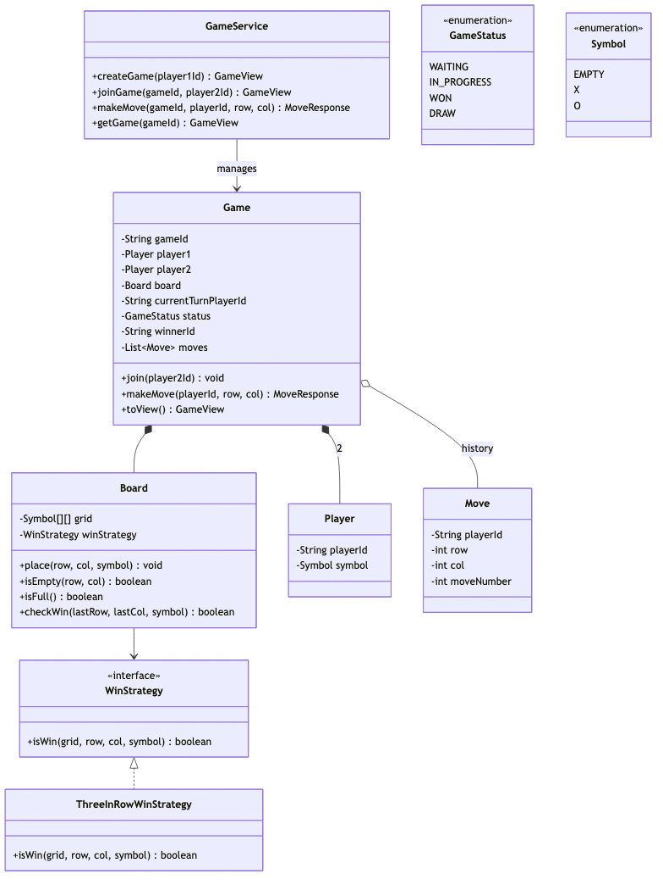
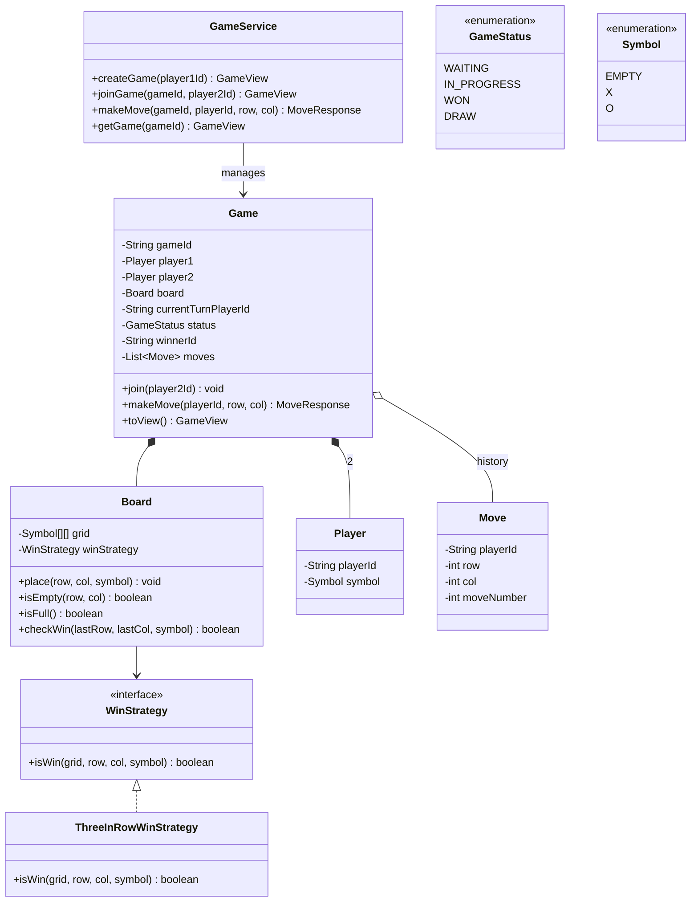
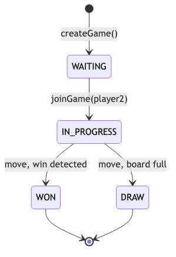
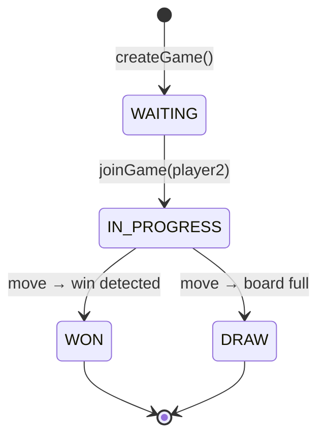
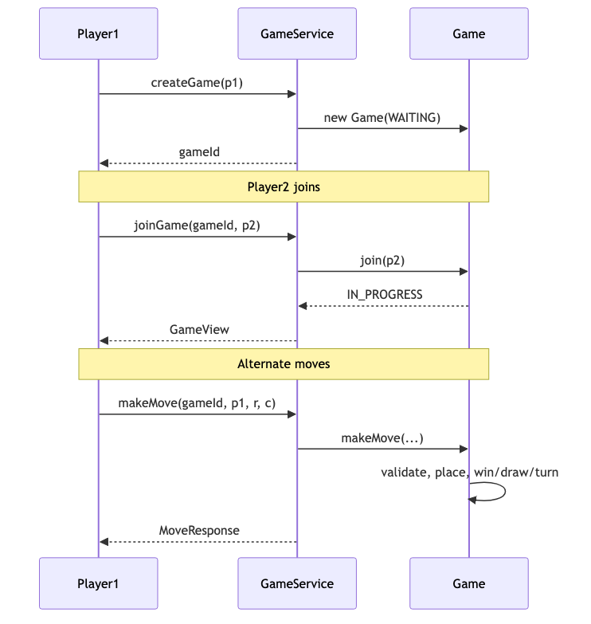
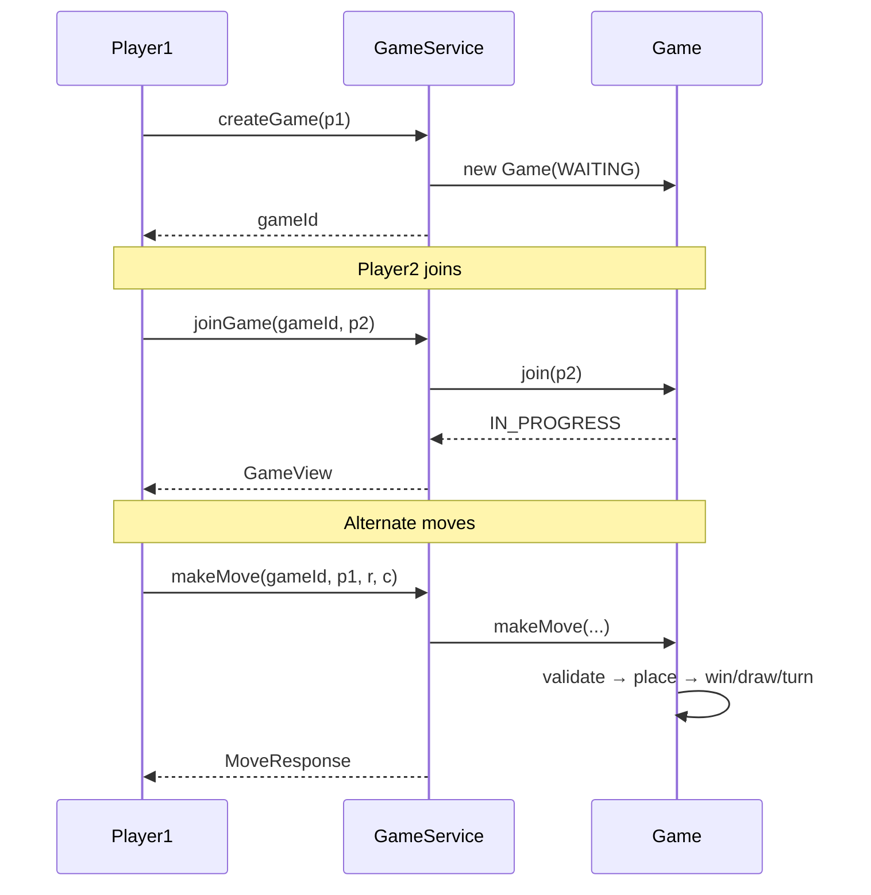
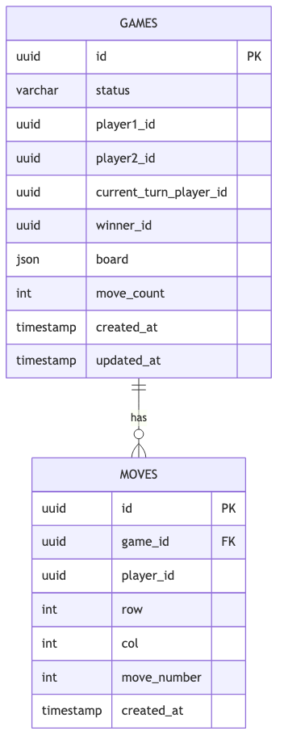
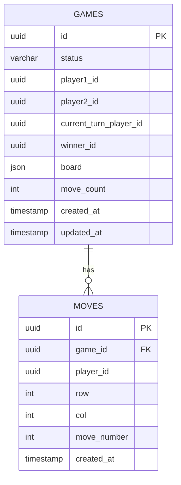
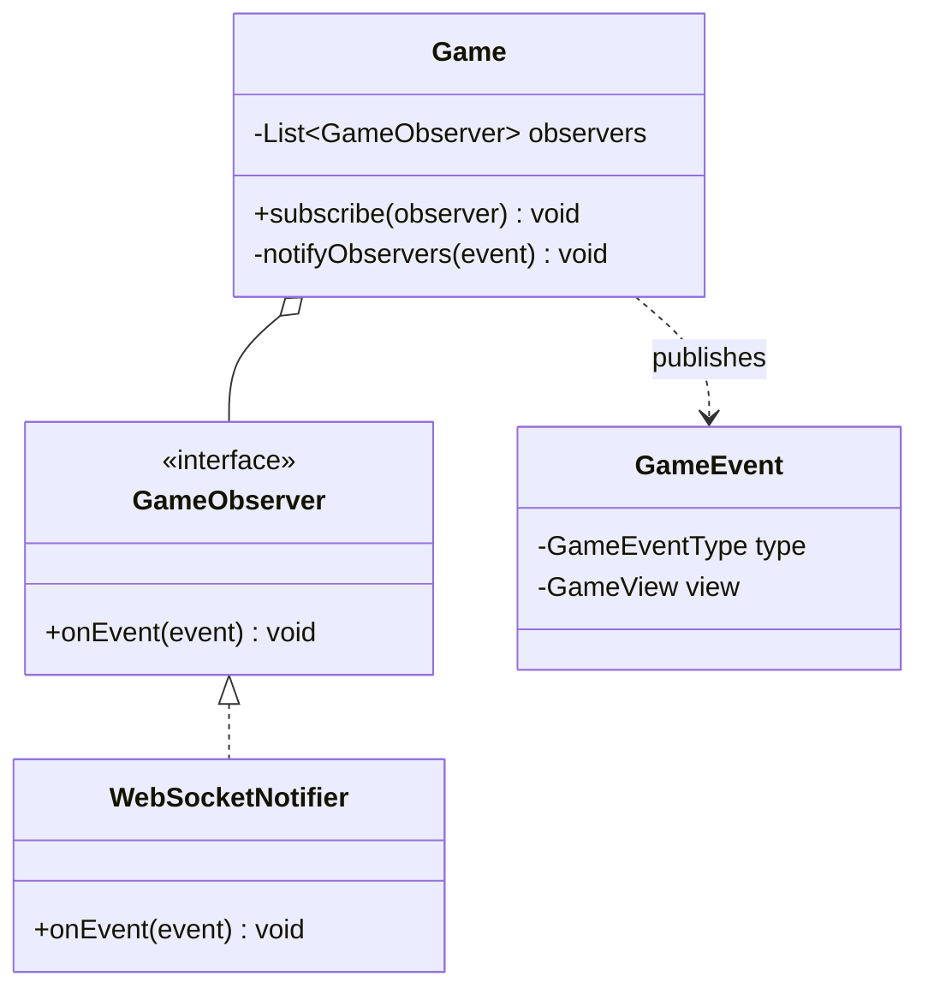

# Tic-Tac-Toe Multiplayer — LLD (1-Hour Scope)

> **Company:** Observe.AI (reported SE2 LLD question)  
> **Focus:** Class design, extensibility, schema — not full implementation  
> **Time budget:** 60 minutes

---

## Problem statement

Design an **online multiplayer** Tic-Tac-Toe game where:

- Player 1 creates a game and shares a `gameId`
- Player 2 joins remotely
- Both players send moves to a **server-authoritative** backend
- Game ends on win or draw

---

## Scope boundary

### In scope

| Item | Notes |
|------|-------|
| 2 players, 3×3 board | Core problem |
| Create → Join → Move → End | Core lifecycle |
| 5 classes + 2 enums | Enough OOP without sprawl |
| 2-table schema | Persistence thinking, kept minimal |
| Turn validation, win/draw, illegal moves | Must-have edge cases |
| `WinStrategy` | Single extensibility hook for N×N |

### Out of scope (mention only if asked)

- WebSocket / real-time push implementation
- Bot / AI, undo, spectators, matchmaking
- Redis, event sourcing, idempotency keys
- Separate `Repository`, `Factory`, `EventPublisher`, `Command` classes
- `Cell` as its own class, multiple DTOs

**Opening line:**

> "I'll design the core domain — create, join, move, win/draw — with a clean class split. I'll skip transport, bots, and undo unless we have time."

---

## Assumptions

```
- Online 2-player, 3×3, X and O
- Server owns game state (authoritative)
- Player1 creates game → shares gameId → Player2 joins
- Moves only when status = IN_PROGRESS
- End states: WON, DRAW
- Persist games + moves; active state can live in memory
```

---

## Time plan (60 min)

| Min | Activity |
|-----|----------|
| 0–5 | Clarify + write assumptions |
| 5–20 | Class diagram + responsibility per class |
| 20–30 | Schema (2 tables) + rationale |
| 30–45 | Flows: create / join / move + edge cases |
| 45–55 | Extensibility (NxN, 3+ players, push) |
| 55–60 | Close: trade-offs + production next steps |

---

## Class diagram



<details>
<summary>Mermaid source</summary>



</details>

---

## Class responsibilities

### `Game` — aggregate root (spend most time here)

**Owns:** players, board, turn, status, move list, winner.

All mutations go through this class — not via direct `Board` access from outside.

```python
def make_move(self, player_id, row, col):
    if self.status != IN_PROGRESS:
        raise GameError(GAME_OVER)
    if player_id != self.current_turn_player_id:
        raise GameError(NOT_YOUR_TURN)
    if not self.board.in_bounds(row, col):
        raise GameError(INVALID_MOVE)
    if not self.board.is_empty(row, col):
        raise GameError(CELL_OCCUPIED)

    self.board.place(row, col, self.current_player.symbol)
    self.moves.append(Move(player_id, row, col))

    if self.board.check_win(row, col, self.current_player.symbol):
        self.status = WON
        self.winner_id = player_id
    elif self.board.is_full():
        self.status = DRAW
    else:
        self._switch_turn()

    return MoveResponse(success=True, game=self.to_view())
```

```python
def join(self, player2_id):
    if self.status != WAITING:
        raise GameError(GAME_FULL)
    self.player2 = Player(player2_id, Symbol.O)
    self.current_turn_player_id = self.player1.player_id
    self.status = IN_PROGRESS
```

---

### `Board` — grid + win check only

**Owns:** `grid: list[list[Symbol]]`, delegates win logic to `WinStrategy`.

**Does NOT:** know player IDs, turns, or game status.

| Method | Purpose |
|--------|---------|
| `place(row, col, symbol)` | Set cell |
| `is_empty(row, col)` | Cell available? |
| `is_full()` | Draw check |
| `check_win(row, col, symbol)` | Delegate to `WinStrategy` |

**Win check:** After each move, only inspect the **row, column, and diagonals through `(row, col)`** — O(1) for 3×3.

---

### `WinStrategy` — extensibility hook

```python
from abc import ABC, abstractmethod

class WinStrategy(ABC):
    @abstractmethod
    def is_win(self, grid: list[list[Symbol]], row: int, col: int, symbol: Symbol) -> bool:
        ...
```

- Default: `ThreeInRowWinStrategy` (3×3)
- Extension: `NInRowWinStrategy(n)` — new class, no change to `Game` or `Board` API

**NxN answer:**

> "Board gets `size` in constructor; inject `NInRowWinStrategy`. Game logic unchanged."

---

### `Player` — data only

```
player_id: str
symbol:    Symbol  # X | O
```

No behavior. Keeps `Game` readable.

---

### `Move` — audit trail

```
player_id, row, col, move_number
```

Immutable. Used for history, replay, and the `moves` DB table.

---

### `GameService` — thin orchestration

```python
games: dict[str, Game] = {}  # in-memory for interview

def create_game(self, player1_id: str) -> GameView:
    game = Game(game_id=uuid4(), player1=Player(player1_id, Symbol.X))
    self.games[game.game_id] = game
    return game.to_view()

def join_game(self, game_id: str, player2_id: str) -> GameView:
    game = self.games[game_id]
    game.join(player2_id)
    self._save(game)
    return game.to_view()

def make_move(self, game_id: str, player_id: str, row: int, col: int) -> MoveResponse:
    game = self.games[game_id]
    response = game.make_move(player_id, row, col)
    self._save(game)
    return response
```

**Rule:** `GameService` never implements game rules — only lookup + persist.

---

### Game storage (by `gameId`)

Games are keyed by `gameId` at two layers:

#### Layer 1 — In memory (active games, interview scope)

`GameService` holds all live games in a map:

```python
games: dict[str, Game] = {}
```

| Operation | Lookup |
|-----------|--------|
| `create_game()` | `games[game_id] = game` |
| `join_game(game_id, ...)` | `games[game_id]` |
| `make_move(game_id, ...)` | `games[game_id]` |
| `get_game(game_id)` | `games.get(game_id)` |

`game_id` **is the dict key**. This supports multiple concurrent games — each session is isolated by its UUID.

If `game_id not in games` → raise `GAME_NOT_FOUND`.

#### Layer 2 — Database (persistence)

Durable storage uses the **`games`** table; primary key **`id`** is the same value as `gameId`:

```
games.id  =  gameId  (uuid PK)
```

| When | What gets written |
|------|-------------------|
| `createGame()` | Insert row into `games` (`id`, `player1_id`, `status=WAITING`, …) |
| `joinGame()` | Update `games` row (`player2_id`, `status=IN_PROGRESS`, …) |
| `makeMove()` | Update `games` row (`board` JSON, `current_turn_player_id`, `status`, …) + insert row into `moves` |

Related moves are stored in **`moves.game_id`** (FK → `games.id`).

#### Read path

```
make_move(game_id, ...)
  → games[game_id]             # in-memory lookup
  → game.make_move(...)
  → self._save(game)           # upsert games row + append moves row
```

For a production system you might read from DB on cache miss (`games` WHERE `id = gameId`), but the domain model stays the same.

**Interview line:**

> "`GameService` indexes active games by `gameId` in a `Map`. The same `gameId` is the primary key in the `games` table for persistence and replay via the `moves` table."

---

### Response objects (minimal)

**`GameView`** — what clients read:

```
gameId, status, board[][],
currentTurnPlayerId, player1Id, player2Id,
winnerId, moveCount
```

**`MoveResponse`:**

```
success, errorCode?, gameView
```

---

## Enums

### `GameStatus`

```
WAITING      → game created, waiting for player 2
IN_PROGRESS  → both players joined, moves allowed
WON          → terminal
DRAW         → terminal
```

### `Symbol`

```
EMPTY, X, O
```

### `ErrorCode` (optional, for `MoveResponse`)

```
NONE, NOT_YOUR_TURN, CELL_OCCUPIED, GAME_OVER,
INVALID_MOVE, GAME_NOT_FOUND, GAME_FULL
```

---

## State machine



<details>
<summary>Mermaid source</summary>



</details>

---

## Core flow



<details>
<summary>Mermaid source</summary>



</details>

---

## Schema (2 tables)



<details>
<summary>Mermaid source</summary>



</details>

| Design choice | Rationale |
|---------------|-----------|
| `games.id` = `gameId` | Same UUID used in API paths, in-memory map key, and DB PK |
| `board` as JSON in `games` | Fast read for `GET /game/{id}` |
| `moves` table | Replay, debugging, move history |
| No separate `players` table | Overkill for 1-hour scope |

---

## API (minimal)

```
POST   /games                      → create game
POST   /games/{id}/join            → player 2 joins
POST   /games/{id}/moves           → { playerId, row, col }
GET    /games/{id}                 → current state
```

---

## Edge cases (know these 6)

| Case | Behavior |
|------|----------|
| Move before P2 joins | Reject — `WAITING` |
| Wrong turn | Reject — `NOT_YOUR_TURN` |
| Occupied cell | Reject — `CELL_OCCUPIED` |
| Move after win/draw | Reject — `GAME_OVER` |
| Out of bounds | Reject — `INVALID_MOVE` |
| Join full game | Reject — already 2 players |

**Concurrency (one sentence):**

> Lock on `gameId` during `makeMove` so two simultaneous requests can't both pass validation.

---

## Extensibility (3 bullets only)

| Question | Answer |
|----------|--------|
| N×N board? | `Board(n)` + `NInRowWinStrategy(n)` |
| 3+ players? | Replace `player1`/`player2` with `list[Player]` + round-robin turn index |
| Live updates? | Observer pattern — see extension below |

---

## Extension: notifications via Observer (small add-on)

When Player 2 joins or a move is made, **both players** need the latest board. Add 3 things — no change to `Board`, `WinStrategy`, or storage schema.

### Classes to add



### Interface

```python
from abc import ABC, abstractmethod

class GameObserver(ABC):
    @abstractmethod
    def on_event(self, event: GameEvent) -> None:
        ...

# GameEvent = { type: GameEventType, view: GameView }
# GameEventType: PLAYER_JOINED | MOVE_APPLIED | GAME_WON | GAME_DRAW
```

### Hook inside `Game` (2 lines at existing mutation points)

```python
class Game:
    def __init__(self):
        self._observers: list[GameObserver] = []

    def subscribe(self, observer: GameObserver) -> None:
        self._observers.append(observer)

    def _notify_observers(self, event_type: GameEventType) -> None:
        event = GameEvent(type=event_type, view=self.to_view())
        for observer in self._observers:
            observer.on_event(event)

    def join(self, player2_id: str) -> None:
        # ... existing join logic ...
        self._notify_observers(GameEventType.PLAYER_JOINED)

    def make_move(self, player_id: str, row: int, col: int) -> MoveResponse:
        # ... existing move logic ...
        if self.status == WON:
            self._notify_observers(GameEventType.GAME_WON)
        elif self.status == DRAW:
            self._notify_observers(GameEventType.GAME_DRAW)
        else:
            self._notify_observers(GameEventType.MOVE_APPLIED)
        return response
```

### One concrete observer (transport stays outside domain)

```python
class WebSocketNotifier(GameObserver):
    def on_event(self, event: GameEvent) -> None:
        # push event.view to both player connections for this game_id
        ...
```

### Wiring (in `GameService.create_game` or on join)

```python
game.subscribe(WebSocketNotifier(game_id))
```

### Why this fits Observer

| Role | Class |
|------|-------|
| **Subject** | `Game` — state changes, calls `notifyObservers()` |
| **Observer** | `GameObserver` — reacts to changes |
| **Concrete observer** | `WebSocketNotifier` — pushes to clients |

**Interview line:**

> "`Game` is the observable — it notifies after join and move. `WebSocketNotifier` is one observer; I could add `EmailNotifier` without touching game rules."

**What stays unchanged:** `Board`, `WinStrategy`, `GameService` orchestration, `games` / `moves` schema.

---

## SOLID (say 3, not 5)

| Principle | Application |
|-----------|-------------|
| **S** | `Board` = grid; `Game` = rules + lifecycle |
| **O** | New win rules → new `WinStrategy` impl |
| **D** | `Board` depends on `WinStrategy` interface |

---

## What to code if asked (~10 min)

Pick **one** method only:

- `Game.make_move`, or
- `WinStrategy.is_win`

Do not implement the full stack.

---

## 30-second close

> "I scoped to 2-player 3×3 with create, join, and move. `Game` is the aggregate root; `Board` handles the grid; win logic is behind `WinStrategy` for N×N later. Two tables — `games` with board JSON and `moves` for history. Service layer is thin. Edge cases are enforced inside `Game.makeMove` before any state change."

---

## Anti-patterns to avoid

- 15+ classes in a 1-hour round
- HLD (API gateway, Kafka, microservices)
- Multiple repository / factory / event classes
- Turn logic inside `Board`
- Full-board scan for win without mentioning row/col optimization

---

## Multiplayer confirmation

This design **is** online multiplayer:

| Aspect | Covered |
|--------|---------|
| Two remote players | `player1Id`, `player2Id` |
| Create → share gameId → join | `createGame` / `joinGame` |
| Server-authoritative state | `GameService` + `Game` |
| Multiple concurrent games | `dict[str, Game]` |
| Cross-player turn enforcement | `currentTurnPlayerId` |

**Deferred:** WebSocket **wiring** (connection registry) — domain hook is `GameObserver` on `Game`; see Observer extension above.

---

## References

- [Observe.AI SE2 offer — LLD question](https://leetcode.com/discuss/post/5502721/observeai-se2-offer-by-anonymous_user-6w7a/)
