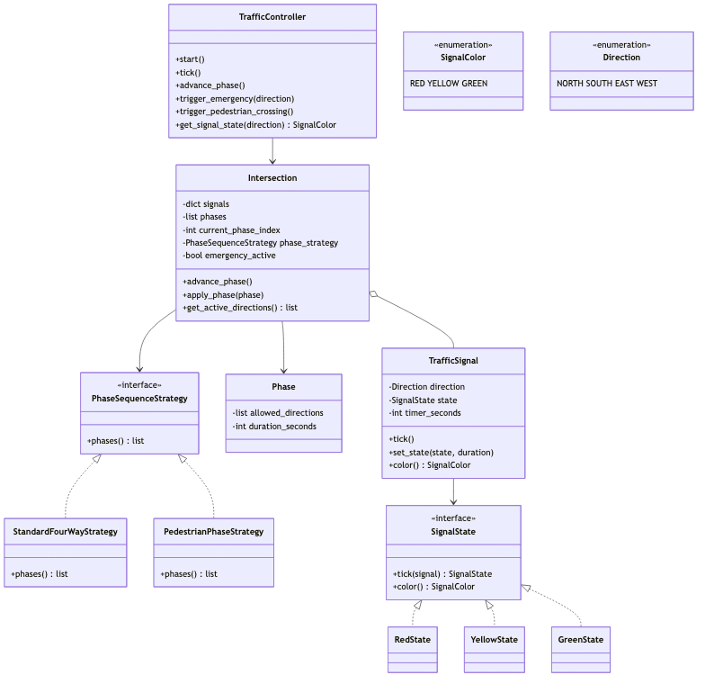
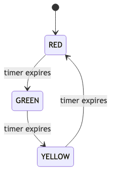

# Traffic Signal System — LLD (1-Hour Scope)

> **Type:** Classic LLD problem  
> **Focus:** Class design, State + Strategy patterns — not hardware deployment  
> **Time budget:** 60 minutes

---

## Problem statement

Design a **traffic signal controller** for a four-way intersection:

- **TrafficSignal** per direction (N/S/E/W) cycling RED → GREEN → YELLOW → RED
- **Intersection** groups signals and advances **Phases** (which directions go green)
- **TrafficController** exposes `tick()` and `advance_phase()`
- **Emergency override** and **pedestrian crossing phase**

---

## Scope boundary

| In scope | Out of scope (mention if asked) |
|----------|--------------------------------|
| State pattern on signals | Hardware / GPIO |
| Strategy for phase sequences | Multi-intersection coordination |
| `tick()` + `advance_phase()` | Threading, persistence |
| Emergency + pedestrian phases | Adaptive density timing |

**Opening line:** "State for lamp colors, Strategy for phase plans. `tick()` decrements timers; `advance_phase()` rotates the cycle."

---

## Assumptions

```
- Four-way intersection; one second per tick()
- Phase sets GREEN directions; others RED (YELLOW only exiting GREEN)
- Emergency: one GREEN, all others RED until cleared
- Pedestrian: all-red phases with empty allowed_directions
```

---

## Time plan (60 min)

| Min | Activity |
|-----|----------|
| 0–5 | Clarify + assumptions |
| 5–20 | Class diagram + State on TrafficSignal |
| 20–35 | Phase, Strategy, Intersection cycle |
| 35–50 | tick() flow + edge cases |
| 50–60 | Close |

---

## Class diagram



<details>
<summary>Mermaid source</summary>

See `diagrams/traffic-class-diagram.mmd`.

</details>

**Key classes:** `TrafficController` → `Intersection` → `TrafficSignal` (×4) + `Phase` list driven by `PhaseSequenceStrategy`. Signal colors via `SignalState` (`RedState`, `GreenState`, `YellowState`).

---

## Class responsibilities

### `TrafficSignal` — State pattern

```python
class TrafficSignal:
    def tick(self) -> None:
        self.state = self.state.tick(self)

    def set_state(self, state: SignalState, duration: int) -> None:
        self.state = state
        self.timer_seconds = duration
```

| State | Behavior | Transition |
|-------|----------|------------|
| `RedState` | No-op | Until `apply_phase()` → GREEN |
| `GreenState` | Decrement timer | 0 → `YellowState` |
| `YellowState` | Decrement timer | 0 → `RedState` |

No `if color == RED` in `TrafficSignal` — transitions live in state objects.

---

### `Phase` + `PhaseSequenceStrategy`

```python
@dataclass
class Phase:
    allowed_directions: list[Direction]  # [] = all-red walk window
    duration_seconds: int

class StandardFourWayStrategy(PhaseSequenceStrategy):
    def phases(self) -> list[Phase]:
        return [
            Phase([Direction.NORTH, Direction.SOUTH], 30),
            Phase([Direction.EAST, Direction.WEST], 30),
        ]

class PedestrianPhaseStrategy(PhaseSequenceStrategy):
    def phases(self) -> list[Phase]:
        return [
            Phase([Direction.NORTH, Direction.SOUTH], 25),
            Phase([], 15),
            Phase([Direction.EAST, Direction.WEST], 25),
            Phase([], 15),
        ]
```

New timing plan → new Strategy class; `Intersection` unchanged.

---

### `Intersection`

```python
def apply_phase(self, phase: Phase) -> None:
    for direction, signal in self.signals.items():
        if direction in phase.allowed_directions:
            signal.set_state(GreenState(), phase.duration_seconds)
        else:
            signal.set_state(RedState(), 0)

def advance_phase(self) -> None:
    if self.emergency_active:
        return
    self.current_phase_index = (self.current_phase_index + 1) % len(self.phases)
    self.apply_phase(self.phases[self.current_phase_index])
    self.phase_timer = self.phases[self.current_phase_index].duration_seconds
```

---

### `TrafficController`

```python
def tick(self) -> None:
    for signal in self.intersection.signals.values():
        signal.tick()
    if not self.intersection.emergency_active:
        self.intersection.phase_timer -= 1
        if self.intersection.phase_timer <= 0:
            self.intersection.advance_phase()

def trigger_emergency(self, direction: Direction) -> None:
    self.intersection.emergency_active = True
    for d, s in self.intersection.signals.items():
        s.set_state(GreenState() if d == direction else RedState(),
                    9999 if d == direction else 0)

def trigger_pedestrian_crossing(self) -> None:
    self.intersection.phase_strategy = PedestrianPhaseStrategy()
    self.intersection.phases = self.intersection.phase_strategy.phases()
    self.intersection.current_phase_index = 0
    self.intersection.advance_phase()
```

---

## State machine (per TrafficSignal)



<details>
<summary>Mermaid source</summary>

See `diagrams/traffic-state-machine.mmd`.

</details>

```
RED ──apply_phase()──▶ GREEN ──timer──▶ YELLOW ──timer──▶ RED
RED ──emergency──────▶ GREEN
```

Intersection level: `Phase₀ → Phase₁ → … → Phase₀` via `advance_phase()`.

---

## Core flow

```
start() → apply_phase(phases[0])
tick()  → signal.tick() for each direction
        → phase_timer -= 1; if 0 → advance_phase()
```

---

## Edge cases

| Case | Handled by |
|------|------------|
| Emergency vehicle | `trigger_emergency(dir)`; `advance_phase()` no-op while active |
| Pedestrian crossing | `PedestrianPhaseStrategy` with `allowed_directions=[]` |
| Yellow clearance | `GreenState` → `YellowState` before phase ends |
| Phase ends mid-YELLOW | `apply_phase()` force-sets next states |

---

## Design patterns

| Pattern | Where |
|---------|-------|
| **State** | `RedState`, `YellowState`, `GreenState` |
| **Strategy** | `PhaseSequenceStrategy` implementations |
| **Facade** | `TrafficController` as single entry point |

---

## What to code if asked (~10 min)

Pick one: `GreenState.tick()`, `Intersection.apply_phase()`, or `StandardFourWayStrategy.phases()`.

---

## 30-second close

> "Per-direction `TrafficSignal` uses State for RED/YELLOW/GREEN. `Intersection` cycles phases via Strategy. `TrafficController.tick()` drives timers; emergency bypasses the cycle; pedestrian mode swaps the strategy."

---

## Anti-patterns

- Color `if/else` in `TrafficSignal.tick()` instead of State objects
- Hardcoded phases inside `Intersection` instead of Strategy
- Setting lamp colors in `advance_phase()` without `TrafficSignal.set_state()`
