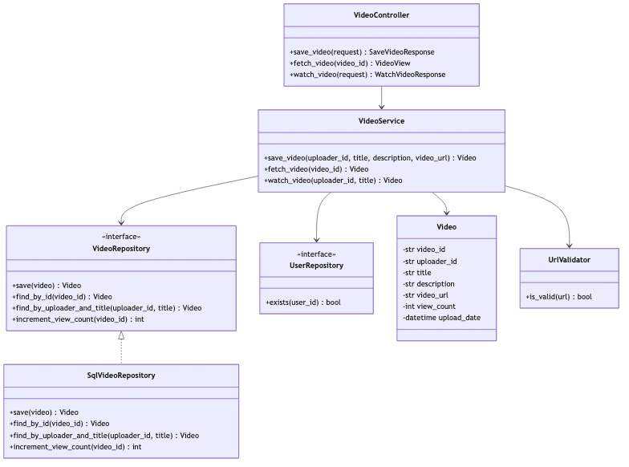
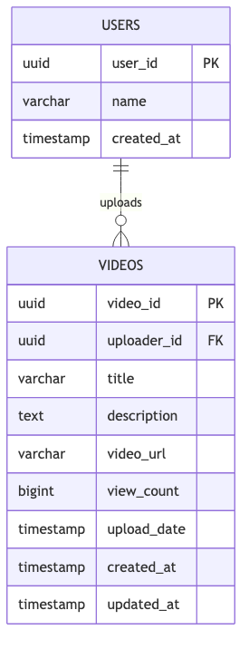
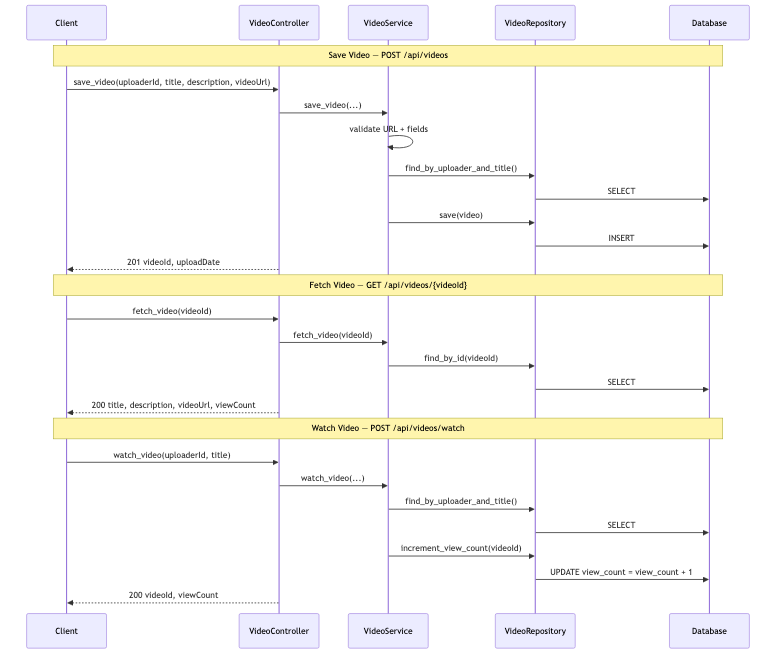

# Video Sharing Platform APIs — LLD (1-Hour Scope)

> **Context:** API + SQL LLD / Machine Coding interview  
> **Focus:** REST API design, service logic, schema, concurrency — not video transcoding or CDN  
> **Time budget:** 60 minutes

---

## Problem statement

Design APIs for a **video-sharing platform**:

1. **Save Video Details** — upload metadata (`title`, `description`, `videoUrl`) for an uploader
2. **Fetch Video Details** — return metadata + `viewCount` + `uploadDate` for a video
3. **Watch Video** — given `uploaderId` + `title`, simulate a watch and **increment view count**

---

## Scope boundary

### In scope

| Item | Notes |
|------|-------|
| `VideoController` | Thin REST layer — maps HTTP ↔ service |
| `VideoService` | Validation, business rules, orchestration |
| `VideoRepository` | SQL persistence (interface + impl) |
| `UrlValidator` | Syntax check for `videoUrl` |
| 3 APIs | `POST` save, `GET` fetch, `POST` watch |
| 2-table schema | `users`, `videos` |
| Atomic view increment | `UPDATE view_count = view_count + 1` |

### Out of scope (mention only if asked)

Actual file upload / blob storage, streaming, transcoding, auth tokens, comments, likes, search, CDN

**Opening line:**

> "Thin controller, `VideoService` owns validation and rules, `VideoRepository` owns SQL. Watch is a write — atomic increment in DB. `(uploader_id, title)` is unique because Watch API keys on that pair."

---

## Assumptions

```
- videoUrl is an external link (YouTube/S3 URL), not binary upload in this round
- Fetch uses videoId (returned from Save); Watch uses (uploaderId, title) per problem
- Title normalized with strip(); uniqueness per uploader
- view_count starts at 0; concurrent watches use DB-level atomic increment
```

---

## Time plan (60 min)

| Min | Activity |
|-----|----------|
| 0–5 | Clarify + assumptions |
| 5–15 | API contracts (methods, params, responses) |
| 15–25 | Class diagram + responsibilities |
| 25–35 | Schema (2 tables) + indexes + constraints |
| 35–50 | Service logic for 3 APIs + SQL queries |
| 50–55 | Edge cases + error mapping |
| 55–60 | Close |

---

## API contracts

### 1. Save Video Details

| Field | Value |
|-------|-------|
| **Method** | `POST` |
| **Path** | `/api/videos` |
| **Body** | `{ uploaderId, title, description, videoUrl }` |
| **Success** | `201 Created` |

```json
{
  "videoId": "uuid",
  "title": "My First Vlog",
  "uploadDate": "2026-06-28T10:00:00Z"
}
```

### 2. Fetch Video Details

| Field | Value |
|-------|-------|
| **Method** | `GET` |
| **Path** | `/api/videos/{videoId}` |
| **Success** | `200 OK` |

```json
{
  "videoId": "uuid",
  "uploaderId": "uuid",
  "title": "My First Vlog",
  "description": "Day in the life",
  "videoUrl": "https://cdn.example.com/v1.mp4",
  "uploadDate": "2026-06-28T10:00:00Z",
  "viewCount": 42
}
```

> Returns `videoUrl` (link to file), not the binary stream — unless interviewer explicitly asks for download proxy.

### 3. Watch Video

| Field | Value |
|-------|-------|
| **Method** | `POST` |
| **Path** | `/api/videos/watch` |
| **Body** | `{ uploaderId, title }` |
| **Success** | `200 OK` |

```json
{
  "videoId": "uuid",
  "title": "My First Vlog",
  "viewCount": 43
}
```

**Why `POST` for watch?** It mutates state (`view_count`). `GET` must be idempotent and side-effect free.

---

## Class diagram



<details>
<summary>Mermaid source</summary>

See `./diagrams/video-class-diagram.mmd`.

</details>

---

## Class responsibilities

### `VideoController` — thin HTTP layer

```python
def save_video(self, body: dict) -> tuple[int, dict]:
    video = self.service.save_video(
        uploader_id=body["uploaderId"],
        title=body["title"],
        description=body.get("description", ""),
        video_url=body["videoUrl"],
    )
    return 201, {"videoId": video.video_id, "title": video.title,
                 "uploadDate": video.upload_date.isoformat()}

def fetch_video(self, video_id: str) -> tuple[int, dict]:
    video = self.service.fetch_video(video_id)
    return 200, video.to_view()

def watch_video(self, body: dict) -> tuple[int, dict]:
    video = self.service.watch_video(body["uploaderId"], body["title"])
    return 200, {"videoId": video.video_id, "title": video.title,
                 "viewCount": video.view_count}
```

No business logic here — only request parsing and status codes.

---

### `VideoService` — business rules

```python
def save_video(self, uploader_id: str, title: str, description: str, video_url: str) -> Video:
    self._validate_save(uploader_id, title, description, video_url)

    if not self.user_repo.exists(uploader_id):
        raise NotFoundError("UPLOADER_NOT_FOUND")

    normalized_title = title.strip()
    if self.repo.find_by_uploader_and_title(uploader_id, normalized_title):
        raise ConflictError("VIDEO_ALREADY_EXISTS")

    video = Video(
        video_id=str(uuid.uuid4()),
        uploader_id=uploader_id,
        title=normalized_title,
        description=description.strip(),
        video_url=video_url.strip(),
        view_count=0,
        upload_date=datetime.utcnow(),
    )
    return self.repo.save(video)

def fetch_video(self, video_id: str) -> Video:
    if not video_id:
        raise ValidationError("VIDEO_ID_REQUIRED")
    video = self.repo.find_by_id(video_id)
    if not video:
        raise NotFoundError("VIDEO_NOT_FOUND")
    return video  # read-only — does NOT increment views

def watch_video(self, uploader_id: str, title: str) -> Video:
    if not uploader_id or not title or not title.strip():
        raise ValidationError("UPLOADER_ID_AND_TITLE_REQUIRED")

    video = self.repo.find_by_uploader_and_title(uploader_id, title.strip())
    if not video:
        raise NotFoundError("VIDEO_NOT_FOUND")

    video.view_count = self.repo.increment_view_count(video.video_id)
    return video
```

---

### `UrlValidator`

```python
from urllib.parse import urlparse

def is_valid(url: str) -> bool:
    parsed = urlparse(url.strip())
    return parsed.scheme in ("http", "https") and bool(parsed.netloc)
```

Syntax only — no HEAD request to CDN in 1-hour scope.

---

### `VideoRepository` — SQL layer

```python
class VideoRepository(ABC):
    @abstractmethod
    def save(self, video: Video) -> Video: ...

    @abstractmethod
    def find_by_id(self, video_id: str) -> Video | None: ...

    @abstractmethod
    def find_by_uploader_and_title(self, uploader_id: str, title: str) -> Video | None: ...

    @abstractmethod
    def increment_view_count(self, video_id: str) -> int: ...
```

---

## Schema (2 tables)



<details>
<summary>Mermaid source</summary>

See `./diagrams/video-schema.mmd`.

</details>

### DDL

```sql
CREATE TABLE users (
    user_id     UUID PRIMARY KEY,
    name        VARCHAR(255) NOT NULL,
    created_at  TIMESTAMP NOT NULL DEFAULT NOW()
);

CREATE TABLE videos (
    video_id     UUID PRIMARY KEY,
    uploader_id  UUID NOT NULL REFERENCES users(user_id),
    title        VARCHAR(255) NOT NULL,
    description  TEXT,
    video_url    VARCHAR(2048) NOT NULL,
    view_count   BIGINT NOT NULL DEFAULT 0,
    upload_date  TIMESTAMP NOT NULL DEFAULT NOW(),
    created_at   TIMESTAMP NOT NULL DEFAULT NOW(),
    updated_at   TIMESTAMP NOT NULL DEFAULT NOW(),

    CONSTRAINT uq_videos_uploader_title UNIQUE (uploader_id, title)
);

CREATE INDEX idx_videos_uploader_title ON videos (uploader_id, title);
```

| Constraint | Why |
|------------|-----|
| `UNIQUE(uploader_id, title)` | Watch API resolves video by this pair — must be unambiguous |
| `FK uploader_id → users` | Reject save for unknown uploader |
| `view_count DEFAULT 0` | New videos start at zero views |
| Index on `(uploader_id, title)` | Fast lookup for Watch API |

---

## SQL queries (say these in interview)

### Save

```sql
INSERT INTO videos (video_id, uploader_id, title, description, video_url, upload_date)
VALUES ($1, $2, $3, $4, $5, NOW())
RETURNING video_id, upload_date;
```

### Fetch by ID

```sql
SELECT video_id, uploader_id, title, description, video_url, view_count, upload_date
FROM videos
WHERE video_id = $1;
```

### Watch — lookup

```sql
SELECT video_id, uploader_id, title, view_count
FROM videos
WHERE uploader_id = $1 AND title = $2;
```

### Watch — atomic increment

```sql
UPDATE videos
SET view_count = view_count + 1,
    updated_at = NOW()
WHERE video_id = $1
RETURNING view_count;
```

> **Never** do read → `view_count + 1` → write in application code under concurrency.

---

## Core flow



<details>
<summary>Mermaid source</summary>

See `./diagrams/video-core-flow.mmd`.

</details>

---

## Edge cases

| Case | API | HTTP | Error code |
|------|-----|------|------------|
| Blank `title` | Save, Watch | `400` | `TITLE_REQUIRED` |
| Invalid `videoUrl` | Save | `400` | `INVALID_VIDEO_URL` |
| Unknown `uploaderId` | Save | `404` | `UPLOADER_NOT_FOUND` |
| Duplicate `(uploaderId, title)` | Save | `409` | `VIDEO_ALREADY_EXISTS` |
| Unknown `videoId` | Fetch | `404` | `VIDEO_NOT_FOUND` |
| Unknown `(uploaderId, title)` | Watch | `404` | `VIDEO_NOT_FOUND` |
| Concurrent watches | Watch | `200` | DB atomic increment — no lost updates |
| Fetch after many watches | Fetch | `200` | Returns latest `view_count` |

---

## Patterns used

| Pattern | Where | Why |
|---------|-------|-----|
| **Repository** | `VideoRepository` | Isolate SQL from business logic |
| **Layered architecture** | Controller → Service → Repository | Testable, single responsibility |
| **DTO / View** | Request/response objects | Decouple HTTP from domain `Video` |

---

## Extensibility (3 bullets)

| Question | Answer |
|----------|--------|
| Real file upload? | Add `VideoStorageService`; store blob key in `video_url` |
| One view per user per day? | `video_views(viewer_id, video_id, viewed_on)` with unique constraint |
| List uploader's videos? | `GET /api/videos?uploaderId=` — index on `uploader_id` |

---

## SOLID (say 3)

| Principle | Application |
|-----------|-------------|
| **S** | Controller = HTTP; Service = rules; Repository = SQL |
| **O** | New storage backend → new `VideoRepository` impl |
| **D** | `VideoService` depends on `VideoRepository` ABC |

---

## What to code if asked (~10 min)

Pick **one**: `VideoService.watch_video()` · `increment_view_count` SQL · `save_video` validation

---

## 30-second close

> "Three APIs: Save returns `videoId`, Fetch is read-only by `videoId`, Watch increments views by `(uploaderId, title)`. Repository pattern keeps SQL out of the service. `UNIQUE(uploader_id, title)` matches the Watch lookup. View count uses atomic `UPDATE ... + 1 RETURNING` for concurrency."

---

## Anti-patterns to avoid

- Incrementing `view_count` on Fetch (side effect on GET)
- Read-modify-write view count in app code (lost updates)
- No unique constraint on `(uploader_id, title)` while Watch keys on it
- SQL in the controller
- Skipping URL validation on Save

---

## References

- API + SQL LLD — video platform (Repository + layered design)
